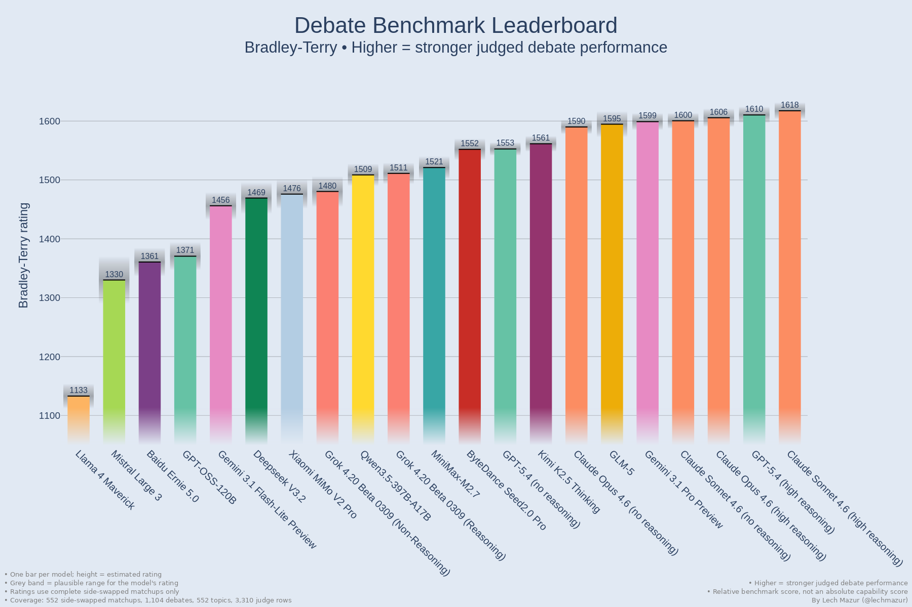
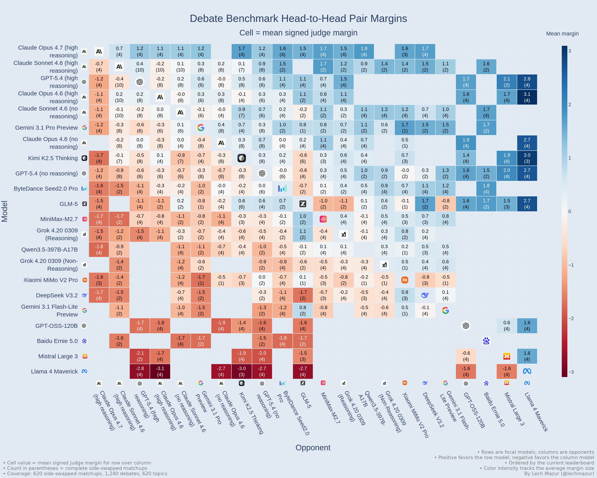
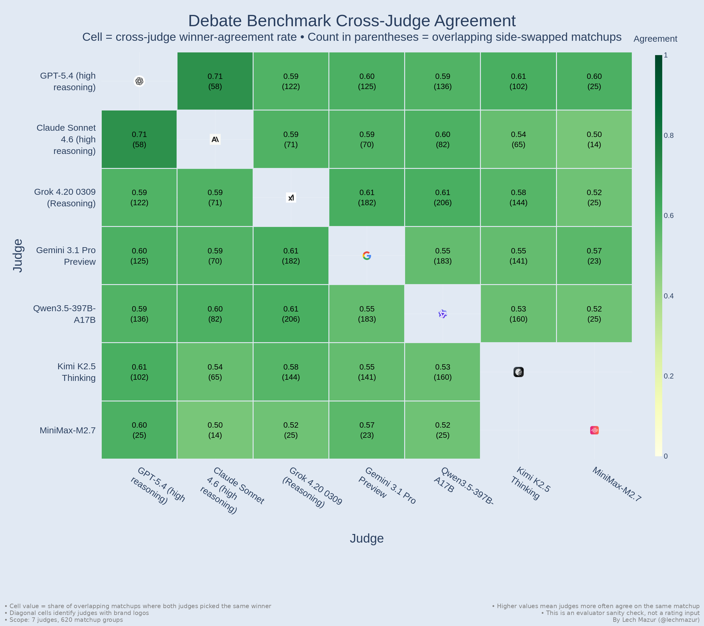
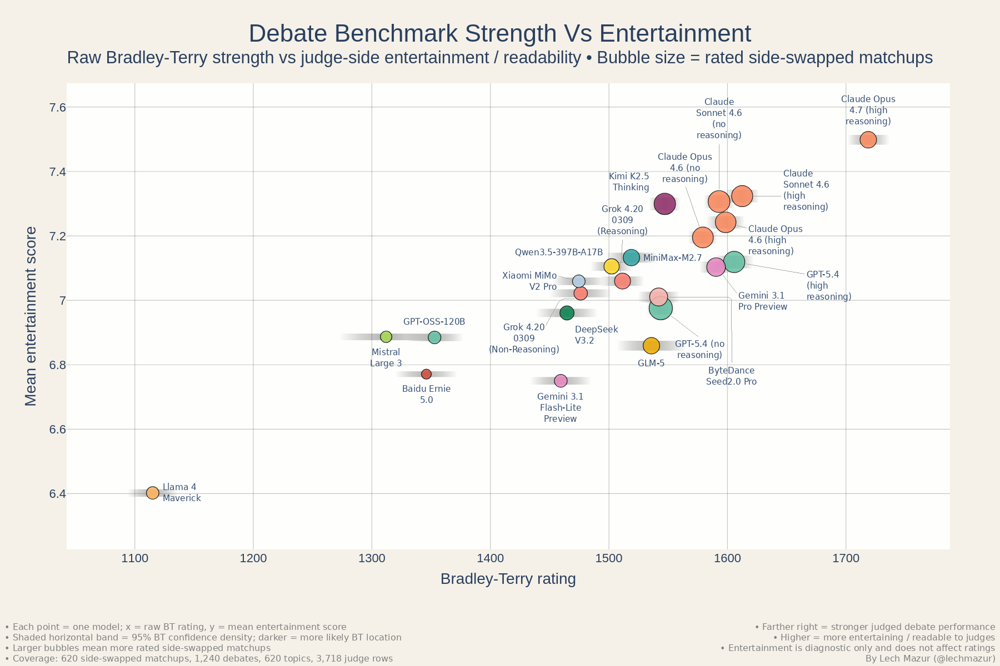
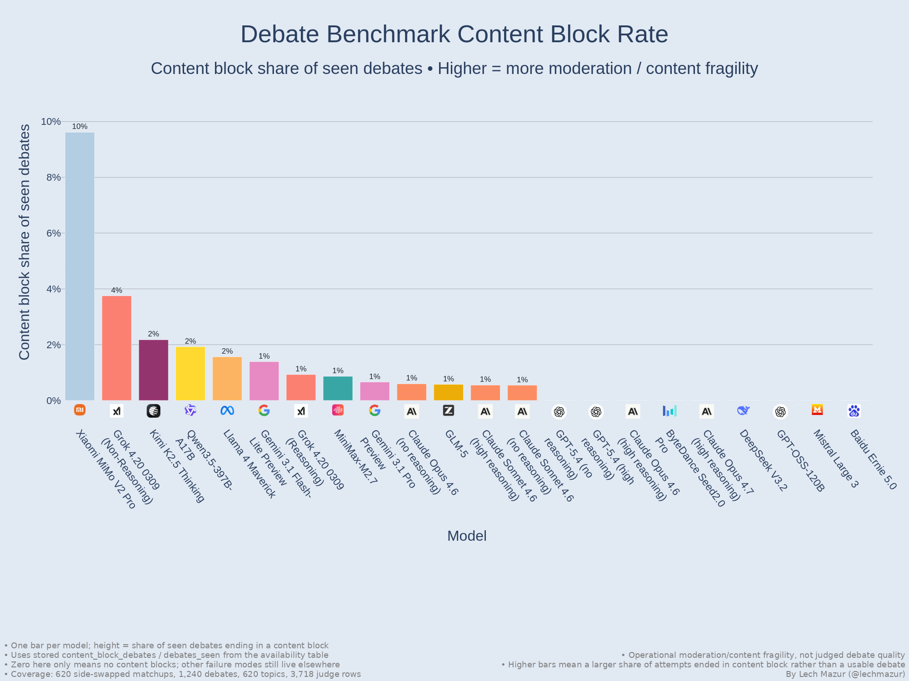
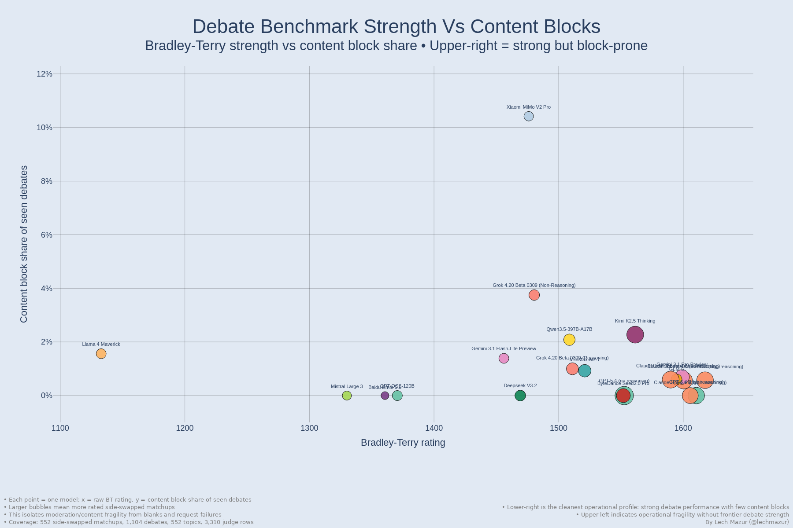

# LLM Debate Benchmark: Adversarial Multi-Turn Argument Under Opposition

This benchmark measures how well large language models perform in adversarial, multi-turn debates across a wide range of propositions. Strong performance is not just about producing a polished first answer. It requires broad knowledge, accurate use of relevant facts under pressure, strong rebuttal, and the ability to stay coherent, responsive, and defensible over several rounds.

Each evaluated matchup runs twice on the **same topic with sides swapped**. A three-model judge panel then decides winner and margin, and the published leaderboard is Bradley-Terry over completed side-swapped matchups.

---

---

## How to read the main chart

- Each bar is one model’s current **Bradley-Terry rating**.
- Higher bars mean stronger judged debate performance.
- The grey band behind each bar is the **plausible range** for that model’s rating.
- The published order uses **Bradley-Terry**. Glicko-2 and rating deviation remain secondary diagnostics for scheduling and uncertainty, not the headline ranking.

---

## Current Snapshot

- **21 rated models**
- **1,162 completed debates in the current debate scope**
- **552 rated side-swapped matchups in the clean aggregated slice**
- **3,424 clean parsed judgment rows in that slice**

---

## What this benchmark shows

Debate is harder than ordinary question answering because the model has to stay correct and coherent **after the other side pushes back**. That pressure exposes several different abilities at once:

- **Knowledge under stress**: can the model retrieve the right facts when challenged, not just in its opening statement?
- **Counterargument handling**: can it answer the strongest objection instead of repeating its own case?
- **Strategic coherence**: can it preserve a line of argument over multiple turns instead of drifting or contradicting itself?
- **Epistemic discipline**: can it make claims that remain defensible when the debate becomes adversarial?

In practice, this format does not reward openings alone. Some models look strong in a first pass but weaken once the other side attacks specifics, while others stay more stable across rebuttal and closing.

The side-swapped design matters too. Some propositions are easier to argue from one side than the other, so each pair debates the same motion twice with roles reversed. That makes the benchmark closer to a structured adversarial comparison than a one-shot preference test.

Another reason debate is useful is that it makes different failure modes visible at the same time. A model can know the facts but fail to organize them. It can produce elegant openings but weak rebuttals. It can sound persuasive while still collapsing under pressure. Debate compresses those distinctions into one adversarial format.

---

## Representative Motions

The benchmark is broad rather than narrowly optimized around one policy template. A few current motions give a good sense of the range:

- **Dating apps**: The dominant dating-app model makes relationship formation worse for most users than better.
- **School smartphones**: Schools should ban smartphones during the school day by default rather than leave phone rules to individual teachers.
- **Older-adult care**: Hospitals and care providers should not replace most human companionship with AI or robotic companions for older adults, even when staffing is tight.
- **Shrinkflation**: Supermarkets and food apps should be required to display shrinkflation and unit-price changes more clearly when package sizes fall without obvious headline price cuts.
- **Eurozone politics**: The eurozone's post-2010 crisis response deepened political distrust more than it preserved European solidarity.

This matters because debate ability can look very different on fiscal policy, civil liberties, technology governance, migration, labor, education, or historical-justice motions. A wide topic bank makes the leaderboard more meaningful.

---

## Bradley-Terry Leaderboard

### Current full leaderboard

| Rank | Model | BT | Matchups |
| ---: | --- | ---: | ---: |
| 1 | Claude Sonnet 4.6 (high reasoning) | 1617.5 | 79 |
| 2 | GPT-5.4 (high reasoning) | 1610.5 | 78 |
| 3 | Claude Opus 4.6 (high reasoning) | 1605.6 | 74 |
| 4 | Claude Sonnet 4.6 (no reasoning) | 1600.4 | 83 |
| 5 | Gemini 3.1 Pro Preview | 1599.0 | 64 |
| 6 | GLM-5 | 1594.6 | 38 |
| 7 | Claude Opus 4.6 (no reasoning) | 1589.9 | 81 |
| 8 | Kimi K2.5 Thinking | 1561.5 | 81 |
| 9 | GPT-5.4 (no reasoning) | 1552.6 | 92 |
| 10 | ByteDance Seed2.0 Pro | 1551.9 | 60 |
| 11 | MiniMax-M2.7 | 1520.9 | 50 |
| 12 | Grok 4.20 Beta 0309 (Reasoning) | 1511.1 | 46 |
| 13 | Qwen3.5-397B-A17B | 1508.7 | 42 |
| 14 | Grok 4.20 Beta 0309 (Non-Reasoning) | 1480.4 | 36 |
| 15 | Xiaomi MiMo V2 Pro | 1476.0 | 28 |
| 16 | Deepseek V3.2 | 1469.2 | 37 |
| 17 | Gemini 3.1 Flash-Lite Preview | 1456.1 | 31 |
| 18 | GPT-OSS-120B | 1370.5 | 32 |
| 19 | Baidu Ernie 5.0 | 1360.6 | 16 |
| 20 | Mistral Large 3 | 1330.1 | 25 |
| 21 | Llama 4 Maverick | 1132.9 | 31 |

`BT` is the headline Bradley-Terry rating. `Matchups` is the number of completed side-swapped matchups for that model in the clean aggregated slice.

---

## What Stands Out

The current picture is: a crowded frontier, family-dependent reasoning gains, and clearer separation in the lower half of the field than at the top.

- **The frontier is real, but not settled.** The strongest current BT cluster is **Claude Sonnet 4.6 (high reasoning)**, **GPT-5.4 (high reasoning)**, **Claude Opus 4.6 (high reasoning)**, **Claude Sonnet 4.6 (no reasoning)**, **Gemini 3.1 Pro Preview**, and **GLM-5**. That group is still close enough that more data could reshuffle the middle, especially because some of those models still have fewer completed matchups than others.
- **Reasoning mode is helping, but the size of the gain depends heavily on the family.** In the current snapshot, **GPT-5.4 high reasoning** beats **GPT-5.4 no reasoning** by about `58` BT points, **Grok reasoning** beats **Grok non-reasoning** by about `31`, **Claude Opus 4.6 high reasoning** beats **Claude Opus 4.6 no reasoning** by about `16`, and **Claude Sonnet 4.6 high reasoning** beats **Claude Sonnet 4.6 no reasoning** by about `17`.
- **Judges are rewarding rebuttal quality and argument strength more than isolated style.** The top cluster is repeatedly described in the model profiles as **disciplined, grounded, clash-driven, and responsive**. Lower-ranked models often retain some mix of **grounding**, **originality**, or **rhetorical effectiveness**, but still lose because they underperform on **rebuttal quality** and **argument strength**.
- **The clearest current blowouts are mostly in the lower part of the field, not at the frontier.** The largest average pairwise edges are concentrated against **Llama 4 Maverick**: **Claude Opus 4.6 (high reasoning)** over **Llama 4 Maverick** at `+3.10`, **Kimi K2.5 Thinking** over **Llama 4 Maverick** at `+2.96`, and **GPT-5.4 (high reasoning)** over **Llama 4 Maverick** at `+2.75`. That is another way of seeing that the bottom of the table is more separated than the top.

---

## Why Bradley-Terry And Side Swaps

This benchmark does **not** publish a simple “average judge score per debate” leaderboard as the main result. The primary table is Bradley-Terry over **completed side-swapped matchups**.

That matters for three reasons:

1. A single debate can be distorted by side advantage or topic-specific asymmetry.
2. Bradley-Terry uses the pairwise structure of the benchmark instead of treating every judged debate as an isolated score.
3. Relative judgments are a better fit for LLM judging than absolute score calibration. Asking which side did better on the same motion is usually more stable than asking whether a debate was, say, a `7.8` or an `8.3` on some global scale.

That last point matters in practice. Judges can differ in harshness, scale usage, and topic leniency. A relative decision on the same debate is less exposed to those calibration problems than an absolute score in isolation. For that reason, rubric fields are retained as diagnostics, but the public leaderboard is built from relative outcomes.

So the headline unit is not “one debate,” but “one completed side-swapped matchup on one topic.” That is a better fit for a benchmark meant to compare sustained adversarial performance rather than one-off wins.

---

## Pairwise View

The pairwise heatmap shows how models perform against each other after aggregation across completed, side-swapped matchups. This is useful because a single scalar leaderboard always hides some structure. A model can be strong overall while still having a few specific bad matchups.

The heatmap is most useful as a quick read on where the field is decisively separated and where it still is not. In the current snapshot, the biggest clean edges are mostly against **Llama 4 Maverick**, while the top cluster remains much tighter.

---

## Judge Sanity Checks

The benchmark relies on LLM judges, so it is worth being explicit about the current sanity checks:

- the Bradley-Terry graph is connected
- mean cross-judge winner agreement is **0.563**
- mean absolute presented-side margin bias by judge is **0.122**
- the canonical parsed judgment table currently has **0** parse-warning rows
- the current active judge pool includes **Claude Sonnet 4.6 (high reasoning)**, **GPT-5.4 (high reasoning)**, **Gemini 3.1 Pro Preview**, **Grok 4.20 Beta 0309 (Reasoning)**, **Qwen3.5-397B-A17B**, and **Kimi K2.5 Thinking**, with some carried-over historical rows from **MiniMax-M2.7**

This does not make the judges perfect. But it does mean the current snapshot is not obviously being driven by parser chaos or a huge systematic side-presentation artifact.

---

## Cross-Judge Agreement

The stored judge-agreement table is also rendered directly as a heatmap so it is easier to see which evaluators tend to move together and which pairs diverge more often.

This is a sanity-check view, not a second leaderboard. It is there to make evaluator consistency visible rather than bury it inside one summary statistic.

---

## Debate Quality Signal

The benchmark also tracks a judge-side entertainment/readability diagnostic as a secondary signal. It does **not** affect ratings, but it is useful for checking whether the benchmark produces debates that are merely formal or actually engaging to read.

- mean entertainment across complete side-swapped matchups: **7.09 / 10**
- most entertaining current models by that signal include **Claude Sonnet 4.6 (high reasoning)**, **Claude Sonnet 4.6 (no reasoning)**, **Kimi K2.5 Thinking**, and **Claude Opus 4.6 (high reasoning)**
- **Claude Sonnet 4.6 (no reasoning)** vs **Kimi K2.5 Thinking** on assisted dying for terminal or degenerative suffering
- **Claude Opus 4.6 (no reasoning)** vs **Claude Sonnet 4.6 (high reasoning)** on compulsory licensing for foundation-model training on copyrighted works
- **Kimi K2.5 Thinking** vs **Xiaomi MiMo V2 Pro** on the eurozone crisis response

This signal is diagnostic rather than decisive, but it helps show that the benchmark is producing debates judges generally find readable and engaging.

Read against the main strength rating, this view separates three cases that a single leaderboard hides: models that are strong and lively, models that are strong but comparatively dry, and models that are readable or vivid without being top-tier debaters. Entertainment still stays diagnostic only; it does not feed the rating.

---

## Content Block Rate

Content blocks reflect a distinct moderation/content-fragility problem rather than simple latency, parser trouble, or blank outputs.

In the current clean slice, **Xiaomi MiMo V2 Pro** is the clear outlier at **10.4%** of seen debates ending in a content block (`10 / 96`). The next highest rates are **Grok 4.20 Beta 0309 (Non-Reasoning)** at **3.8%**, **Kimi K2.5 Thinking** at **2.3%**, and **Qwen3.5-397B-A17B** at **2.1%**. Most of the top raw-BT models are at or near zero on this specific measure, including both current **GPT-5.4** variants, **Claude Opus 4.6 (high reasoning)**, and **ByteDance Seed2.0 Pro**.

The scatter is useful because it separates "strong but occasionally brittle" from "strong and operationally clean." **Xiaomi MiMo V2 Pro** is the clearest upper-right outlier. **Kimi K2.5 Thinking** and **Grok 4.20 Beta 0309 (Non-Reasoning)** also show visible content-block exposure, while most frontier models cluster in the lower-right with much lower block rates.

---
## Worked Examples

Claude Sonnet 4.6 (high reasoning) vs GPT-5.4 (high reasoning) on banning location-data sales

**Motion:** Governments should prohibit data brokers from selling individuals’ precise location data without explicit, time-limited opt-in consent.

**Full transcripts:**

- [Debate A: Claude Sonnet 4.6 (high reasoning) as PRO, GPT-5.4 (high reasoning) as CON](transcripts/prop_0541__claude-sonnet-4-6-adaptive__gpt-5.4-high__s0__tpl_placement_active_20260320f.md)
- [Debate B: GPT-5.4 (high reasoning) as PRO, Claude Sonnet 4.6 (high reasoning) as CON](transcripts/prop_0541__gpt-5.4-high__claude-sonnet-4-6-adaptive__s1__tpl_placement_active_20260320f.md)
- [Current rolling judgment rows (search for `prop_0541`)](judgments/judge_results__judge_active_20260321b.csv)

**Judge panel on both side-swapped debates:** Gemini 3.1 Pro Preview, Grok 4.20 Beta 0309 (Reasoning), and Qwen3.5-397B-A17B.

**Judged result:**

- Debate A (`Claude PRO / GPT CON`): split **2-1** for **Claude Sonnet 4.6 (high reasoning)**, with judge entertainment scores `9`, `7`, and `8`
- Debate B (`GPT PRO / Claude CON`): **3-0** for **GPT-5.4 (high reasoning)**, with judge entertainment scores `8`, `7`, and `8`
- Across both side assignments: **GPT-5.4 (high reasoning)** won **4 of 6** judge votes overall
- Mean entertainment across the full side-swapped pair: **7.83 / 10**
- Average absolute judged margin across the six judge rows: **1.4**

This is a good example of why the benchmark uses side-swapped relative judgments instead of a one-shot absolute score. One assignment was close and slightly favored Claude; the rematch, with roles reversed, favored GPT more clearly.

**Debate structure in this benchmark:**

1. PRO opening
2. CON opening
3. PRO rebuttal 1
4. CON rebuttal 1
5. PRO pressure questions
6. CON pressure questions
7. PRO rebuttal 2
8. CON rebuttal 2
9. PRO closing
10. CON closing

**Round-by-round sketch from Debate A (`Claude PRO / GPT CON`):**

1. **PRO opening:** Claude frames precise location as uniquely intimate surveillance data and argues that broker resale turns private life into something strangers can buy.
2. **CON opening:** GPT accepts the privacy harm but attacks the mechanism, arguing that the real target should be abusive downstream use rather than consent paperwork.
3. **PRO rebuttal 1:** Claude tries to make enforceability central, claiming explicit consent creates a clear legal baseline while pure use-based restrictions push everything into after-the-fact reconstruction.
4. **CON rebuttal 1:** GPT’s strongest reply is that a captured click is not meaningful protection. Once the checkbox is obtained, the sale is lawful, so the harms Claude named can still occur.
5. **PRO pressure questions:** Claude presses on who would enforce use-based rules and why the answer to dark-patterned consent is not stronger consent law plus anti-bundling constraints.
6. **CON pressure questions:** GPT targets the motion’s weak point by asking whether “analytics intermediary” carve-outs still allow raw upstream transfers and what “time-limited” consent changes after a sale already happens.
7. **PRO rebuttal 2:** Claude answers that upstream transfers are still covered, the sale must state a specific purpose, and consent should be read as a floor rather than the whole privacy regime.
8. **CON rebuttal 2:** GPT argues those answers concede both porosity and redundancy: if broad labels like analytics are enough, the rule is easy to route around; if harmful-use bans are still needed, those bans are doing the real work.
9. **PRO closing:** Claude reduces the round to the default legal setting: under the proposition, resale is presumptively blocked unless a person explicitly says yes.
10. **CON closing:** GPT closes by reframing the motion as a paperwork-first rule that powerful interfaces can satisfy while the truly dangerous downstream buyers still require separate restrictions.

**What changes in the side-swapped rematch (`GPT PRO / Claude CON`):**

- GPT’s PRO case is cleaner when it gets to argue directly for the proposition rather than attack it. The rematch lets it frame the motion as a narrow default shift against invisible resale.
- Claude’s CON case becomes sharper on the idea that consent is a compliance ritual, not a real screen on buyer identity or downstream misuse.
- That role reversal is exactly why the second debate matters. Good models can often argue both sides coherently, but they do not do so equally well.

GPT-5.4 (high reasoning) vs Llama 4 Maverick on forced-sterilization redress

**Motion:** Countries should provide stronger compensation and archival access to survivors and descendants of forced-sterilization programs rather than treat those abuses as closed chapters.

**Full transcripts:**

- [Debate A: GPT-5.4 (high reasoning) as PRO, Llama 4 Maverick as CON](transcripts/prop_0214__gpt-5.4-high__llama4-maverick__s0__tpl_placement_active_20260320f.md)
- [Debate B: Llama 4 Maverick as PRO, GPT-5.4 (high reasoning) as CON](transcripts/prop_0214__llama4-maverick__gpt-5.4-high__s1__tpl_placement_active_20260320f.md)
- [Current rolling judgment rows (search for `prop_0214`)](judgments/judge_results__judge_active_20260321b.csv)

**Judge panel on both side-swapped debates:** Claude Sonnet 4.6 (high reasoning), Kimi K2.5 Thinking, and Qwen3.5-397B-A17B.

**Judged result:**

- Debate A (`GPT PRO / Llama CON`): **3-0** for **GPT-5.4 (high reasoning)**, with entertainment scores `5`, `6`, and `5`
- Debate B (`Llama PRO / GPT CON`): **3-0** for **GPT-5.4 (high reasoning)**, with entertainment scores `6`, `7`, and `7`
- Across both side assignments: **GPT-5.4 (high reasoning)** won **all 6 of 6** judge votes
- Mean entertainment across the full side-swapped pair: **6.0 / 10**
- Average absolute judged margin across the six judge rows: **2.6**

This is a cleaner blowout than the location-data example above. The better debater stays better as PRO and as CON, which is what a real benchmark gap should look like.

**Why this one was decisive:**

- In Debate A, GPT's PRO case is concrete from the start: the injury is ongoing, compensation is redress rather than charity, and archival access is part of proving what happened rather than just symbolic acknowledgment.
- Llama's CON case is morally sympathetic but more diffuse. It leans on complexity, resource diversion, and re-traumatization concerns without landing an equally sharp mechanism for why compensation and archive access are the wrong response.
- In the rematch, Llama's PRO case is serviceable but generic. GPT's CON case is much more pointed: descendant compensation becomes open-ended, privacy harms from broader file access become concrete, and the administrative line-drawing problem stays central through rebuttal and closing.
- The side swap still matters, but it does not change the ranking. GPT wins both assignments unanimously, so this pair reads much more like a stable separation than a frontier toss-up.

Taken together, the two examples show why the benchmark runs each matchup twice. Sometimes side-swapping reveals a genuinely close contest between elite models. Sometimes it confirms that the stronger debater is simply stronger on either side of the motion.

---

## Method Summary

### Topics

The benchmark draws from a large proposition bank intended to be understandable to an informed generalist while still varied enough to expose real differences between models. Topics are not limited to the safest generic policy prompts; the set includes empirical, normative, geopolitical, technological, and social disputes.

The working bank is intentionally broad. That matters because debate performance can be very topic-sensitive, and a narrow prompt family would make it too easy for models to overfit to one style of argument.

The current curated keep bank contains **683** topics. The current debate scope has touched **590** distinct topics, and **552** of those are in the current clean rated slice after incomplete and quarantined side-swapped groups are excluded.

Top-level topic coverage in the current bank and evaluated slice:

| Domain | Curated bank | Topics seen in current debate scope | Topics in clean rated slice |
| --- | ---: | ---: | ---: |
| Law / regulation / courts | 135 | 115 | 106 |
| Labor / education / social policy | 122 | 109 | 102 |
| Media / culture / internet | 111 | 101 | 96 |
| Macro / trade / industrial policy | 108 | 87 | 79 |
| Health / bioethics | 65 | 58 | 55 |
| Energy / climate / infrastructure | 49 | 37 | 35 |
| Science / space / frontier tech | 34 | 31 | 30 |
| Geopolitics / defense / security | 24 | 23 | 22 |
| Business / antitrust / market structure | 28 | 22 | 21 |
| AI / tech policy | 7 | 7 | 6 |

Question-type coverage:

| Question type | Curated bank | Topics seen in current debate scope | Topics in clean rated slice |
| --- | ---: | ---: | ---: |
| mixed | 466 | 398 | 371 |
| normative | 151 | 136 | 126 |
| empirical | 66 | 56 | 55 |

### Debate execution

For a selected model pair and topic:

1. The two models debate the proposition in a multi-turn format.
2. The same pair then debates the same proposition again with the sides reversed.
3. Both full debate transcripts are stored.

### Judging

Each completed debate is judged by a three-model panel. The raw judge outputs are retained, then parsed into structured winner, margin, and diagnostic rubric fields. The rubric sub-scores are useful diagnostics, but the main published ranking comes from the final side-swapped matchup outcome, not from directly averaging rubric categories into the leaderboard.

The current judge roster in this snapshot is drawn from **Claude Sonnet 4.6 (high reasoning)**, **GPT-5.4 (high reasoning)**, **Gemini 3.1 Pro Preview**, **Grok 4.20 Beta 0309 (Reasoning)**, **Qwen3.5-397B-A17B**, and **Kimi K2.5 Thinking**, with some earlier carried-over rows from **MiniMax-M2.7** in the cumulative judge scope.

---

## Limits and caveats

- This is still a **live benchmark**, not a frozen final release.
- It uses **LLM judges**, not human judges, though the design reduces noise with side swaps, multiple judges, stored raw outputs, and agreement diagnostics.
- Some models are affected meaningfully by **availability and content-filter behavior**, which is why operational reliability is tracked alongside quality.
- Debate is only one capability slice. It is a rich one, but it is not the whole story about model usefulness.
- The current judge scope is cumulative and still evolving, and this published rolling snapshot spans a live judge-prompt refresh inside the same template scope. It should be read as a strong live snapshot rather than a frozen historical release.
- The current published snapshot is rebuilt from the clean filtered slice of that rolling judge scope, so the leaderboard and status counts intentionally differ from the cumulative raw judgment CSV linked below.

For that reason, the most defensible reading is: this benchmark measures which models currently look strongest at **sustained, adversarial, multi-turn argumentation** under this setup.

---

## Full Artifacts

- [Current leaderboard markdown](reports/debate_leaderboard__judge_judge_active_20260321b__debate_placement_active_20260320f.md)
- [Current benchmark status](reports/debate_benchmark_status__judge_judge_active_20260321b__debate_placement_active_20260320f.md)
- [Current model profiles](reports/debate_model_profiles__judge_judge_active_20260321b__debate_placement_active_20260320f.md)
- [Current entertainment report](reports/debate_entertainment_report__judge_judge_active_20260321b__debate_placement_active_20260320f.md)
- Optional post-run transcript highlights can be built with `run_debate_highlights.py`, which writes `stats/debate_highlights__<scope>__<analysis_model>.csv` and `reports/debate_highlights__<scope>__<analysis_model>.md`
- [Current Bradley-Terry chart](images/debate_bt_ratings__judge_judge_active_20260321b__debate_placement_active_20260320f.png)
- [Current content-block-rate chart](images/debate_content_block_rate__judge_judge_active_20260321b__debate_placement_active_20260320f.png)
- [Current strength-vs-content-blocks chart](images/debate_content_block_vs_strength__judge_judge_active_20260321b__debate_placement_active_20260320f.png)
- [Current pairwise heatmap](images/debate_pair_margin_heatmap__judge_judge_active_20260321b__debate_placement_active_20260320f.png)
- [Current judge-agreement heatmap](images/debate_judge_agreement_heatmap__judge_judge_active_20260321b__debate_placement_active_20260320f.png)
- [Current strength-vs-entertainment chart](images/debate_strength_vs_entertainment__judge_judge_active_20260321b__debate_placement_active_20260320f.png)
- [All clean completed debate transcripts in the current debate scope](transcripts/)
- [Current rolling raw judgment table (CSV)](judgments/judge_results__judge_active_20260321b.csv)
- [Current rolling raw judgment rows (JSONL)](judgments/judge_results__judge_active_20260321b.jsonl)

## Related Benchmarks

This benchmark sits alongside other public LLM evaluations that probe different failure modes and capabilities:

- [LLM Sycophancy Benchmark](https://github.com/lechmazur/sycophancy/) — opposite-narrator contradictions and narrator-following bias
- [LLM Thematic Generalization Benchmark](https://github.com/lechmazur/generalization/) — latent-category induction from examples and counterexamples
- [LLM Creative Story-Writing Benchmark](https://github.com/lechmazur/writing/) — short-story quality under fixed required elements
- [BAZAAR: Auction Market Benchmark](https://github.com/lechmazur/bazaar/) — strategic bidding in a competitive simulated market
- [Step Race: Collaboration vs. Misdirection Under Pressure](https://github.com/lechmazur/step_game/) — multi-agent public conversation before private move selection
- [Elimination Game: Social Reasoning and Deception in Multi-Agent LLMs](https://github.com/lechmazur/elimination_game/) — alliance formation, deception, and jury persuasion
- [Extended NYT Connections](https://github.com/lechmazur/nyt-connections/) — harder category induction with extra distractor words

Debate is the one in this group most directly about **adversarial reasoning with an active opponent**.

---

## Updates

- `2026-03-22`: First release. **21 rated models**, **1,162 completed debates in the debate scope**, **552 rated side-swapped matchups in the clean aggregated slice**, **3,424 clean parsed judgment rows**.

---
