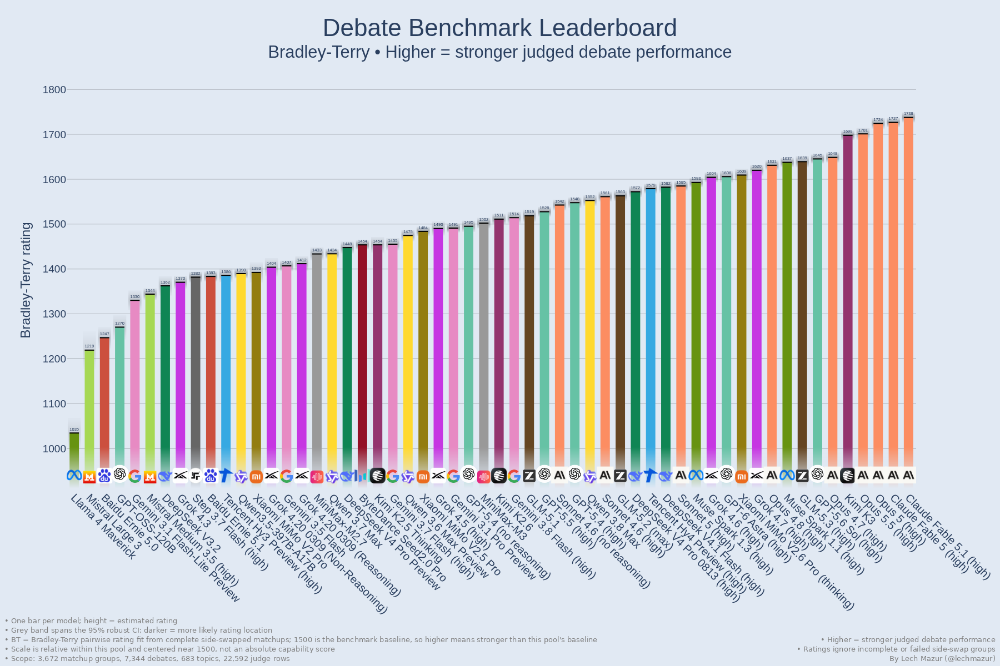
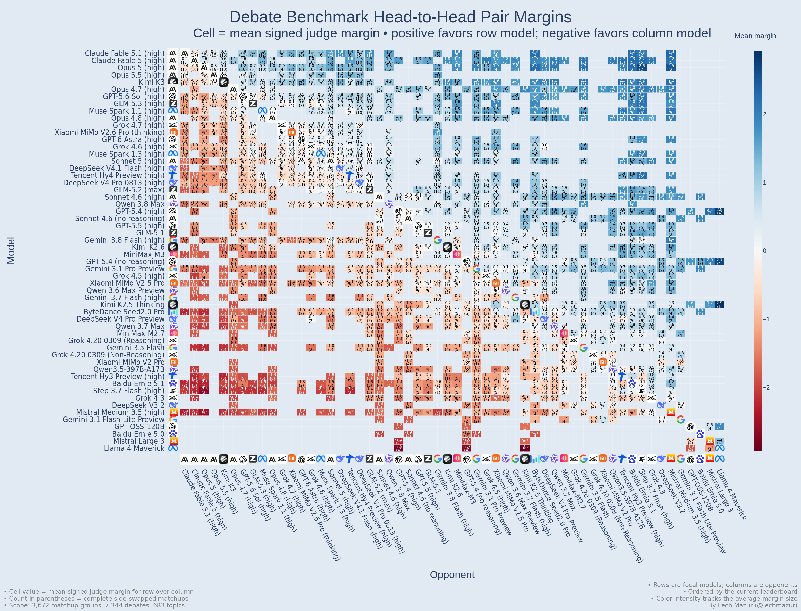
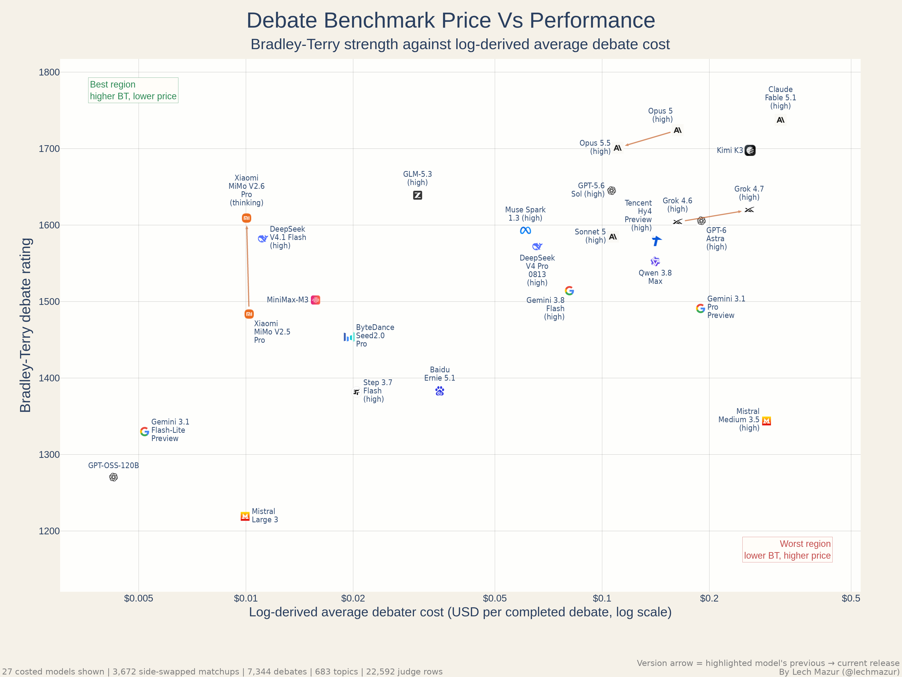
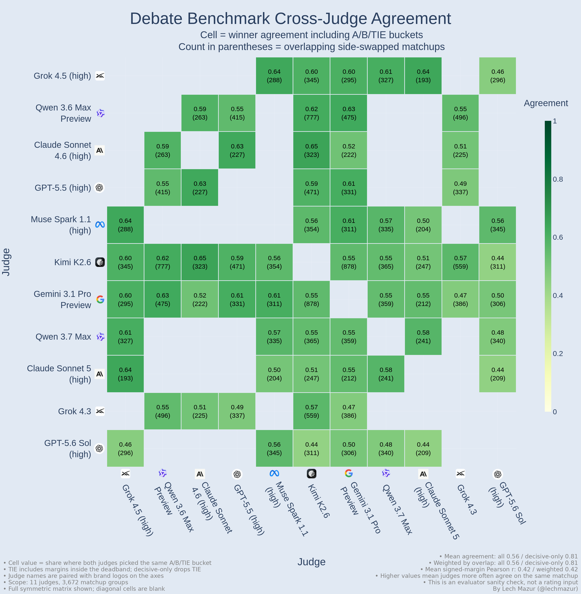
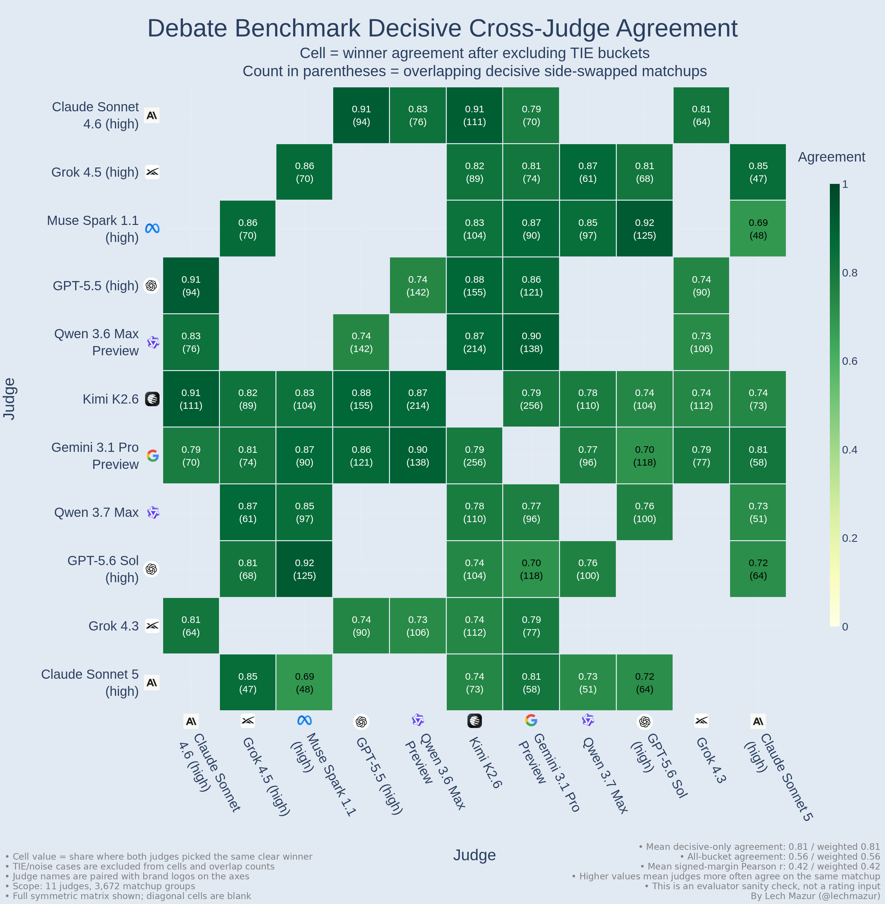
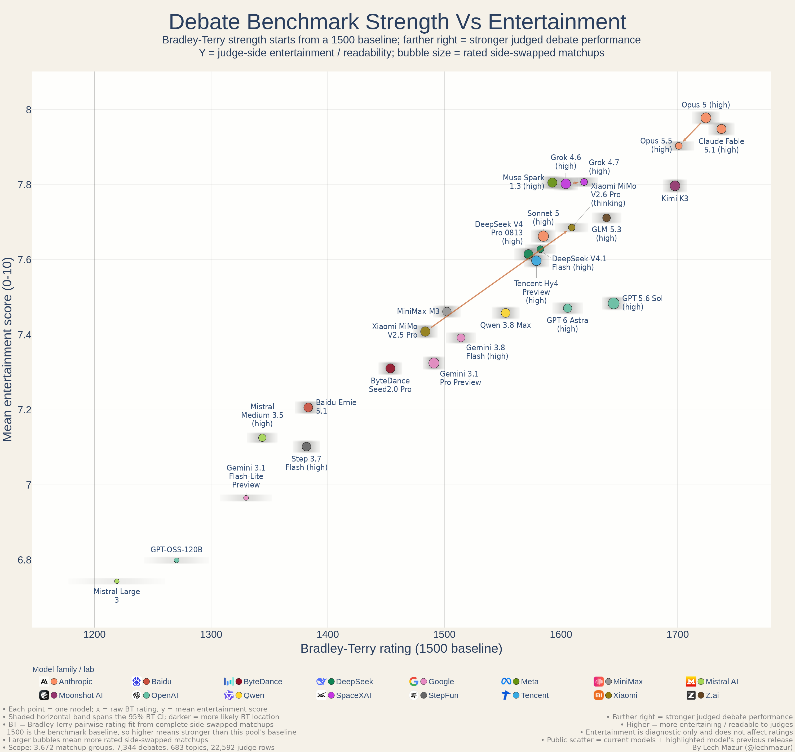
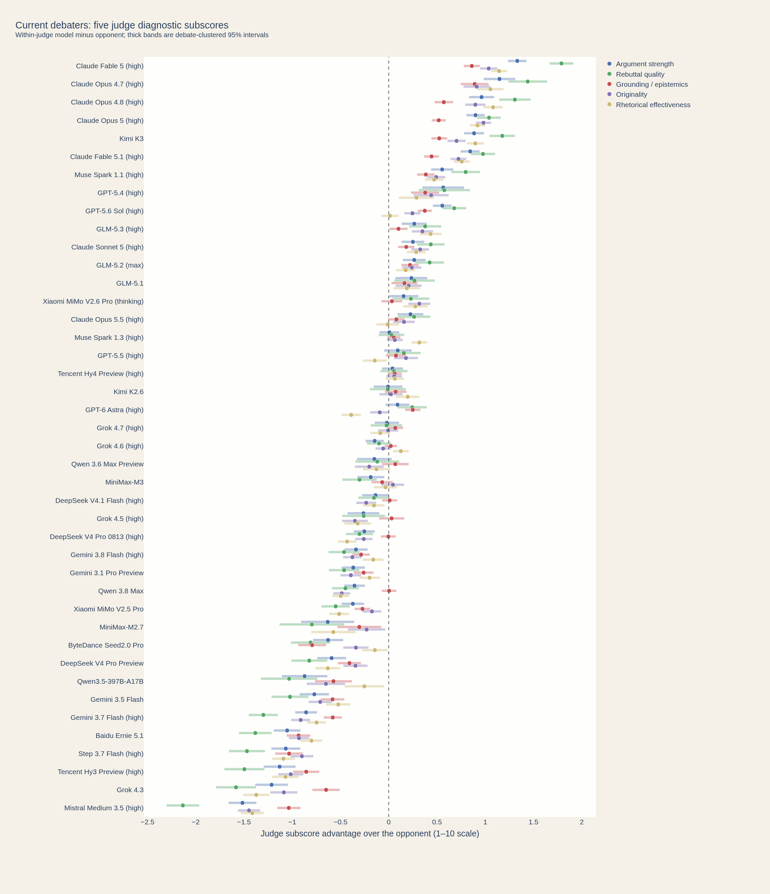
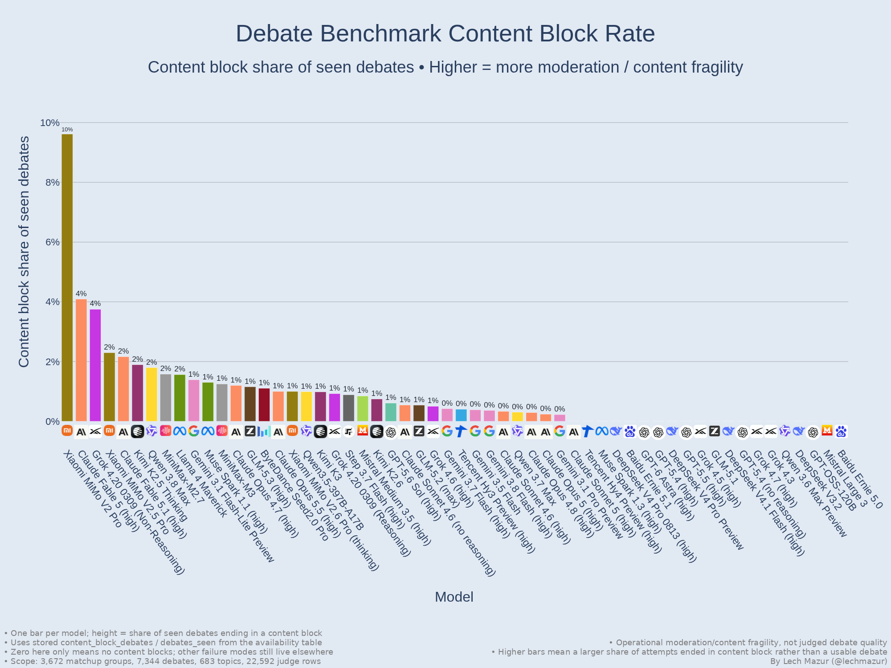
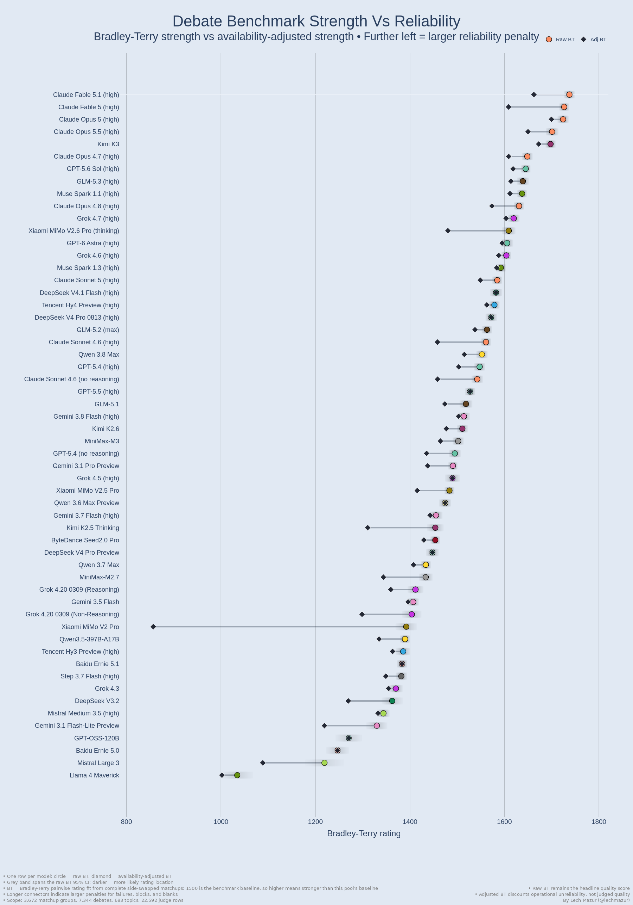
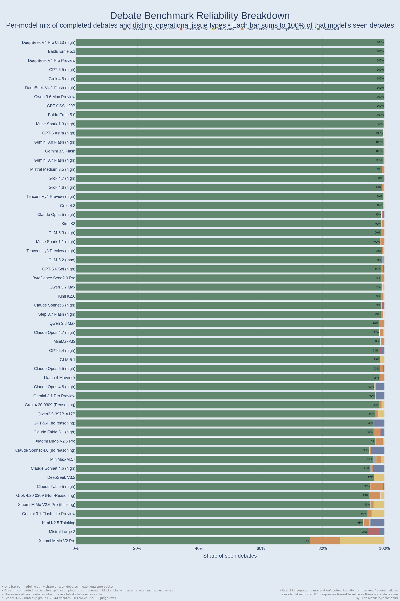

# LLM Debate Benchmark: Adversarial Multi-Turn Argument Under Opposition

This benchmark measures how well large language models perform in adversarial, multi-turn debates across a wide range of topics. Strong performance requires more than a polished opening: models need broad knowledge, accurate facts under pressure, strong rebuttal, and the ability to remain coherent and responsive over several rounds.

Each matchup runs twice on the **same motion with sides swapped**. A three-model judge panel decides each debate's winner and margin. The published leaderboard uses Bradley-Terry ratings built from complete side-swapped matchups.

---

---

## How to read the chart

- Higher bars mean stronger judged debate performance.
- Bradley-Terry is a relative within-pool rating centered near `1500`, not an absolute capability score.
- The grey band spans the **95% robust confidence interval**; darker shading means greater relative density.
- The published order uses Bradley-Terry. Glicko-2 remains a secondary scheduling diagnostic.

## Current snapshot — September 24, 2026

- **59 rated model identities** in the complete stored graph; **56** shown publicly
- **3,672 complete side-swapped matchups**, comprising **7,344 debates**, used for ratings
- **22,592 judge decisions** behind the ratings
- **683 topics** represented in the rated corpus

This update focuses on **Claude Opus 5.5 High, Grok 4.7 High, MiMo V2.6 Pro Thinking, and DeepSeek V4.1 Flash High**. Their expansion completed **728 of 740 scheduled debates** and **2,184 judgments**, including newcomer-versus-newcomer matches. Twelve unavailable attempts remain recorded separately.

One side-swapped matchup means two debates on the same motion with PRO and CON roles reversed.

### Model and data scopes

| View | Models | Matchups | Purpose |
| --- | ---: | ---: | --- |
| Complete stored rating graph | 59 | 3,740 represented; 3,672 rated | All retained historical and current results |
| Public leaderboard | 56 | 3,482 represented; 3,424 rated after report-time exclusions | Reader-facing ranking |
| Current qualitative analysis | 43 | 2,926 complete, or 5,852 debates | 42 public behavior cards and four newcomer dossiers |
| Current-focused cost and comparison charts | 27 | — | Current models plus selected predecessors |

The raw judge table contains 22,818 stored decisions; 22,592 belong to complete matchups used for ratings. These scopes answer different questions, so their counts are not expected to match. The full leaderboard retains historical comparisons; current-focused charts hide superseded versions except selected predecessors. The September 5 blind participant-judging study is a separate historical diagnostic and does not feed the leaderboard.

## Reader paths

1. **Ranking:** start with the chart above, the [full leaderboard report](reports/debate_leaderboard__judge_judge_blend_20260923_finala__debate_all_templates.md), and the [new-entrant analysis](reports/frontier_expansion_20260923_final_analysis.md).
2. **Design checks:** inspect the [pairwise heatmap](#pairwise-view), [judge agreement](#judge-sanity-checks), and [status report](reports/debate_benchmark_status__judge_judge_blend_20260923_finala__debate_all_templates.md).
3. **How models debate:** use the [behavior model cards](reports/debate_behavior_model_cards__judge_judge_blend_20260923_finala__debate_all_templates__gpt-5.6-medium.md) and [four newcomer dossiers](reports/debate_model_dossiers__judge_judge_blend_20260923_finala__debate_all_templates__gpt-5.6-medium__reviewed.md), plus the [quantitative model profiles](reports/debate_model_profiles__judge_judge_blend_20260923_finala__debate_all_templates.md).
4. **Individual debates:** browse the [matchup results index](reports/debate_matchup_judgments__judge_judge_blend_20260923_finala__debate_all_templates.md) and [published transcripts](transcripts/).
5. **Topic coverage:** see the [summaries by subject and question type](#topics).

## Pairwise view

Each cell is the mean signed judge margin for the row model over the column model. Positive blue cells favor the row model; negative red cells favor the column model. The number in parentheses is the count of complete side-swapped matchups for that head-to-head. Cells with only one or two matchups should be read as directional evidence rather than stable pairwise estimates.

## Bradley-Terry leaderboard

| Rank | Model | BT | Matchups |
| ---: | --- | ---: | ---: |
| 1 | Claude Fable 5.1 (high) | 1737.6 | 177 |
| 2 | Claude Fable 5 (high) | 1726.5 | 205 |
| 3 | Claude Opus 5 (high) | 1724.2 | 207 |
| 4 | Claude Opus 5.5 (high) | 1701.0 | 97 |
| 5 | Kimi K3 | 1697.7 | 200 |
| 6 | Claude Opus 4.7 (high) | 1648.5 | 120 |
| 7 | GPT-5.6 Sol (high) | 1645.1 | 242 |
| 8 | GLM-5.3 (high) | 1639.0 | 128 |
| 9 | Muse Spark 1.1 (high) | 1637.5 | 189 |
| 10 | Claude Opus 4.8 (high) | 1630.9 | 165 |
| 11 | Grok 4.7 (high) | 1619.8 | 99 |
| 12 | Xiaomi MiMo V2.6 Pro (thinking) | 1609.2 | 92 |
| 13 | GPT-6 Astra (high) | 1605.6 | 152 |
| 14 | Grok 4.6 (high) | 1604.1 | 197 |
| 15 | Muse Spark 1.3 (high) | 1592.6 | 179 |
| 16 | Claude Sonnet 5 (high) | 1584.9 | 217 |
| 17 | DeepSeek V4.1 Flash (high) | 1582.3 | 100 |
| 18 | Tencent Hy4 Preview (high) | 1578.9 | 194 |
| 19 | DeepSeek V4 Pro 0813 (high) | 1572.1 | 174 |
| 20 | GLM-5.2 (max) | 1563.1 | 182 |
| 21 | Claude Sonnet 4.6 (high) | 1561.0 | 139 |
| 22 | Qwen 3.8 Max | 1552.5 | 163 |
| 23 | GPT-5.4 (high) | 1547.6 | 131 |
| 24 | Claude Sonnet 4.6 (no reasoning) | 1542.4 | 85 |
| 25 | GPT-5.5 (high) | 1527.5 | 126 |
| 26 | GLM-5.1 | 1518.7 | 99 |
| 27 | Gemini 3.8 Flash (high) | 1514.2 | 136 |
| 28 | Kimi K2.6 | 1511.0 | 131 |
| 29 | MiniMax-M3 | 1502.2 | 156 |
| 30 | GPT-5.4 (no reasoning) | 1495.1 | 95 |
| 31 | Gemini 3.1 Pro Preview | 1491.0 | 215 |
| 32 | Grok 4.5 (high) | 1490.2 | 122 |
| 33 | Xiaomi MiMo V2.5 Pro | 1483.7 | 187 |
| 34 | Qwen 3.6 Max Preview | 1474.6 | 84 |
| 35 | Gemini 3.7 Flash (high) | 1455.2 | 117 |
| 36 | Kimi K2.5 Thinking | 1453.8 | 73 |
| 37 | ByteDance Seed2.0 Pro | 1453.7 | 176 |
| 38 | DeepSeek V4 Pro Preview | 1447.7 | 128 |
| 39 | Qwen 3.7 Max | 1433.8 | 156 |
| 40 | MiniMax-M2.7 | 1433.5 | 89 |
| 41 | Grok 4.20 0309 (Reasoning) | 1411.8 | 49 |
| 42 | Gemini 3.5 Flash | 1406.9 | 129 |
| 43 | Grok 4.20 0309 (Non-Reasoning) | 1403.9 | 36 |
| 44 | Xiaomi MiMo V2 Pro | 1392.2 | 30 |
| 45 | Qwen3.5-397B-A17B | 1389.7 | 91 |
| 46 | Tencent Hy3 Preview (high) | 1385.7 | 122 |
| 47 | Baidu Ernie 5.1 | 1383.3 | 168 |
| 48 | Step 3.7 Flash (high) | 1381.8 | 160 |
| 49 | Grok 4.3 | 1370.3 | 88 |
| 50 | DeepSeek V3.2 | 1362.4 | 41 |
| 51 | Mistral Medium 3.5 (high) | 1343.9 | 117 |
| 52 | Gemini 3.1 Flash-Lite Preview | 1330.0 | 31 |
| 53 | GPT-OSS-120B | 1270.4 | 31 |
| 54 | Baidu Ernie 5.0 | 1246.8 | 16 |
| 55 | Mistral Large 3 | 1219.2 | 22 |
| 56 | Llama 4 Maverick | 1034.5 | 29 |

`BT` is the headline Bradley-Terry rating. `Matchups` counts complete side-swapped matchup groups.

### What stands out

- **Claude Fable 5.1 remains first** at 1737.6, followed by Fable 5 at 1726.5 and Opus 5 at 1724.2. Their confidence intervals overlap.
- **Claude Opus 5.5 enters at #4** with 1701.0 across 97 complete matchups, 23.2 points below Opus 5.
- **Grok 4.7 reaches #11** at 1619.8, up 15.7 points from Grok 4.6. Their confidence intervals overlap.
- **MiMo V2.6 Pro Thinking reaches #12** at 1609.2, up 125.5 points from MiMo V2.5 Pro. It has 92 complete matchups; availability remains weaker than its debate-quality ranking.
- **DeepSeek V4.1 Flash reaches #17** at 1582.3 across 100 complete matchups. DeepSeek V4 Pro 0813 scores 1572.1; Flash and Pro are distinct variants, so this is a same-family comparison.
- **Each newcomer has 92–100 complete matchups against 13–17 opponents.** All six newcomer-to-newcomer pairings were included. Confidence intervals and pairwise coverage matter more than small rank differences.

## Price vs. performance

Higher and further left is better. The x-axis is average debater-side USD per completed, rating-eligible debate, calculated from recorded token usage and applicable prices or provider-reported request costs. It accounts for the number of input and output tokens actually used, including recorded reasoning tokens and cache or batch discounts. It covers accepted turns and excludes failed attempts and judging.

Cost coverage is reported per model; models without usable cost data are omitted. Arrows connect the focused models to their recorded predecessors where available. DeepSeek Pro is a separate comparison variant, not a Flash predecessor.

DeepSeek V4.1 Flash averages **$0.01117 per debate (1.12¢)** across 200 debates with complete recorded token usage. Its estimate uses the full-week weighted average of the scheduled rates: **20.83% peak and 79.17% off-peak**, independent of when requests ran.

## Judge sanity checks

The rating graph is connected. Mean all-bucket cross-judge winner agreement is `0.556`. Decisive-only agreement is `0.806`: it considers only judge pairs where both selected a clear winner, excluding cases where either judge returned a tie or noise-level result. Mean absolute presented-side margin bias is `0.183` on the signed-margin scale. Panels use three distinct model families and avoid same-family judges against debaters when feasible.

The active judge pool is GPT-5.6 Sol (high), Claude Sonnet 5 (high), Gemini 3.1 Pro Preview, Qwen 3.7 Max, Grok 4.5 (high), Kimi K2.6, and Muse Spark 1.1 (high). The combined rating graph also retains judgments from earlier panels.

The first heatmap includes Side A, Side B, and tie/noise buckets. The second asks the narrower question: when both judges chose a clear winner, how often did they choose the same winner? These are evaluator-consistency diagnostics, not a second leaderboard.

## How do models judge their own debates?

In the September 5 study, the eight highest-ranked latest-version models at selection time blindly judged **450 debates against one another**, covering all 28 pairings and 225 side-swapped matchups. Each participant evaluated each debate twice, with anonymous A/B labels and display order reversed: **1,800 valid judgments** in total. Judgments include a winner, a 0–5 margin, and five 1–10 diagnostic scores.

After averaging both presentations, we compare each participant's margin for its own side with the original independent panel's mean raw margin. Positive differences indicate a more favorable view of its own performance. Brackets show 95% confidence intervals clustered by topic.

| Participant | Own minus panel margin, 95% CI | Panel-awarded losses acknowledged |
| --- | ---: | ---: |
| Claude Fable 5.1 (high) | +0.02 [−0.13, +0.18] | 8/14 (57%) |
| Claude Opus 5 (high) | −0.03 [−0.21, +0.12] | 16/23 (70%) |
| Kimi K3 | +0.26 [+0.10, +0.42] | 21/37 (57%) |
| GLM-5.3 (high) | −0.02 [−0.23, +0.18] | 25/44 (57%) |
| GPT-6 Astra (high) | +2.33 [+2.13, +2.54] | 1/69 (1%) |
| Grok 4.6 (high) | +0.32 [+0.16, +0.48] | 47/73 (64%) |
| Muse Spark 1.3 (high) | +0.22 [−0.02, +0.47] | 31/52 (60%) |
| Claude Sonnet 5 (high) | +0.23 [+0.02, +0.43] | 40/60 (67%) |

**Astra is the clear outlier in this sample.** Against Fable 5.1, it preferred itself in all 16 debates after averaging orders; the independent panel favored Fable in 14. Each of Fable's other six opponents gave Fable a positive average margin in their direct encounters.

Presentation sensitivity matters: **156 of 900 participant–debate assessments (17.3%) picked opposite winners across the two presentations**. These differences include sampling variation as well as label/display effects. We average both orders and retain graded margins and ties. Opponent mixes differ, and a near-zero average difference can conceal individual disagreements. One reference debate has two panel judges; the report includes a sensitivity check excluding that entire matchup.

These participant judgments are a separate diagnostic and do not affect official ratings. See the [full report and per-model summaries](participant_judging/participant_blind_top8_20260905a/report.md), [order-sensitivity chart](participant_judging/participant_blind_top8_20260905a/presentation_effect.png), and [individual judgments with explanations](participant_judging/participant_blind_top8_20260905a/examples.md).

## Debate quality signal

The benchmark tracks an entertainment/readability score as a diagnostic only; it does not affect ratings. Across chart-visible complete matchups, the mean is `7.49 / 10`. The highest model averages include Claude Opus 5, Claude Fable 5.1, Claude Opus 5.5, Grok 4.7, and Muse Spark 1.3.

See the [entertainment report](reports/debate_entertainment_report__judge_judge_blend_20260923_finala__debate_all_templates.md) for model and matchup details.

## Qualitative behavior

The September 24 analysis covers every eligible complete side-swapped matchup within its 43-model comparison roster, including all four highlighted newcomers:

- **5,852 / 5,852 debates** with blinded transcript annotations and behavior-to-outcome linkage
- **2,926 / 2,926 side-swapped matchups** with paired behavior synthesis
- **42 public behavior model cards** with judge diagnostics and transcript evidence; report-suppressed models remain in the stored analysis
- **Four new reviewed dossiers:** Claude Opus 5.5 High, Grok 4.7 High, MiMo V2.6 Pro Thinking, and DeepSeek V4.1 Flash High

The dossiers describe recurring strengths, weaknesses, execution, and behavior across assigned sides. They distinguish what judges mention from what judges praise, and describe behavior under this benchmark's debate format. Earlier dossiers remain available as dated snapshots.

- [Behavior model cards](reports/debate_behavior_model_cards__judge_judge_blend_20260923_finala__debate_all_templates__gpt-5.6-medium.md)
- [Four newcomer dossiers](reports/debate_model_dossiers__judge_judge_blend_20260923_finala__debate_all_templates__gpt-5.6-medium__reviewed.md)
- [September 4 model dossiers](reports/debate_model_dossiers__judge_judge_blend_glm53_coverage_20260904a__debate_all_templates__gpt-5.6-medium__reviewed.md)
- [Deterministic qualitative audit](reports/debate_qualitative_behavior__judge_judge_blend_20260923_finala__debate_all_templates.md)
- [Current quantitative model profiles](reports/debate_model_profiles__judge_judge_blend_20260923_finala__debate_all_templates.md)

### Historical qualitative readings

The March 2026 close readings remain available as a dated, deliberately selected sample. They show the arguments and judge reasoning behind individual results, rather than representative estimates of current model behavior:

- [Transcript evidence and judge notes](reports/qualitative_model_comparisons__judge_judge_active_20260321b__debate_placement_active_20260320f.md)
- [Debate-by-debate summaries](reports/qualitative_model_comparison_summaries__judge_judge_active_20260321b__debate_placement_active_20260320f__gpt-5.4-medium.md)
- [Cross-model synthesis](reports/qualitative_model_comparison_synthesis__judge_judge_active_20260321b__debate_placement_active_20260320f__gpt-5.4-medium.md)

## Reliability

Content blocks, blank outputs, formatting failures, and model-service failures are tracked separately from debate quality. The availability-adjusted view shows how reliability would change model strength if completion problems were penalized; it does not change how completed debates were judged.

## Topics

The topic bank contains **683 motions**, spanning policy, empirical, and moral disputes intended to be understandable to an informed generalist. All 683 appear in the complete stored rating graph. The tables count distinct topics, not debates; individual models have different topic coverage.

| Theme | Topic bank | Topics with debates | Topics used for ratings |
| --- | ---: | ---: | ---: |
| Law / regulation / courts | 135 | 135 | 135 |
| Labor / education / social policy | 122 | 122 | 122 |
| Media / culture / internet | 111 | 111 | 111 |
| Macro / trade / industrial policy | 108 | 108 | 108 |
| Health / bioethics | 65 | 65 | 65 |
| Energy / climate / infrastructure | 49 | 49 | 49 |
| Science / space / frontier tech | 34 | 34 | 34 |
| Business / antitrust / market structure | 28 | 28 | 28 |
| Geopolitics / defense / security | 24 | 24 | 24 |
| AI / tech policy | 7 | 7 | 7 |
| **Total** | **683** | **683** | **683** |

| Question type | Topic bank | Topics with debates | Topics used for ratings |
| --- | ---: | ---: | ---: |
| Mixed | 466 | 466 | 466 |
| Normative | 151 | 151 | 151 |
| Empirical | 66 | 66 | 66 |
| **Total** | **683** | **683** | **683** |

## Worked examples

### New-entrant examples

- **Claude Opus 5.5 vs Grok 4.7** on children’s digital wellbeing. Each won unanimously, 3–0, as CON, leaving the paired result tied. Both challenged whether sleep, boredom, and play adequately address product-specific harms such as grooming and unwanted purchases. Read [Debate A](transcripts/prop_0270__claude-opus-5-5-high__grok-4.7-high__s0__tpl_placement_active_20260813a.md), [Debate B](transcripts/prop_0270__grok-4.7-high__claude-opus-5-5-high__s1__tpl_placement_active_20260813a.md), and the [matchup report](reports/debate_matchup_judgments/judge_judge_blend_20260923_finala__debate_all_templates/matchup-judgment-prop_0270-claude-opus-5-5-high-vs-grok-4.7-high.md).
- **DeepSeek V4.1 Flash vs MiMo V2.6 Pro Thinking** on whether the British economy would be stronger without Brexit. Each won unanimously, 3–0, as PRO, again producing a paired tie. The clash turns on the relevant counterfactual: whether avoiding Brexit's additional costs would improve an economy that still faces domestic structural problems. Read [Debate A](transcripts/prop_0030__deepseek-v4.1-flash-high__mimo-v2.6-pro-thinking__s0__tpl_placement_active_20260813a.md), [Debate B](transcripts/prop_0030__mimo-v2.6-pro-thinking__deepseek-v4.1-flash-high__s1__tpl_placement_active_20260813a.md), and the [matchup report](reports/debate_matchup_judgments/judge_judge_blend_20260923_finala__debate_all_templates/matchup-judgment-prop_0030-deepseek-v4.1-flash-high-vs-mimo-v2.6-pro-thinking.md).

These pairs illustrate why a single debate direction can be misleading.

### Earlier model comparison

**Claude Opus 4.8 vs Claude Opus 5** on banning corporate political donations: Opus 4.8 won the first direction 2–1 as PRO; Opus 5 won the reverse direction 3–0 as PRO and won the paired result. Every judge rated both debates 9 / 10 for entertainment. Read [Debate A](transcripts/prop_0379__claude-opus-4-8-adaptive__claude-opus-5-high__s0__tpl_placement_active_20260320f.md), [Debate B](transcripts/prop_0379__claude-opus-5-high__claude-opus-4-8-adaptive__s1__tpl_placement_active_20260320f.md), and the [matchup report](reports/debate_matchup_judgments/judge_judge_blend_20260923_finala__debate_all_templates/matchup-judgment-prop_0379-claude-opus-4-8-adaptive-vs-claude-opus-5-high.md).

## Best lines

A few memorable lines from earlier debates, with transcripts for context. These are examples of rhetoric, not inputs to the ratings.

> You cannot reject a trap you cannot see.

— **Qwen3.5-397B-A17B**, arguing for a ban on personalized algorithmic pricing. [Transcript](transcripts/prop_0041__qwen3.5-397b-a17b__minimax-m2.7__s1__tpl_placement_active_20260320f.md)

> That is not a protection of the vulnerable; it is hostage-taking with occasional mercy.

— **MiniMax-M2.7**, challenging the claim that personalized pricing protects low-income shoppers. [Transcript](transcripts/prop_0041__minimax-m2.7__qwen3.5-397b-a17b__s0__tpl_placement_active_20260320f.md)

> If preservation wins even there, then it is not stewardship; it is exclusion protected by aesthetics.

— **GPT-5.4 (high)**, arguing for housing density in historic districts. [Transcript](transcripts/prop_0003__gpt-5.4-high__minimax-m2.7__s0__tpl_placement_active_20260320f.md)

## Method summary

For each selected model pair and topic:

1. The two models debate the proposition in a ten-turn format.
2. They debate the same proposition again with PRO and CON reversed.
3. Full prompts, raw responses, parsed turns, and transcripts are retained.
4. A three-model judge panel selects a winner and margin for each debate.
5. Complete side-swapped groups feed Bradley-Terry; rubric subscores remain diagnostic.

The ten turns are PRO opening, CON opening, first rebuttals, pressure questions, second rebuttals, and closings. Output length is enforced by deterministic clipping, so the stored text—not a model's self-reported word count—is authoritative.

Bradley-Terry estimates relative strength from paired outcomes while accounting for opponent strength. This makes comparisons across uneven schedules more useful than a raw win rate or an average of rubric scores. Swapping sides reduces the influence of an easier position on a particular motion; multiple judges and confidence intervals help show the remaining uncertainty.

## Limits and caveats

- This is a live benchmark, not a frozen final release.
- It uses LLM judges rather than human judges, though side swaps, multiple judges, distinct judge families, and agreement diagnostics reduce some noise.
- Matchup schedules are intentionally non-uniform, so confidence intervals and the pairwise matrix matter.
- Qualitative tags and dossier prose come from GPT-5.6 Sol (medium), not human coders.
- Availability and content-filter behavior can materially affect coverage; reliability is reported separately.
- Debate is one capability slice, not a complete measure of model usefulness.

## Further reading and data

- [Leaderboard report](reports/debate_leaderboard__judge_judge_blend_20260923_finala__debate_all_templates.md)
- [Benchmark status](reports/debate_benchmark_status__judge_judge_blend_20260923_finala__debate_all_templates.md)
- [Matchup results index](reports/debate_matchup_judgments__judge_judge_blend_20260923_finala__debate_all_templates.md)
- [New-entrant analysis](reports/frontier_expansion_20260923_final_analysis.md)
- [Judge decision table](judgments/judge_results__judge_blend_20260923_finala.csv)
- [Full judge decision records (gzip-compressed JSONL)](judgments/judge_results__judge_blend_20260923_finala.jsonl.gz)
- [Completed public transcripts](transcripts/)

### Reproducibility checks

- [Proxy-error integrity audit](reports/debate_proxy_error_audit__judge_judge_blend_20260923_finala__debate_all_templates.md)
- Public judgment exports omit local prompt and raw-response filesystem paths; canonical raw artifacts remain retained in the benchmark data store.

## Related benchmarks

- [LLM Sycophancy Benchmark](https://github.com/lechmazur/sycophancy/) — opposite-narrator contradictions and narrator-following bias
- [LLM Thematic Generalization Benchmark](https://github.com/lechmazur/generalization/) — latent-category induction from examples and counterexamples
- [LLM Creative Story-Writing Benchmark](https://github.com/lechmazur/writing/) — short-story quality under fixed required elements
- [BAZAAR: Auction Market Benchmark](https://github.com/lechmazur/bazaar/) — strategic bidding in a competitive simulated market
- [Buyout Game Benchmark](https://github.com/lechmazur/buyout_game/) — multi-agent bargaining, transfers, and hostile takeovers
- [PACT](https://github.com/lechmazur/pact/) — multi-round buyer-seller bargaining with hidden values and public messages
- [LLM Persuasion Benchmark](https://github.com/lechmazur/persuasion/) — multi-turn persuasion measured by opinion movement
- [LLM Round-Trip Translation Benchmark](https://github.com/lechmazur/translation/) — meaning and voice retained after translation out of English and back
- [Step Race](https://github.com/lechmazur/step_game/) — collaboration and misdirection under pressure
- [Elimination Game](https://github.com/lechmazur/elimination_game/) — social reasoning, deception, and jury persuasion
- [Extended NYT Connections](https://github.com/lechmazur/nyt-connections/) — category induction with distractors

## Updates

- `2026-09-24`: Added Opus 5.5 High, Grok 4.7 High, MiMo V2.6 Pro Thinking, and DeepSeek V4.1 Flash High.

- `2026-09-05`: Added blind participant judging among the current top eight: 450 debates, both presentation orders, graded margins, and per-model summaries.
- `2026-09-04`: Added GPT-6 Astra (high) and GLM-5.3 (high), expanded opponent coverage for highlighted models, completed six new qualitative profiles, and refreshed the cost chart using recorded token usage.

- `2026-09-03`: Added Claude Fable 5.1 (high), Tencent Hy4 Preview (high), Gemini 3.8 Flash (high), and Muse Spark 1.3 (high) after two-stage adaptive placement.
- `2026-08-14`: Added Grok 4.6 (high), Gemini 3.7 Flash (high). Added qualitative behavior coverage and current-model dossiers.
- `2026-08-04`: Added Qwen 3.8 Max.
- `2026-07-24`: Added Claude Opus 5 (high).
- `2026-07-17`: Added Kimi K3.
- `2026-07-13`: Added MiniMax-M3, Claude Sonnet 5 (high), Grok 4.5 (high), GPT-5.6 Sol (high), and Muse Spark 1.1 (high).
- `2026-06-20`: Added GLM-5.2 (max).
- `2026-06-10`: Added Claude Fable 5 (high).

---
