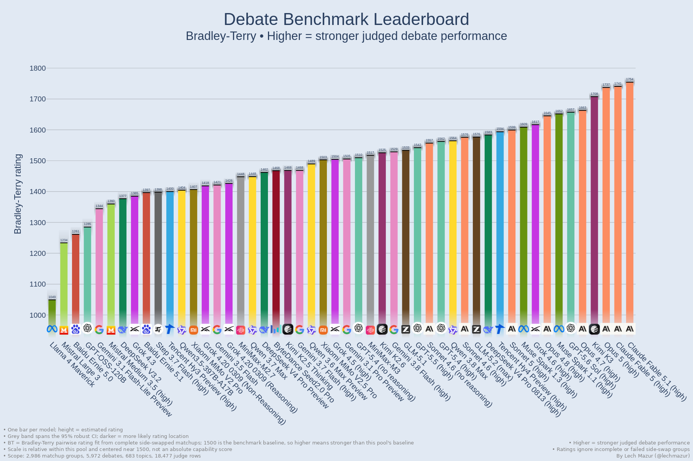
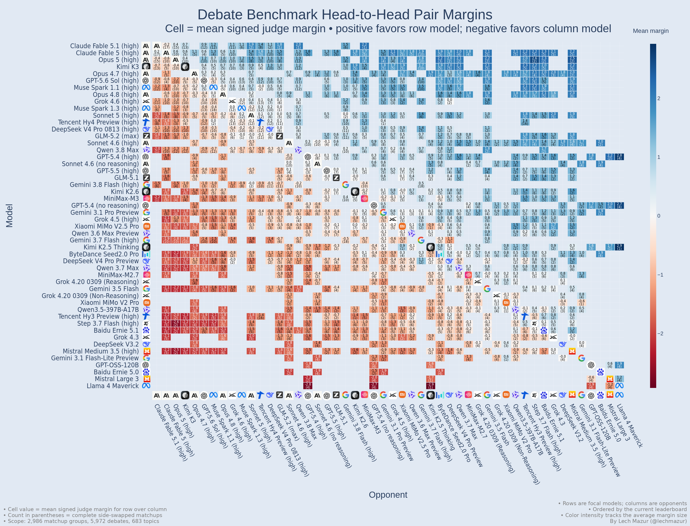
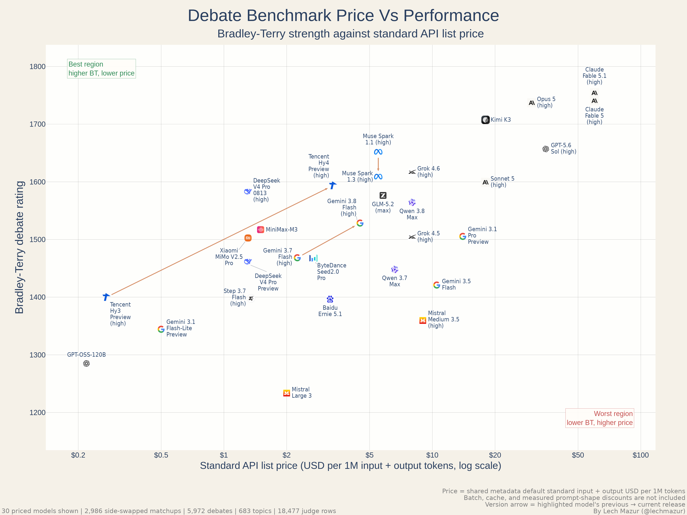
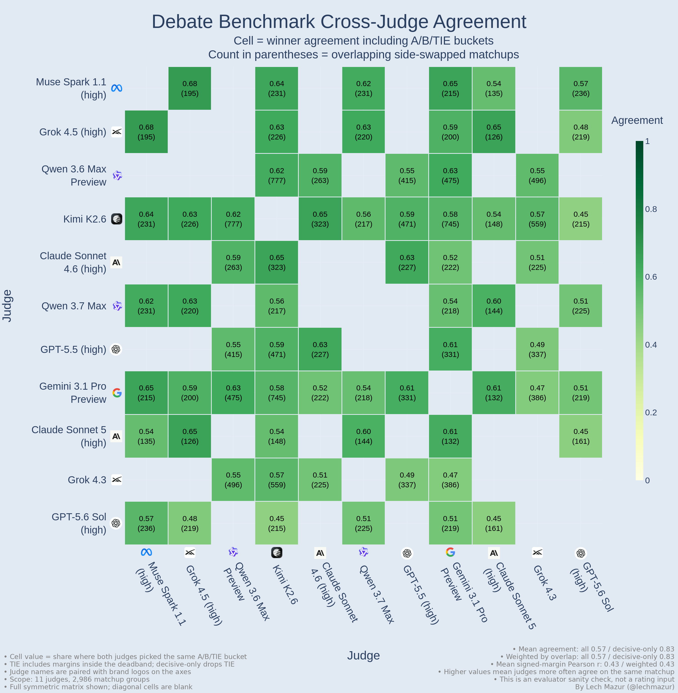
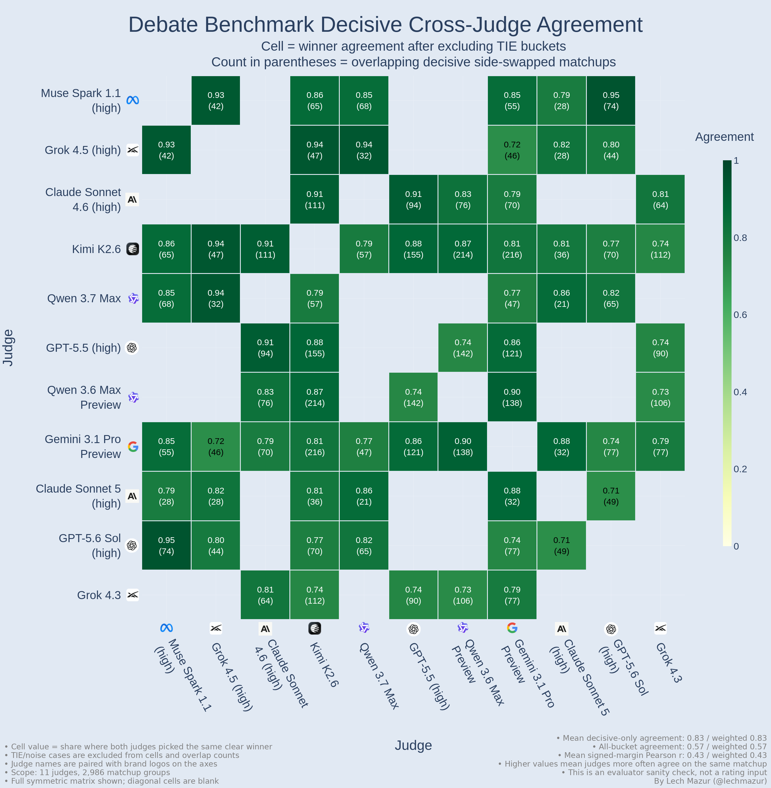
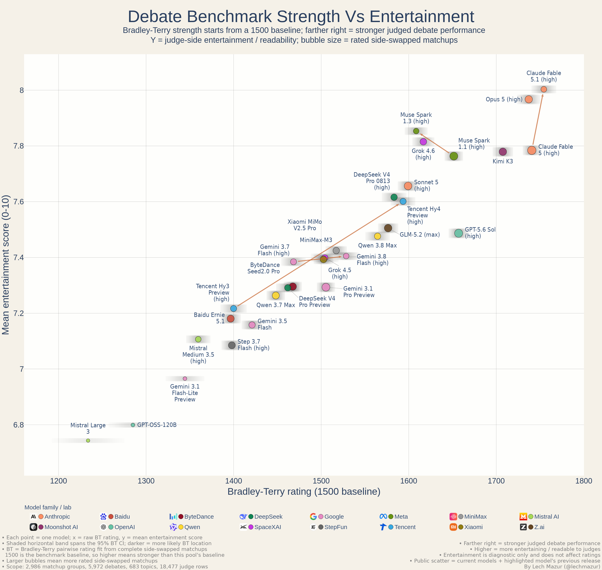
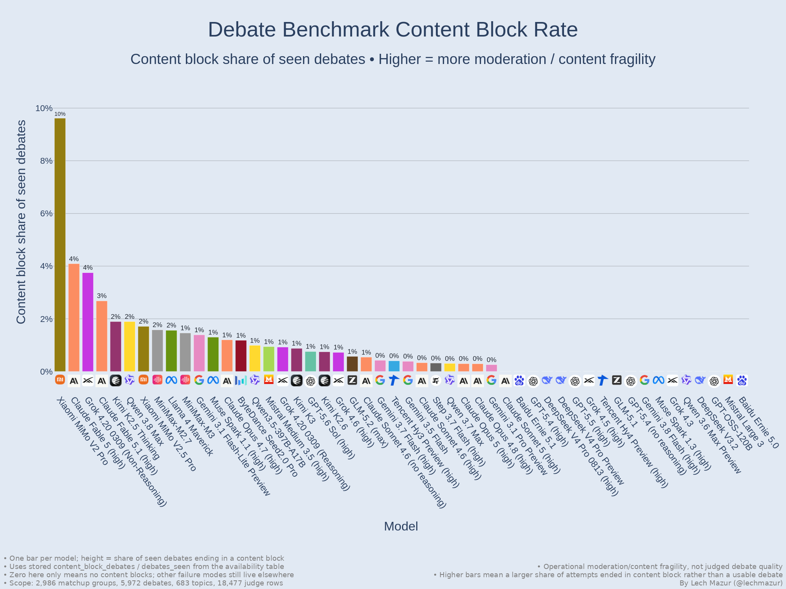
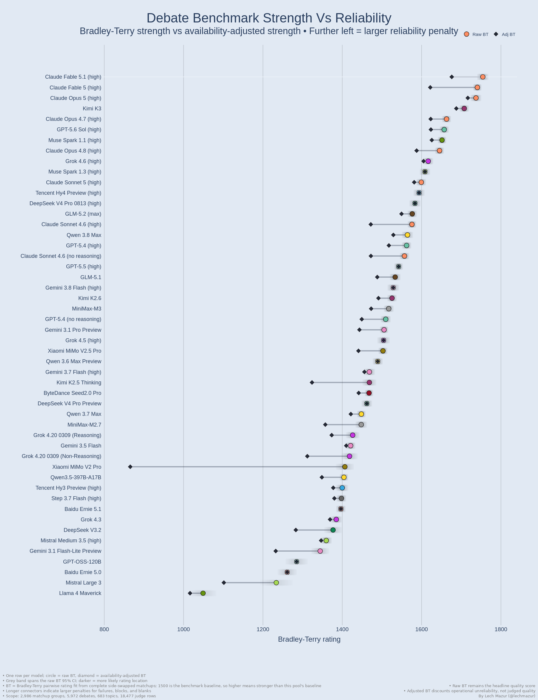
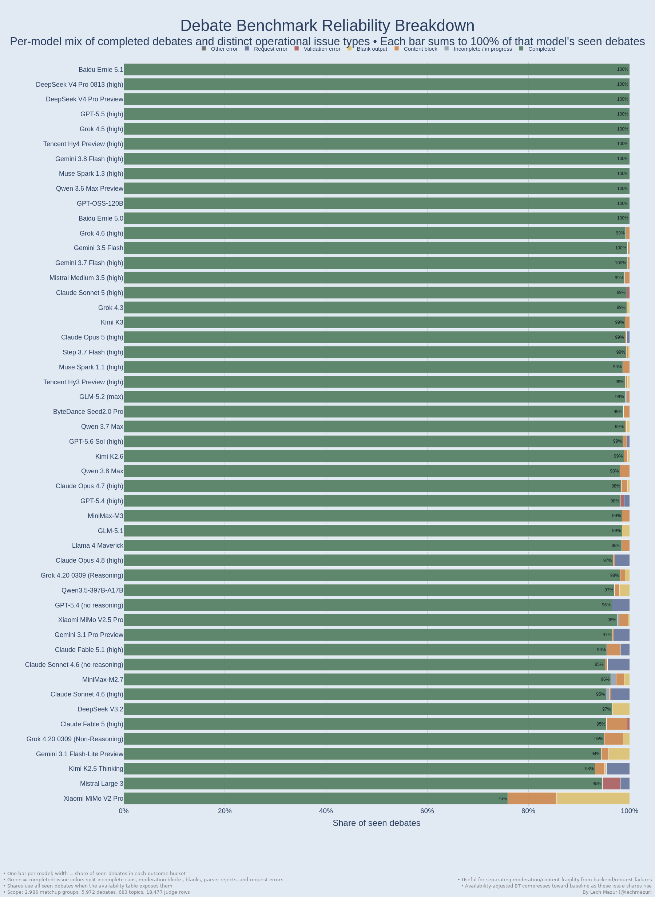

# LLM Debate Benchmark: Adversarial Multi-Turn Argument Under Opposition

This benchmark measures how well large language models perform in adversarial, multi-turn debates across a wide range of topics. Strong performance requires more than a polished opening: models need broad knowledge, accurate facts under pressure, strong rebuttal, and the ability to remain coherent and responsive over several rounds.

Each matchup runs twice on the **same motion with sides swapped**. A three-model judge panel decides each debate's winner and margin. The published leaderboard uses Bradley-Terry ratings built from complete side-swapped matchups.

---

---

## How to read the chart

- Higher bars mean stronger judged debate performance.
- Bradley-Terry is a relative within-pool rating centered near `1500`, not an absolute capability score.
- The grey band spans the **95% robust confidence interval**; darker shading means greater relative density.
- The published order uses Bradley-Terry. Glicko-2 remains a secondary scheduling diagnostic.

## Current snapshot

- **53 rated model identities** in the complete stored graph; **50** shown publicly
- **2,986 complete side-swapped matchups**, comprising **5,972 debates**, used for ratings
- **18,477 judge decisions** behind the ratings
- **683 topics** represented in the rated corpus

One side-swapped matchup means two debates on the same motion with PRO and CON roles reversed.

### Model and data scopes

| View | Models | Matchups | Purpose |
| --- | ---: | ---: | --- |
| Complete stored rating graph | 53 | 3,039 represented; 2,986 rated | All retained historical and current results |
| Public leaderboard | 50 | 2,781 represented; 2,738 rated after retired or superseded identities are excluded | Reader-facing ranking |
| Current-roster qualitative analysis | 33 | 1,861 rated, or 3,722 debates | Behavior cards and dossiers among current peers only |
| Current-focused cost and comparison charts | 26 | — | Current models plus selected predecessors |

The raw judge table contains 18,658 stored decisions; 18,477 belong to complete matchups used for ratings. These scopes answer different questions, so their counts are not expected to match. The qualitative-analysis row remains the separately frozen August snapshot; the ranking, matchup, profile, reliability, and entertainment views use the current results.

## Reader paths

1. **Ranking:** start with the chart above, the [full leaderboard report](reports/debate_leaderboard__judge_judge_blend_20260902_finala__debate_all_templates.md), and the [new-entrant analysis](reports/frontier_expansion_20260902_final_analysis.md).
2. **Design checks:** inspect the [pairwise heatmap](#pairwise-view), [judge agreement](#judge-sanity-checks), and [status report](reports/debate_benchmark_status__judge_judge_blend_20260902_finala__debate_all_templates.md).
3. **How models debate:** use the frozen-August [behavior model cards](reports/debate_behavior_model_cards__judge_judge_blend_20260814a__debate_all_templates__gpt-5.6-medium.md) and [current-model dossiers](reports/debate_model_dossiers__judge_judge_blend_20260814a__debate_all_templates__gpt-5.6-medium.md), plus the current [model profiles](reports/debate_model_profiles__judge_judge_blend_20260902_finala__debate_all_templates.md).
4. **Individual debates:** browse the [matchup results index](reports/debate_matchup_judgments__judge_judge_blend_20260902_finala__debate_all_templates.md) and [published transcripts](transcripts/).

## Pairwise view

Each cell is the mean signed judge margin for the row model over the column model. Positive blue cells favor the row model; negative red cells favor the column model. The number in parentheses is the count of complete side-swapped matchups for that head-to-head. Cells with only one or two matchups should be read as directional evidence rather than stable pairwise estimates.

## Bradley-Terry leaderboard

| Rank | Model | BT | Matchups |
| ---: | --- | ---: | ---: |
| 1 | Claude Fable 5.1 (high) | 1754.3 | 107 |
| 2 | Claude Fable 5 (high) | 1740.6 | 205 |
| 3 | Claude Opus 5 (high) | 1737.1 | 167 |
| 4 | Kimi K3 | 1707.5 | 169 |
| 5 | Claude Opus 4.7 (high) | 1662.9 | 120 |
| 6 | GPT-5.6 Sol (high) | 1657.0 | 194 |
| 7 | Muse Spark 1.1 (high) | 1651.5 | 189 |
| 8 | Claude Opus 4.8 (high) | 1645.2 | 165 |
| 9 | Grok 4.6 (high) | 1616.7 | 137 |
| 10 | Muse Spark 1.3 (high) | 1608.5 | 100 |
| 11 | Claude Sonnet 5 (high) | 1599.2 | 177 |
| 12 | Tencent Hy4 Preview (high) | 1593.6 | 122 |
| 13 | DeepSeek V4 Pro 0813 (high) | 1583.3 | 135 |
| 14 | GLM-5.2 (max) | 1576.4 | 172 |
| 15 | Claude Sonnet 4.6 (high) | 1575.6 | 139 |
| 16 | Qwen 3.8 Max | 1564.4 | 129 |
| 17 | GPT-5.4 (high) | 1562.2 | 131 |
| 18 | Claude Sonnet 4.6 (no reasoning) | 1556.8 | 85 |
| 19 | GPT-5.5 (high) | 1542.1 | 126 |
| 20 | GLM-5.1 | 1533.4 | 99 |
| 21 | Gemini 3.8 Flash (high) | 1528.5 | 100 |
| 22 | Kimi K2.6 | 1525.5 | 131 |
| 23 | MiniMax-M3 | 1517.2 | 133 |
| 24 | GPT-5.4 (no reasoning) | 1509.6 | 95 |
| 25 | Gemini 3.1 Pro Preview | 1505.4 | 186 |
| 26 | Grok 4.5 (high) | 1504.2 | 122 |
| 27 | Xiaomi MiMo V2.5 Pro | 1502.6 | 140 |
| 28 | Qwen 3.6 Max Preview | 1489.4 | 84 |
| 29 | Gemini 3.7 Flash (high) | 1468.4 | 117 |
| 30 | Kimi K2.5 Thinking | 1468.3 | 73 |
| 31 | ByteDance Seed2.0 Pro | 1467.5 | 164 |
| 32 | DeepSeek V4 Pro Preview | 1461.8 | 128 |
| 33 | Qwen 3.7 Max | 1448.2 | 156 |
| 34 | MiniMax-M2.7 | 1447.8 | 89 |
| 35 | Grok 4.20 0309 (Reasoning) | 1426.2 | 49 |
| 36 | Gemini 3.5 Flash | 1421.0 | 129 |
| 37 | Grok 4.20 0309 (Non-Reasoning) | 1418.3 | 36 |
| 38 | Xiaomi MiMo V2 Pro | 1406.6 | 30 |
| 39 | Qwen3.5-397B-A17B | 1404.2 | 91 |
| 40 | Tencent Hy3 Preview (high) | 1399.9 | 122 |
| 41 | Step 3.7 Flash (high) | 1398.0 | 150 |
| 42 | Baidu Ernie 5.1 | 1396.6 | 156 |
| 43 | Grok 4.3 | 1384.9 | 88 |
| 44 | DeepSeek V3.2 | 1376.8 | 41 |
| 45 | Mistral Medium 3.5 (high) | 1359.6 | 105 |
| 46 | Gemini 3.1 Flash-Lite Preview | 1344.4 | 31 |
| 47 | GPT-OSS-120B | 1285.0 | 31 |
| 48 | Baidu Ernie 5.0 | 1261.2 | 16 |
| 49 | Mistral Large 3 | 1233.7 | 22 |
| 50 | Llama 4 Maverick | 1049.1 | 29 |

`BT` is the headline Bradley-Terry rating. `Matchups` counts complete side-swapped matchup groups.

### What stands out

- **Claude Fable 5.1 takes the top point estimate.** It reaches 1754.3 across 107 complete matchups, narrowly ahead of Fable 5 and Opus 5; the top confidence intervals still overlap.
- **Muse Spark 1.3 places #10.** Its 1608.5 estimate is below Muse Spark 1.1's 1651.5, including a 1–8–9 paired-group record in their direct comparison.
- **Tencent Hy4 Preview places #12.** Its 1593.6 estimate is far above Hy3 Preview's 1399.9.
- **Gemini 3.8 Flash places #21.** Its 1528.5 estimate is well above Gemini 3.7 Flash's 1468.4, with a 9–8–1 direct paired-group record.
- **The adaptive entrants are well sampled.** Fable 5.1 has 107 matchups, Hy4 has 122, and both Gemini 3.8 and Muse 1.3 have 100; see the [new-entrant analysis](reports/frontier_expansion_20260902_final_analysis.md) for stage and opponent breakdowns.
- **Close ranks remain uncertain.** Confidence intervals and pairwise coverage matter more than one- or two-place differences.

## Price vs. performance

Higher and further left is better. The x-axis is estimated debater-side USD per completed debate and excludes judging cost. The current chart uses the best available verified USD pricing metadata; models without usable pricing are omitted rather than assigned a guessed cost.

## Judge sanity checks

The rating graph is connected. Mean all-bucket cross-judge winner agreement is `0.572`. Decisive-only agreement is `0.825`: it considers only judge pairs where both selected a clear winner, excluding cases where either judge returned a tie or noise-level result. Mean absolute presented-side margin bias is `0.173` on the signed-margin scale. Panels use three distinct model families and avoid same-family judges against debaters when feasible.

The first heatmap includes Side A, Side B, and tie/noise buckets. The second asks the narrower question: when both judges chose a clear winner, how often did they choose the same winner? These are evaluator-consistency diagnostics, not a second leaderboard.

## Debate quality signal

The benchmark tracks an entertainment/readability score as a diagnostic only; it does not affect ratings. Across chart-visible complete matchups, the mean is `7.44 / 10`. The highest model averages currently include Claude Fable 5.1, Claude Opus 5, Muse Spark 1.3, Grok 4.6, Claude Fable 5, Kimi K3, Muse Spark 1.1, Claude Opus 4.8, Claude Opus 4.7, and Claude Sonnet 5.

See the [entertainment report](reports/debate_entertainment_report__judge_judge_blend_20260902_finala__debate_all_templates.md) for model and matchup details.

## Qualitative behavior

The separately frozen August qualitative layer covers every eligible current-v-current debate in its 33-model roster. It has not yet been rerun for the four newest highlighted models:

- **3,722 / 3,722 debates** with blinded transcript annotations
- **1,861 / 1,861 side-swapped matchups** with paired behavior synthesis
- **3,722 / 3,722 debates** with behavior-to-outcome linkage
- **11,241 judge rows** feeding judge-consensus and diagnostic summaries
- **33 current-model dossiers** generated from current-peer evidence only

- [Behavior model cards](reports/debate_behavior_model_cards__judge_judge_blend_20260814a__debate_all_templates__gpt-5.6-medium.md)
- [Current-model dossiers](reports/debate_model_dossiers__judge_judge_blend_20260814a__debate_all_templates__gpt-5.6-medium.md)
- [Deterministic qualitative audit](reports/debate_qualitative_behavior__judge_judge_blend_20260814a__debate_all_templates.md)
- [Current quantitative model profiles](reports/debate_model_profiles__judge_judge_blend_20260902_finala__debate_all_templates.md)

## Reliability

Content blocks, blank outputs, formatting failures, and model-service failures are tracked separately from debate quality. The availability-adjusted view shows how reliability would change model strength if completion problems were penalized; it does not change how completed debates were judged.

## New-entrant examples

- **Claude Fable 5.1 vs Claude Opus 5** on safeguards for cross-border commercial surrogacy: [Debate A](transcripts/prop_0539__claude-fable-5-1-high__claude-opus-5-high__s0__tpl_placement_active_20260813a.md), [Debate B](transcripts/prop_0539__claude-opus-5-high__claude-fable-5-1-high__s1__tpl_placement_active_20260813a.md), and the [matchup report](reports/debate_matchup_judgments/judge_judge_blend_20260902_finala__debate_all_templates/matchup-judgment-prop_0539-claude-fable-5-1-high-vs-claude-opus-5-high.md). Mean entertainment: `8.67 / 10`; Fable 5.1 won the paired result.
- **Claude Opus 5 vs Muse Spark 1.3** on opt-in consent for AI dubbing of actors' voices: [Debate A](transcripts/prop_0096__claude-opus-5-high__muse-spark-1.3-high__s0__tpl_placement_active_20260813a.md), [Debate B](transcripts/prop_0096__muse-spark-1.3-high__claude-opus-5-high__s1__tpl_placement_active_20260813a.md), and the [matchup report](reports/debate_matchup_judgments/judge_judge_blend_20260902_finala__debate_all_templates/matchup-judgment-prop_0096-claude-opus-5-high-vs-muse-spark-1.3-high.md). Mean entertainment: `8.50 / 10`; the paired result was a tie.
- **Claude Fable 5.1 vs Tencent Hy4 Preview** on the public value of universal pre-K: [Debate A](transcripts/prop_0089__claude-fable-5-1-high__hy4-preview-high__s0__tpl_placement_active_20260813a.md), [Debate B](transcripts/prop_0089__hy4-preview-high__claude-fable-5-1-high__s1__tpl_placement_active_20260813a.md), and the [matchup report](reports/debate_matchup_judgments/judge_judge_blend_20260902_finala__debate_all_templates/matchup-judgment-prop_0089-claude-fable-5-1-high-vs-hy4-preview-high.md). Mean entertainment: `7.83 / 10`; Fable 5.1 won the paired result.
- **Gemini 3.8 Flash vs Qwen 3.8 Max** on teaching a country's own historical atrocities: [Debate A](transcripts/prop_0072__gemini-3.8-flash-high__qwen3.8-max__s0__tpl_placement_active_20260813a.md), [Debate B](transcripts/prop_0072__qwen3.8-max__gemini-3.8-flash-high__s1__tpl_placement_active_20260813a.md), and the [matchup report](reports/debate_matchup_judgments/judge_judge_blend_20260902_finala__debate_all_templates/matchup-judgment-prop_0072-gemini-3.8-flash-high-vs-qwen3.8-max.md). Mean entertainment: `7.17 / 10`; the paired result was a tie.

## Method summary

For each selected model pair and topic:

1. The two models debate the proposition in a ten-turn format.
2. They debate the same proposition again with PRO and CON reversed.
3. Full prompts, raw responses, parsed turns, and transcripts are retained.
4. A three-model judge panel selects a winner and margin for each debate.
5. Complete side-swapped groups feed Bradley-Terry; rubric subscores remain diagnostic.

The ten turns are PRO opening, CON opening, first rebuttals, pressure questions, second rebuttals, and closings. Output length is enforced by deterministic clipping, so the stored text—not a model's self-reported word count—is authoritative.

## Limits and caveats

- This is a live benchmark, not a frozen final release.
- It uses LLM judges rather than human judges, though side swaps, multiple judges, distinct judge families, and agreement diagnostics reduce some noise.
- Matchup schedules are intentionally non-uniform, so confidence intervals and the pairwise matrix matter.
- Qualitative tags and dossier prose come from GPT-5.6 Sol (medium), not human coders; the GPT-5.6 Sol dossier is self-analysis.
- Availability and content-filter behavior can materially affect coverage; reliability is reported separately.
- Debate is one capability slice, not a complete measure of model usefulness.

## Further reading and data

- [Leaderboard report](reports/debate_leaderboard__judge_judge_blend_20260902_finala__debate_all_templates.md)
- [Benchmark status](reports/debate_benchmark_status__judge_judge_blend_20260902_finala__debate_all_templates.md)
- [Matchup results index](reports/debate_matchup_judgments__judge_judge_blend_20260902_finala__debate_all_templates.md)
- [New-entrant analysis](reports/frontier_expansion_20260902_final_analysis.md)
- [Judge decision table](judgments/judge_results__judge_blend_20260902_finala.csv)
- [Full judge decision records (gzip-compressed JSONL)](judgments/judge_results__judge_blend_20260902_finala.jsonl.gz)
- [Completed public transcripts](transcripts/)

### Reproducibility checks

- [Proxy-error integrity audit](reports/debate_proxy_error_audit__judge_judge_blend_20260902_finala__debate_all_templates.md)
- Public judgment exports omit local prompt and raw-response filesystem paths; canonical raw artifacts remain retained in the benchmark data store.

## Related benchmarks

- [LLM Sycophancy Benchmark](https://github.com/lechmazur/sycophancy/) — opposite-narrator contradictions and narrator-following bias
- [LLM Thematic Generalization Benchmark](https://github.com/lechmazur/generalization/) — latent-category induction from examples and counterexamples
- [LLM Creative Story-Writing Benchmark](https://github.com/lechmazur/writing/) — short-story quality under fixed required elements
- [BAZAAR: Auction Market Benchmark](https://github.com/lechmazur/bazaar/) — strategic bidding in a competitive simulated market
- [Buyout Game Benchmark](https://github.com/lechmazur/buyout_game/) — multi-agent bargaining, transfers, and hostile takeovers
- [PACT](https://github.com/lechmazur/pact/) — multi-round buyer-seller bargaining with hidden values and public messages
- [LLM Persuasion Benchmark](https://github.com/lechmazur/persuasion/) — multi-turn persuasion measured by opinion movement
- [LLM Round-Trip Translation Benchmark](https://github.com/lechmazur/translation/) — meaning and voice retained after translation out of English and back
- [Step Race](https://github.com/lechmazur/step_game/) — collaboration and misdirection under pressure
- [Elimination Game](https://github.com/lechmazur/elimination_game/) — social reasoning, deception, and jury persuasion
- [Extended NYT Connections](https://github.com/lechmazur/nyt-connections/) — category induction with distractors

## Updates

- `2026-09-03`: Added Claude Fable 5.1 (high), Tencent Hy4 Preview (high), Gemini 3.8 Flash (high), and Muse Spark 1.3 (high) after two-stage adaptive placement.
- `2026-08-14`: Added Grok 4.6 (high), Gemini 3.7 Flash (high). Added qualitative behavior coverage and current-model dossiers.
- `2026-08-04`: Added Qwen 3.8 Max.
- `2026-07-24`: Added Claude Opus 5 (high).
- `2026-07-17`: Added Kimi K3.
- `2026-07-13`: Added MiniMax-M3, Claude Sonnet 5 (high), Grok 4.5 (high), GPT-5.6 Sol (high), and Muse Spark 1.1 (high).
- `2026-06-20`: Added GLM-5.2 (max).
- `2026-06-10`: Added Claude Fable 5 (high).

---
