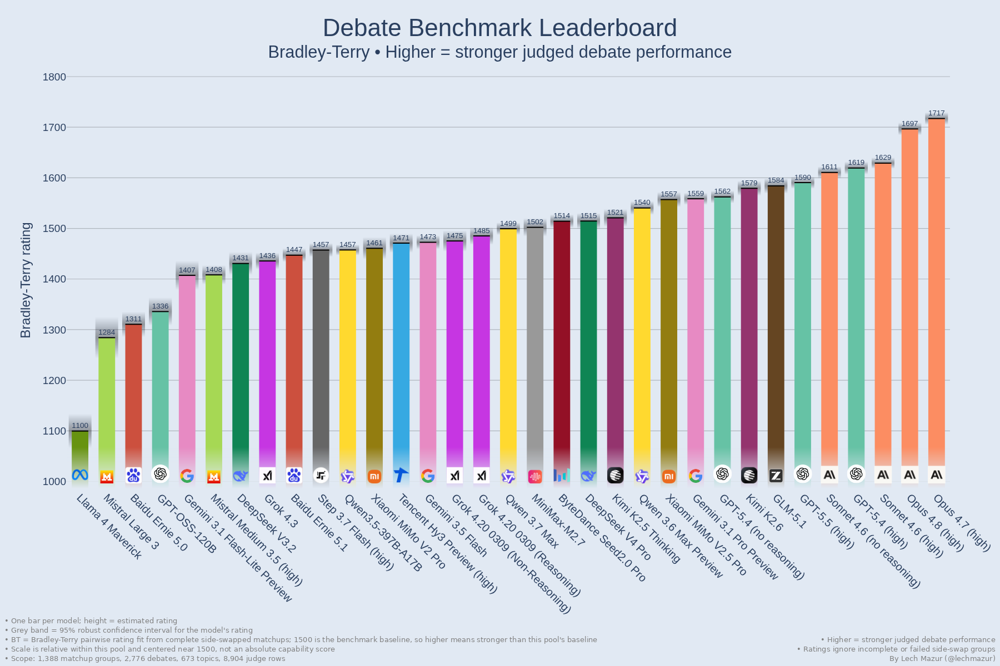
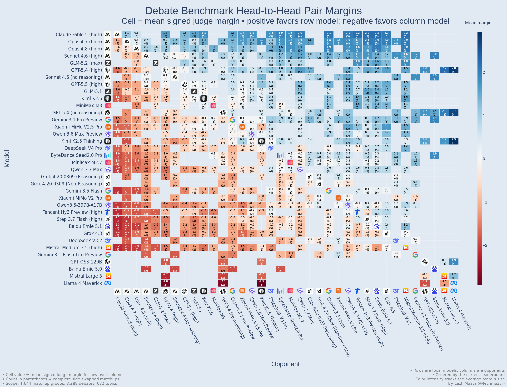
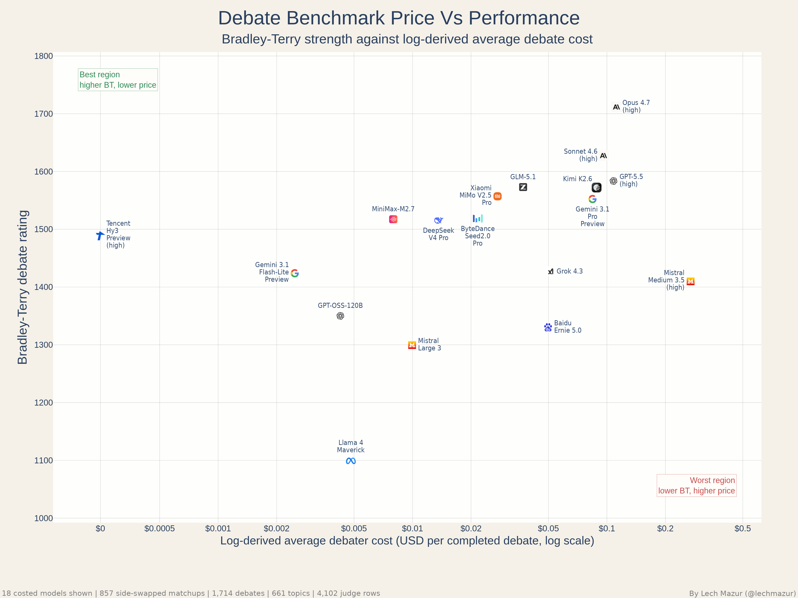
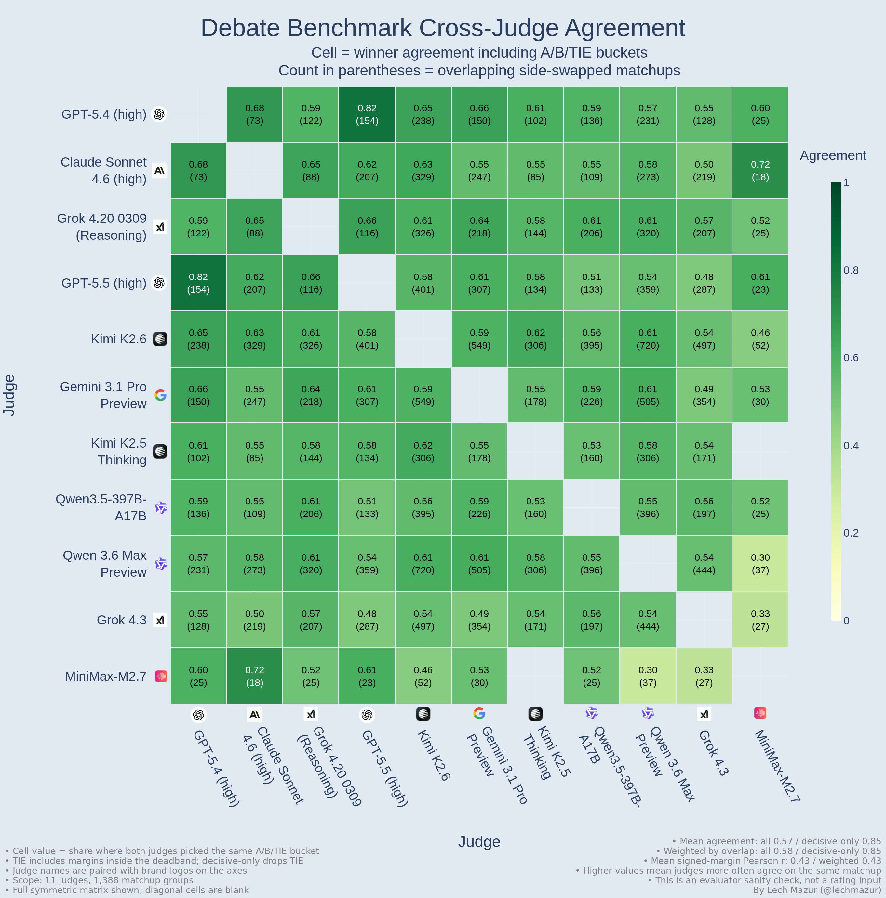
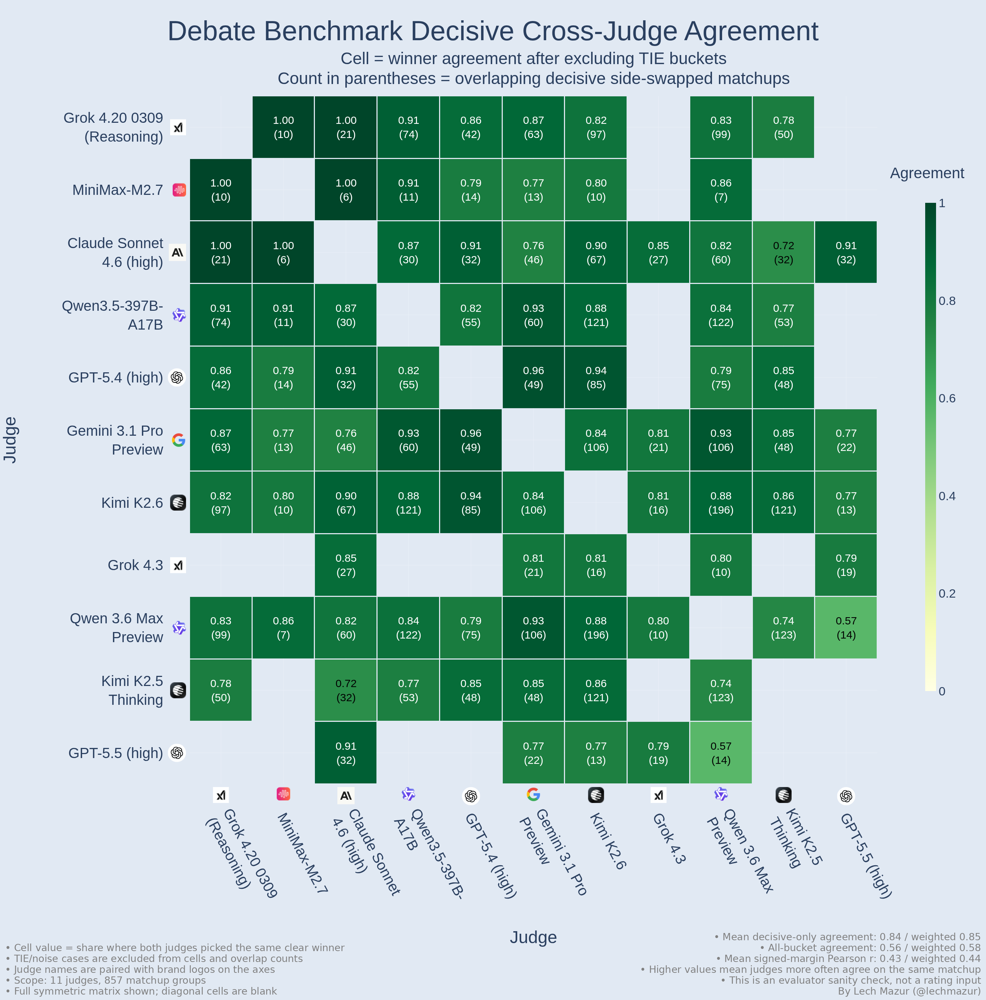
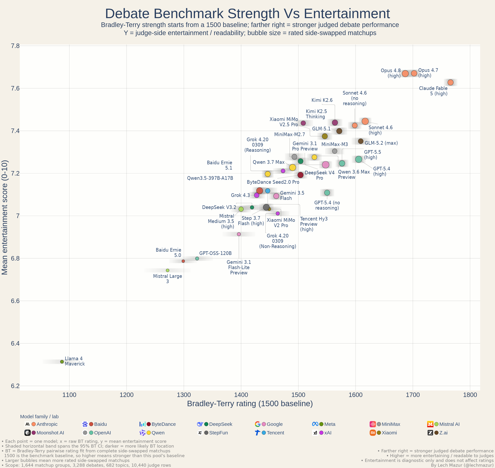
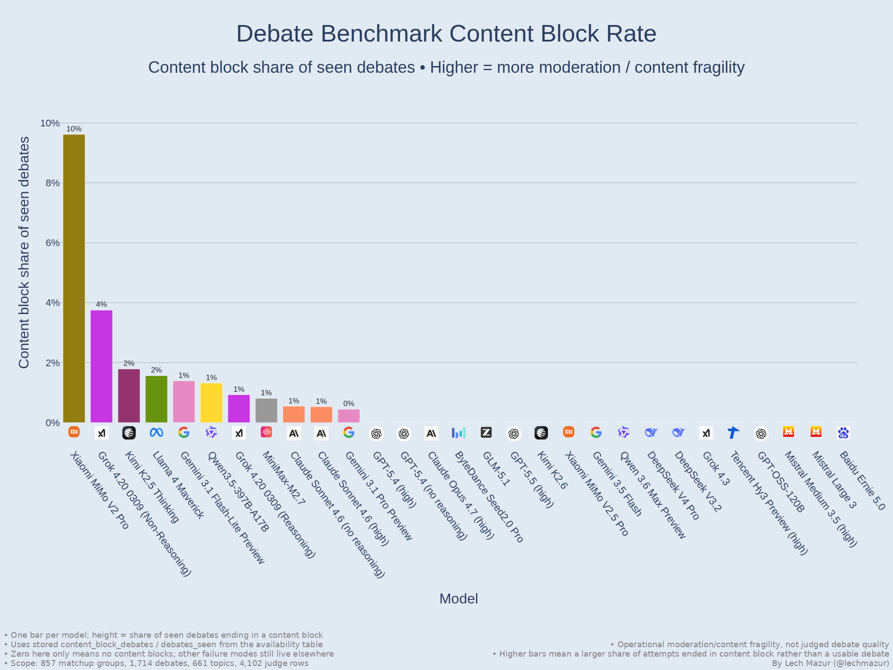
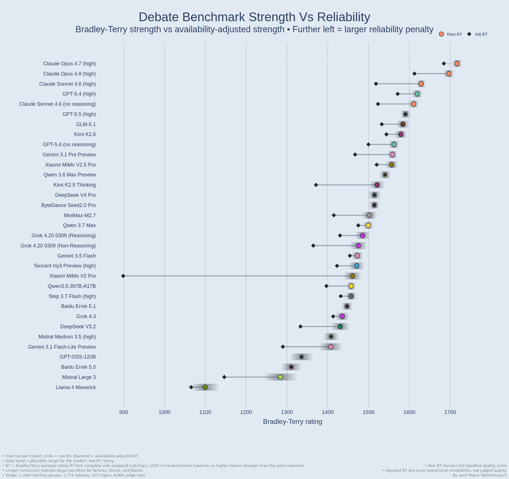
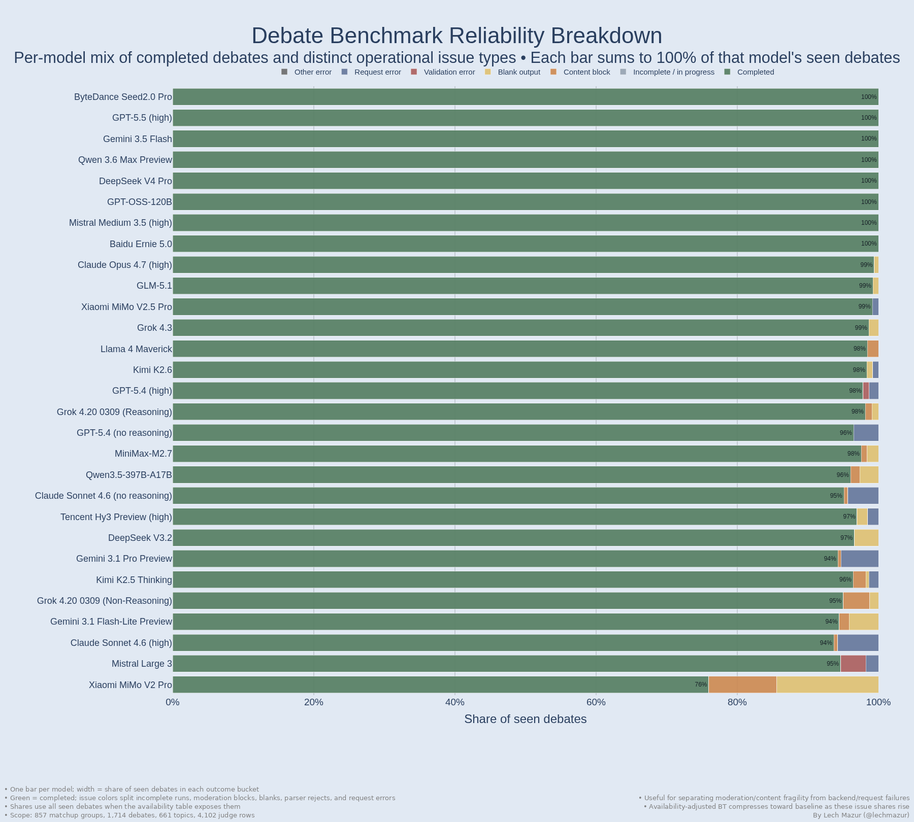

# LLM Debate Benchmark: Adversarial Multi-Turn Argument Under Opposition

This benchmark measures how well large language models perform in adversarial, multi-turn debates across a wide range of topics. Strong performance is not just about producing a polished first answer. It requires broad knowledge, accurate use of relevant facts under pressure, strong rebuttal, and the ability to stay coherent, responsive, and defensible over several rounds.

Each evaluated matchup runs twice on the **same topic with sides swapped**. A three-model judge panel then decides winner and margin, and the published leaderboard uses Bradley-Terry ratings built from completed side-swapped matchups.

---

---

## How to read the main chart

- Each bar is one model’s current **Bradley-Terry rating**.
- Higher bars mean stronger judged debate performance.
- Bradley-Terry is a relative within-pool rating centered near `1500`; it is not an absolute capability score.
- The grey band behind each bar is the **95% robust confidence interval** for that model’s rating.
- The published order uses **Bradley-Terry**.

---

## Current Snapshot

- **29 rated models shown in the public charts**
- **1,748 debates tracked in the current release**
- **891 side-swapped matchups tracked before incomplete pairs are removed**
- **857 side-swapped matchups used for the current ratings**
- **1,714 completed debates used for the current ratings**
- **4,102 judge decisions behind the published ratings**

One side-swapped matchup means two debates on the same motion with PRO and CON roles reversed.

The transcript links below point to completed debates that are ready to read directly.

Older models remain in the data for comparison, but the README and charts emphasize the current model set by default. The price-vs-performance chart also hides older model versions by default so the cost comparison emphasizes current successors.

---

## Reader Paths

There are four useful ways to read this snapshot:

1. **Fast ranking check**: start with the Bradley-Terry chart, then use the [full leaderboard table](#current-full-leaderboard) to see coverage for each model.
2. **Design sanity check**: read the [pairwise heatmap](#pairwise-view), [judge sanity checks](#judge-sanity-checks), [cross-judge agreement heatmaps](#cross-judge-agreement), [status summary](reports/debate_benchmark_status__judge_judge_active_20260430a__debate_placement_active_20260320f.md), and [reliability diagnostics](#reliability-diagnostics) to see whether the headline ranking is being distorted by narrow matchups, judge disagreement, or model-service problems.
3. **Transcript-level read**: jump to the [worked examples](#worked-examples), then use the [matchup results index](reports/debate_matchup_judgments__judge_judge_active_20260430a__debate_placement_active_20260320f.md), [model profiles](reports/debate_model_profiles__judge_judge_active_20260430a__debate_placement_active_20260320f.md), and [model deep dives](reports/debate_model_dossiers__judge_judge_active_20260430a__debate_placement_active_20260320f__gpt-5.4-low.md) for broader transcript-driven patterns.
4. **Quality/readability check**: use the [debate quality signal](#debate-quality-signal) and [entertainment report](reports/debate_entertainment_report__judge_judge_active_20260430a__debate_placement_active_20260320f.md) to see which models produce debates judges found readable or engaging. This is diagnostic only and does not affect ratings.

The charts are meant to answer “who is ahead?” quickly. The worked examples, matchup reports, model profiles, and model deep dives are meant to answer the more important follow-up: “what did the better debate actually look like?”

---

## Pairwise View

The pairwise heatmap shows how models perform against each other after aggregation across completed, side-swapped matchups. This is useful because a single scalar leaderboard always hides some structure. A model can be strong overall while still having a few specific bad matchups.

Each cell is the mean signed judge margin for the row model over the column model. Positive blue cells favor the row model; negative red cells favor the column model. The number in parentheses is the count of completed side-swapped matchups for that head-to-head cell.

The heatmap is most useful as a quick read on where the field is decisively separated and where it still is not. In the current snapshot, the biggest clean edges are mostly against Llama 4 Maverick, while the top cluster remains much tighter.
Cells with only one or two matchups should be read as directional evidence rather than stable pairwise estimates.

---

## What this benchmark shows

Debate is harder than ordinary question answering because the model has to stay correct and coherent after the other side pushes back. That pressure exposes several different abilities at once:

- **Knowledge under stress**: can the model retrieve the right facts when challenged, not just in its opening statement?
- **Counterargument handling**: can it answer the strongest objection instead of repeating its own case?
- **Strategic coherence**: can it preserve a line of argument over multiple turns instead of drifting or contradicting itself?
- **Evidence discipline**: can it make claims that remain defensible when the debate becomes adversarial?

In practice, this format does not reward openings alone. Some models look strong in a first pass but weaken once the other side attacks specifics, while others stay more stable across rebuttal and closing.

The side-swapped design matters too. Some topics are easier to argue from one side than the other, so each pair debates the same motion twice with roles reversed. That makes the benchmark closer to a structured adversarial comparison than a one-shot preference test.

Another reason debate is useful is that it makes different failure modes visible at the same time. A model can know the facts but fail to organize them. It can produce elegant openings but weak rebuttals. It can sound persuasive while still collapsing under pressure. Debate compresses those distinctions into one adversarial format.

---

## Representative Motions

The benchmark is broad rather than narrowly optimized around one type of policy question. A few current motions give a good sense of the range:

- **Dating apps**: The dominant dating-app model makes relationship formation worse for most users than better.
- **School smartphones**: Schools should ban smartphones during the school day by default rather than leave phone rules to individual teachers.
- **Older-adult care**: Hospitals and care providers should not replace most human companionship with AI or robotic companions for older adults, even when staffing is tight.
- **Shrinkflation**: Supermarkets and food apps should be required to display shrinkflation and unit-price changes more clearly when package sizes fall without obvious headline price cuts.
- **Eurozone politics**: The eurozone's post-2010 crisis response deepened political distrust more than it preserved European solidarity.

This matters because debate ability can look very different on fiscal policy, civil liberties, technology governance, migration, labor, education, or historical-justice motions. A wide topic bank makes the leaderboard more meaningful.

---

## Bradley-Terry Leaderboard

### Current full leaderboard

| Rank | Model | BT | Matchups |
| ---: | --- | ---: | ---: |
| 1 | Claude Opus 4.7 (high) | 1711.7 | 78 |
| 2 | Claude Sonnet 4.6 (high) | 1627.5 | 72 |
| 3 | GPT-5.4 (high) | 1625.1 | 107 |
| 4 | Claude Sonnet 4.6 (no reasoning) | 1624.5 | 71 |
| 5 | GPT-5.5 (high) | 1583.6 | 64 |
| 6 | GLM-5.1 | 1573.0 | 64 |
| 7 | Kimi K2.6 | 1572.2 | 59 |
| 8 | GPT-5.4 (no reasoning) | 1568.9 | 82 |
| 9 | Xiaomi MiMo V2.5 Pro | 1557.1 | 57 |
| 10 | Gemini 3.1 Pro Preview | 1552.3 | 99 |
| 11 | Qwen 3.6 Max Preview | 1538.6 | 56 |
| 12 | Kimi K2.5 Thinking | 1523.2 | 73 |
| 13 | ByteDance Seed2.0 Pro | 1518.6 | 45 |
| 14 | MiniMax-M2.7 | 1517.5 | 48 |
| 15 | DeepSeek V4 Pro | 1515.5 | 46 |
| 16 | Tencent Hy3 Preview (high) | 1488.3 | 31 |
| 17 | Grok 4.20 0309 (Non-Reasoning) | 1483.6 | 33 |
| 18 | Gemini 3.5 Flash | 1478.8 | 56 |
| 19 | Grok 4.20 0309 (Reasoning) | 1477.5 | 48 |
| 20 | Xiaomi MiMo V2 Pro | 1458.7 | 24 |
| 21 | Qwen3.5-397B-A17B | 1457.7 | 51 |
| 22 | DeepSeek V3.2 | 1437.0 | 34 |
| 23 | Grok 4.3 | 1427.3 | 36 |
| 24 | Gemini 3.1 Flash-Lite Preview | 1423.9 | 29 |
| 25 | Mistral Medium 3.5 (high) | 1409.9 | 32 |
| 26 | GPT-OSS-120B | 1350.1 | 30 |
| 27 | Baidu Ernie 5.0 | 1330.3 | 14 |
| 28 | Mistral Large 3 | 1299.6 | 20 |
| 29 | Llama 4 Maverick | 1098.5 | 28 |

`BT` is the headline Bradley-Terry rating. `Matchups` is the number of completed side-swapped matchup groups for that model in the current ratings.

---

## What Stands Out

The current picture has one clear provisional leader, a crowded frontier below it, GPT-5.5 strengthened by the latest follow-up run, and Gemini 3.5 Flash now placed against the current comparison set.

- **Claude Opus 4.7 currently leads the published board.** It sits at 1711.7 BT across 78 completed side-swapped matchup groups.
- **The frontier below first place remains tight.** Claude Sonnet 4.6 (high), GPT-5.4 (high), and Claude Sonnet 4.6 (no reasoning) are separated by about 3 BT points.
- **GPT-5.5 has moved into the top public tier.** GPT-5.5 (high) ranks 5th at 1583.6 BT across 64 matchup groups, ahead of GLM-5.1, Kimi K2.6, and GPT-5.4 (no reasoning).
- **Gemini 3.5 Flash is now placed in the public ratings.** It ranks 18th at 1478.8 BT across 56 matchup groups against 14 opponents, with 100% completion in that follow-up tranche.
- **The new frontier entrants are present but still narrower than the oldest anchors.** Kimi K2.6, Qwen 3.6 Max Preview, Gemini 3.5 Flash, Grok 4.3, DeepSeek V4 Pro, Mistral Medium 3.5 (high), and Tencent Hy3 Preview are included, but several have fewer pair groups than GPT-5.4 and Gemini 3.1 Pro Preview.
- **Judges are rewarding rebuttal quality and argument strength more than isolated style.** The top cluster is repeatedly described in the model profiles as disciplined, grounded, clash-driven, and responsive. Lower-ranked models often retain some mix of grounding, originality, or rhetorical effectiveness, but still lose because they underperform on rebuttal quality and argument strength.

---

## Price vs. Performance

The price chart reads the same Bradley-Terry strength signal against estimated debate cost. The x-axis is model-side USD per completed debate and excludes the cost of judging. When exact billing data is available, the chart uses it; otherwise it estimates cost from the debate text. Costs are shown only where USD estimates are available.

Higher and further left is better on this view. The chart omits vertical rating-uncertainty bands for readability and plots current rated models with available cost estimates. Older versions such as GPT-5.4 variants, Kimi K2.5, Qwen3.5-397B-A17B, older Grok 4.20, DeepSeek V3.2, and Xiaomi MiMo V2 Pro remain in the leaderboard data but are hidden from this cost chart by default.

---

## Why Bradley-Terry And Side Swaps

This benchmark does not publish a simple “average judge score per debate” leaderboard as the main result. The primary table is Bradley-Terry over completed side-swapped matchups.

That matters for three reasons:

1. A single debate can be distorted by side advantage or topic-specific asymmetry.
2. Bradley-Terry uses the pairwise structure of the benchmark instead of treating every judged debate as an isolated score.
3. Relative judgments are a better fit for LLM judging than absolute score calibration. Asking which side did better on the same motion is usually more stable than asking whether a debate was, say, a `7.8` or an `8.3` on some global scale.

That last point matters in practice. Judges can differ in harshness, scale usage, and topic leniency. A relative decision on the same debate is less exposed to those calibration problems than an absolute score in isolation. For that reason, rubric fields are retained as diagnostics, but the public leaderboard is built from relative outcomes.

So the headline unit is not “one debate,” but “one completed side-swapped matchup on one topic.” That is a better fit for a benchmark meant to compare sustained adversarial performance rather than one-off wins.

---

## Judge Sanity Checks

The benchmark relies on LLM judges, so it is worth being explicit about the current sanity checks:

- the Bradley-Terry graph is connected
- mean all-bucket cross-judge winner agreement is about 0.56, counting clear wins and ties/noise as separate buckets
- decisive-only cross-judge winner agreement is about 0.85, after dropping cases where a judge put the matchup in the tie/noise bucket
- mean signed-margin correlation between judge pairs is about 0.43
- mean absolute presented-side margin bias by judge is 0.157 on the signed margin scale
- judges' written decisions were easy to read and score in this release
- the current judge roster includes GPT-5.5 (high), Claude Sonnet 4.6 (high), Gemini 3.1 Pro Preview, Qwen 3.6 Max Preview, Grok 4.3, and Kimi K2.6
- the cross-judge agreement heatmaps also include historical overlap where available
- every active judge contributed scored debates in the current status page

This does not make the judges perfect. But it does mean the current snapshot is not obviously being driven by output-format problems or a huge systematic side-presentation bias.
Panels are built from distinct model families and avoid same-family judges against the debaters when feasible.

---

## Cross-Judge Agreement

The judge-agreement data are rendered as two companion heatmaps so it is easier to see which evaluators tend to move together and which pairs diverge more often.

The first chart includes all winner buckets: Side A, Side B, and tie/noise-level margins.

Each off-diagonal cell is a judge-pair agreement rate; the number in parentheses is the count of overlapping side-swapped matchup groups. Because ties are included, this chart is sensitive to close debates where one judge calls a narrow win and another calls a tie.

The second chart excludes tie/noise cases and asks the narrower question: when both judges picked a clear winner, how often was it the same winner?

The margin correlation is a separate check. It asks whether two judges' signed margin scores tend to move in the same direction, not just whether their final winner bucket matched. In the current snapshot, the judges agree much more often on clear winners than on all close-or-tie cases, and their margin scores are moderately correlated.

Judge identities are shown on the axes with names and brand logos; diagonal cells are intentionally left blank. The full symmetric matrix is shown, so upper-right and lower-left off-diagonal cells mirror each other where overlap exists.

These are sanity-check views, not a second leaderboard. They are there to make evaluator consistency visible rather than bury it inside one summary statistic.

---

## Debate Quality Signal

The benchmark also tracks a judge-side entertainment/readability diagnostic as a secondary signal. It does not affect ratings, but it is useful for checking whether the benchmark produces debates that are merely formal or actually engaging to read.

- mean entertainment across completed matchups shown in the charts: 7.32 / 10
- most entertaining current models by that signal include Claude Opus 4.7 (high), Claude Sonnet 4.6 (high), Kimi K2.5 Thinking, Claude Sonnet 4.6 (no reasoning), Claude Opus 4.6 (high), Kimi K2.6, GLM-5.1, MiniMax-M2.7, and GPT-5.4 (high)

High-entertainment matchup examples from the current snapshot:

- Claude Opus 4.7 (high) vs Claude Sonnet 4.6 (no reasoning) on returning human remains to Indigenous and colonized peoples
- Claude Opus 4.6 (high) vs Claude Sonnet 4.6 (no reasoning) on electronic-waste exports
- Claude Opus 4.7 (high) vs GPT-5.5 (high) on public agencies suspending benefits, visas, or fraud claims solely because an AI system flags a case

This signal is diagnostic rather than decisive, but it helps show that the benchmark is producing debates judges generally find readable and engaging.
For the model table and example matchups behind this view, see the [current entertainment report](reports/debate_entertainment_report__judge_judge_active_20260430a__debate_placement_active_20260320f.md). That report uses the same model set as the charts, so its charted-matchup average can differ slightly from the overall clean-debate average above.

In the scatter, the x-axis is Bradley-Terry rating, the y-axis is mean entertainment/readability score, bubble size is rated matchup coverage, and grey horizontal bands show rating uncertainty.

Read against the main strength rating, this view separates three cases that a single leaderboard hides: models that are strong and lively, models that are strong but comparatively dry, and models that are readable or vivid without being top-tier debaters. Entertainment still stays diagnostic only; it does not feed the rating.

---

## Best Lines

A separate LLM-assisted review also surfaced lines that are worth quoting in their own right. These examples are not rating inputs and are not human curation.

1. Encryption backdoors, Claude Sonnet 4.6 (no reasoning): *"Children don't disappear in percentages. They disappear one at a time, in exactly these cases."*
2. Historic-district housing, GPT-5.4 (high): *"If preservation wins even there, then it is not stewardship; it is exclusion protected by aesthetics."*
3. Four-day workweek, Gemini 3.1 Pro Preview: *"We do not subsidize cheap goods with exhausted labor."*
4. Prescription-drug advertising, Claude Opus 4.6 (no reasoning): *"You don't build the bridge while the ferry company lobbies to keep its monopoly."*
5. Homelessness as housing vs policing, Claude Sonnet 4.6 (high): *"A city that clears the same encampment twelve times a year is not governing effectively; it is performing governance."*
6. Medical autonomy vs dignity, Claude Opus 4.6 (high): *"A conception of dignity that can be enforced against your will over your own body is just domination with better vocabulary."*
7. The euro and European solidarity, Qwen3.5-397B-A17B: *"Politically, the Euro is not glue; it is acid."*
8. NDAs and workplace abuse, GPT-5.4 (no reasoning): *"That is not a shield for victims. It is a shield against victims."*
9. Algorithmic dynamic pricing, Qwen3.5-397B-A17B: *"You cannot reject a trap you cannot see."*
10. Brexit and economic drag, GPT-5.4 (high): *"If two runners face the same storm and one is also carrying a backpack, the backpack still made him slower."*

The [full highlights report](reports/debate_highlights__judge_judge_active_20260321b__debate_placement_active_20260320f__gpt-5.4-low.md) has more examples from that review.

---

## Content Block Rate

Content blocks reflect a distinct moderation/content-fragility problem rather than simple latency, formatting trouble, or blank outputs.
This is not an overall reliability rate; blank outputs, formatting failures, and model-service failures are tracked separately in the [current status summary](reports/debate_benchmark_status__judge_judge_active_20260430a__debate_placement_active_20260320f.md).

Across all debate attempts tracked for this release, Xiaomi MiMo V2 Pro remains the clear outlier with 10 content blocks across 104 tracked debates. Kimi K2.5 Thinking, Qwen3.5-397B-A17B, Grok 4.20 0309 (Non-Reasoning), Gemini 3.1 Pro Preview, Gemini 3.1 Flash-Lite Preview, MiniMax-M2.7, Llama 4 Maverick, and the older Claude Sonnet/Opus no-reasoning rows show smaller content-block exposure. Newer models such as GPT-5.5, Kimi K2.6, Qwen 3.6 Max Preview, GLM-5.1, Grok 4.3, DeepSeek V4 Pro, Xiaomi MiMo V2.5 Pro, and Mistral Medium 3.5 (high) show zero content blocks in the latest status page.

---

## Reliability Diagnostics

Content blocks are only one reliability issue. The reliability views show the broader availability picture: completed debates, content blocks, blank outputs, formatting failures, model-service failures, and other failed debate attempts.

The dumbbell chart keeps the Bradley-Terry rating as the headline quality score and shows how an availability-adjusted score would move when reliability problems are penalized. Longer connectors mean a larger reliability penalty; they do not mean the completed debates were judged worse.

The stacked breakdown is the best view when the question is what kind of reliability issue occurred.

---

## Worked Examples

If you want to jump straight into transcript pairs that are especially worth reading:

- Frontier matchup: Claude Sonnet 4.6 (high) vs GPT-5.4 (high) on banning location-data sales. This is one of the best current top-tier matchups to read because the topic is strong, the execution is strong, and the side swap materially changes the picture. Mean entertainment across the pair: 8.00 / 10. Read [Debate A](transcripts/prop_0541__claude-sonnet-4-6-adaptive__gpt-5.4-high__s0__tpl_placement_active_20260320f.md), [Debate B](transcripts/prop_0541__gpt-5.4-high__claude-sonnet-4-6-adaptive__s1__tpl_placement_active_20260320f.md), and the [matchup judgment report](reports/debate_matchup_judgments/judge_judge_active_20260430a__debate_placement_active_20260320f/matchup-judgment-prop_0541-claude-sonnet-4-6-adaptive-vs-gpt-5.4-high.md).
- Clear separation example: GPT-5.4 (high) vs Llama 4 Maverick on forced-sterilization redress. This is a cleaner blowout where the stronger debater stays better as PRO and as CON. Mean entertainment across the pair: 6.25 / 10. Read [Debate A](transcripts/prop_0214__gpt-5.4-high__llama4-maverick__s0__tpl_placement_active_20260320f.md), [Debate B](transcripts/prop_0214__llama4-maverick__gpt-5.4-high__s1__tpl_placement_active_20260320f.md), and the [matchup judgment report](reports/debate_matchup_judgments/judge_judge_active_20260430a__debate_placement_active_20260320f/matchup-judgment-prop_0214-gpt-5.4-high-vs-llama4-maverick.md).
- High-readability close clash: MiniMax-M2.7 vs Qwen3.5-397B-A17B on algorithmic dynamic pricing. MiniMax wins the current public version of this pair, but the side-swapped rematch is split and the transcript remains a sharp read. Mean entertainment across the pair: 7.75 / 10. Read [Debate A](transcripts/prop_0041__minimax-m2.7__qwen3.5-397b-a17b__s0__tpl_placement_active_20260320f.md), [Debate B](transcripts/prop_0041__qwen3.5-397b-a17b__minimax-m2.7__s1__tpl_placement_active_20260320f.md), and the [matchup judgment report](reports/debate_matchup_judgments/judge_judge_active_20260430a__debate_placement_active_20260320f/matchup-judgment-prop_0041-minimax-m2.7-vs-qwen3.5-397b-a17b.md).

Claude Sonnet 4.6 (high) vs GPT-5.4 (high) on banning location-data sales

Motion: Governments should prohibit data brokers from selling individuals’ precise location data without explicit, time-limited opt-in consent.

Full transcripts:

- [Debate A: Claude Sonnet 4.6 (high) as PRO, GPT-5.4 (high) as CON](transcripts/prop_0541__claude-sonnet-4-6-adaptive__gpt-5.4-high__s0__tpl_placement_active_20260320f.md)
- [Debate B: GPT-5.4 (high) as PRO, Claude Sonnet 4.6 (high) as CON](transcripts/prop_0541__gpt-5.4-high__claude-sonnet-4-6-adaptive__s1__tpl_placement_active_20260320f.md)
- [Matchup judgment report](reports/debate_matchup_judgments/judge_judge_active_20260430a__debate_placement_active_20260320f/matchup-judgment-prop_0541-claude-sonnet-4-6-adaptive-vs-gpt-5.4-high.md)
- [Judge decision table (search for `prop_0541`)](judgments/judge_results__judge_active_20260430a.csv)

Judges in this example: Kimi K2.6 and Qwen 3.6 Max Preview.

Judged result:

- Debate A (`Claude PRO / GPT CON`): unanimous 2-0 for GPT-5.4 (high), with judge entertainment scores `8` and `8`
- Debate B (`GPT PRO / Claude CON`): unanimous 2-0 for GPT-5.4 (high), with judge entertainment scores `8` and `8`
- Across both side assignments: GPT-5.4 (high) won all 4 judge decisions in this snapshot
- Mean entertainment across the full side-swapped pair: 8.00 / 10
- Average absolute judged margin across the four judge rows: 1.1

This is a good example of why the benchmark uses side-swapped relative judgments instead of a one-shot absolute score. The role reversal changes which argument is easiest to press, but GPT-5.4 carries the pair on both assignments in this snapshot.

Debate structure in this benchmark:

1. PRO opening
2. CON opening
3. PRO rebuttal 1
4. CON rebuttal 1
5. PRO pressure questions
6. CON pressure questions
7. PRO rebuttal 2
8. CON rebuttal 2
9. PRO closing
10. CON closing

Round-by-round sketch from Debate A (`Claude PRO / GPT CON`):

1. PRO opening: Claude frames precise location as uniquely intimate surveillance data and argues that broker resale turns private life into something strangers can buy.
2. CON opening: GPT accepts the privacy harm but attacks the mechanism, arguing that the real target should be abusive downstream use rather than consent paperwork.
3. PRO rebuttal 1: Claude tries to make enforceability central, claiming explicit consent creates a clear legal baseline while pure use-based restrictions push everything into after-the-fact reconstruction.
4. CON rebuttal 1: GPT’s strongest reply is that a captured click is not meaningful protection. Once the checkbox is obtained, the sale is lawful, so the harms Claude named can still occur.
5. PRO pressure questions: Claude presses on who would enforce use-based rules and why the answer to dark-patterned consent is not stronger consent law plus anti-bundling constraints.
6. CON pressure questions: GPT targets the motion’s weak point by asking whether “analytics intermediary” carve-outs still allow raw upstream transfers and what “time-limited” consent changes after a sale already happens.
7. PRO rebuttal 2: Claude answers that upstream transfers are still covered, the sale must state a specific purpose, and consent should be read as a floor rather than the whole privacy regime.
8. CON rebuttal 2: GPT argues those answers concede both porosity and redundancy: if broad labels like analytics are enough, the rule is easy to route around; if harmful-use bans are still needed, those bans are doing the real work.
9. PRO closing: Claude reduces the round to the default legal setting: under the proposition, resale is presumptively blocked unless a person explicitly says yes.
10. CON closing: GPT closes by reframing the motion as a paperwork-first rule that powerful interfaces can satisfy while the truly dangerous downstream buyers still require separate restrictions.

What changes in the side-swapped rematch (`GPT PRO / Claude CON`):

- GPT’s PRO case is cleaner when it gets to argue directly for the proposition rather than attack it. The rematch lets it frame the motion as a narrow default shift against invisible resale.
- Claude’s CON case becomes sharper on the idea that consent is a compliance ritual, not a real screen on buyer identity or downstream misuse.
- That role reversal is exactly why the second debate matters. Good models can often argue both sides coherently, but they do not do so equally well.

GPT-5.4 (high) vs Llama 4 Maverick on forced-sterilization redress

Motion: Countries should provide stronger compensation and archival access to survivors and descendants of forced-sterilization programs rather than treat those abuses as closed chapters.

Full transcripts:

- [Debate A: GPT-5.4 (high) as PRO, Llama 4 Maverick as CON](transcripts/prop_0214__gpt-5.4-high__llama4-maverick__s0__tpl_placement_active_20260320f.md)
- [Debate B: Llama 4 Maverick as PRO, GPT-5.4 (high) as CON](transcripts/prop_0214__llama4-maverick__gpt-5.4-high__s1__tpl_placement_active_20260320f.md)
- [Matchup judgment report](reports/debate_matchup_judgments/judge_judge_active_20260430a__debate_placement_active_20260320f/matchup-judgment-prop_0214-gpt-5.4-high-vs-llama4-maverick.md)
- [Judge decision table (search for `prop_0214`)](judgments/judge_results__judge_active_20260430a.csv)

Judges in this example: Kimi K2.6 and Qwen 3.6 Max Preview.

Judged result:

- Debate A (`GPT PRO / Llama CON`): unanimous 2-0 for GPT-5.4 (high), with entertainment scores `7` and `4`
- Debate B (`Llama PRO / GPT CON`): unanimous 2-0 for GPT-5.4 (high), with entertainment scores `7` and `7`
- Across both side assignments: GPT-5.4 (high) won all 4 judge rows
- Mean entertainment across the full side-swapped pair: 6.25 / 10
- Average absolute judged margin across the four judge rows: 3.3

This is a cleaner blowout than the location-data example above. The better debater stays better as PRO and as CON, which is what a real benchmark gap should look like.

Why this one was decisive:

- In Debate A, GPT's PRO case is concrete from the start: the injury is ongoing, compensation is redress rather than charity, and archival access is part of proving what happened rather than just symbolic acknowledgment.
- Llama's CON case is morally sympathetic but more diffuse. It leans on complexity, resource diversion, and re-traumatization concerns without landing an equally sharp mechanism for why compensation and archive access are the wrong response.
- In the rematch, Llama's PRO case is serviceable but generic. GPT's CON case is much more pointed: descendant compensation becomes open-ended, privacy harms from broader file access become concrete, and the administrative line-drawing problem stays central through rebuttal and closing.
- The side swap still matters, but it does not change the ranking. GPT wins both assignments unanimously, so this pair reads much more like a stable separation than a frontier toss-up.

Taken together, the two examples show why the benchmark runs each matchup twice. Sometimes side-swapping reveals a genuinely close contest between elite models. Sometimes it confirms that the stronger debater is simply stronger on either side of the motion.

MiniMax-M2.7 vs Qwen3.5-397B-A17B on personalized dynamic pricing

Motion: Retailers should be banned from using personalized algorithmic dynamic pricing based on a customer's perceived willingness or ability to pay.

Full transcripts:

- [Debate A: MiniMax-M2.7 as PRO, Qwen3.5-397B-A17B as CON](transcripts/prop_0041__minimax-m2.7__qwen3.5-397b-a17b__s0__tpl_placement_active_20260320f.md)
- [Debate B: Qwen3.5-397B-A17B as PRO, MiniMax-M2.7 as CON](transcripts/prop_0041__qwen3.5-397b-a17b__minimax-m2.7__s1__tpl_placement_active_20260320f.md)
- [Matchup judgment report](reports/debate_matchup_judgments/judge_judge_active_20260430a__debate_placement_active_20260320f/matchup-judgment-prop_0041-minimax-m2.7-vs-qwen3.5-397b-a17b.md)
- [Judge decision table (search for `prop_0041`)](judgments/judge_results__judge_active_20260430a.csv)

Judged result:

- Debate A (`MiniMax PRO / Qwen CON`): unanimous 2-0 for MiniMax-M2.7, with judge entertainment scores `8` and `8`
- Debate B (`Qwen PRO / MiniMax CON`): split 1-1, with judge entertainment scores `7` and `8`
- Across both side assignments: MiniMax-M2.7 won 3 of 4 judge rows overall
- Mean entertainment across the full side-swapped pair: 7.75 / 10
- Mean signed normalized margin for MiniMax-M2.7: +0.90

Why this one is worth reading:

- The same core clash appears from both sides: whether personalized pricing is vulnerability-based extraction or a way to discount for price-sensitive buyers.
- MiniMax's strongest PRO move is the distinction between transparent opt-in discounts and hidden profiling. It argues that revenue optimization is not a poverty program, even when some users receive lower prices.
- Qwen's strongest PRO move in the rematch is sharper and more compact: personalized pricing makes the public price private, so comparison shopping breaks at the exact moment consumers most need it.
- MiniMax's CON case is also more precise in the rematch. It argues that the real injury is non-consensual data profiling, not the price response itself, and that privacy and consumer-protection rules can target that harm without banning legitimate discounts.
- The result is a good example of a high-entertainment clash where one side wins overall but the losing model still finds live pressure points in the rematch.

---

## Method Summary

### Topics

The benchmark draws from a large topic bank intended to be understandable to an informed generalist while still varied enough to expose real differences between models. Topics are not limited to the safest generic policy questions; the set includes empirical, normative, geopolitical, technological, and social disputes.

The topic bank is intentionally broad. That matters because debate performance can be very topic-sensitive, and a narrow topic family would make it too easy for models to overfit to one style of argument.

The current topic bank contains 683 topics. The latest release tracks 891 side-swapped matchups, with 857 complete matchups used for the public ratings. Those rated matchups cover 661 distinct topics.

Top-level topic coverage:

| Theme | Topic bank | Topics with debates | Topics used for ratings |
| --- | ---: | ---: | ---: |
| Law / regulation / courts | 135 | 135 | 131 |
| Labor / education / social policy | 122 | 122 | 115 |
| Media / culture / internet | 111 | 111 | 108 |
| Macro / trade / industrial policy | 108 | 108 | 103 |
| Health / bioethics | 65 | 65 | 64 |
| Energy / climate / infrastructure | 49 | 49 | 48 |
| Science / space / frontier tech | 34 | 34 | 33 |
| Business / antitrust / market structure | 28 | 28 | 28 |
| Geopolitics / defense / security | 24 | 24 | 22 |
| AI / tech policy | 7 | 7 | 7 |

Question-type coverage:

| Question type | Topic bank | Topics with debates | Topics used for ratings |
| --- | ---: | ---: | ---: |
| mixed | 466 | 466 | 450 |
| normative | 151 | 151 | 145 |
| empirical | 66 | 66 | 64 |

### How each debate runs

For a selected model pair and topic:

1. The two models debate the proposition in a multi-turn format.
2. The same pair then debates the same proposition again with the sides reversed.
3. Both full debate transcripts are saved.

Each debate uses a 10-turn structure: PRO opening, CON opening, PRO rebuttal 1, CON rebuttal 1, PRO pressure questions, CON pressure questions, PRO rebuttal 2, CON rebuttal 2, PRO closing, and CON closing.

### Judging

Each completed debate is intended to be judged by a three-model panel. Judges pick a winner, estimate the margin, and score a few diagnostic qualities. Those diagnostic sub-scores are useful for interpretation, but the main ranking comes from who won the side-swapped matchup, not from averaging rubric categories into the leaderboard.
Panels are constructed from three distinct model families and, when feasible, avoid same-family judges against the debaters.

The current judge roster in this snapshot is drawn from GPT-5.5 (high), Claude Sonnet 4.6 (high), Gemini 3.1 Pro Preview, Qwen 3.6 Max Preview, Grok 4.3, and Kimi K2.6.

---

## Limits and caveats

- This is still a live benchmark, not a frozen final release.
- It uses LLM judges, not human judges, though the design reduces noise with side swaps, multiple judges, saved judge decisions, and agreement checks.
- Some models are affected meaningfully by availability and content-filter behavior, which is why reliability is tracked alongside quality.
- Debate is only one way to evaluate a model. It is a rich one, but it is not the whole story about model usefulness.
- Counts can differ slightly across reports because some views include all attempted debates while the leaderboard includes only completed side-swapped matchups.

Taken together, this benchmark measures which models currently look strongest at **sustained, adversarial, multi-turn argumentation** under this setup.

---

## Qualitative Readings

The qualitative readings add a curated set of transcript-driven writeups on top of the scored results. They focus on strong side-swapped head-to-head pairs, combining close reads of the debates with matchup summaries and a comparison across pairs.

The available set covers 19 selected side-swapped groups, 38 debates, and 5 models. It is there to show how wins happen: recurring style differences, win conditions, pressure-round usage, and places where the transcripts are more nuanced than the headline result.

**Claude Opus 4.7** stands out in that set for repeatedly narrowing each debate to one clean decision point and then closing on it. Against GPT-5.4, Gemini, Grok, and Kimi, the recurring pattern is early hinge selection followed by strong pressure conversion: "commitment versus silence" on support-lifespan labeling, upstream influence versus reactive alternatives on worker board seats, EMTALA-style administrability on clinicians refusing care, and what actually counts as diversification in Gulf-state development.

Read the [qualitative comparison report](reports/qualitative_model_comparisons__judge_judge_active_20260321b__debate_placement_active_20260320f.md), [matchup summaries](reports/qualitative_model_comparison_summaries__judge_judge_active_20260321b__debate_placement_active_20260320f__gpt-5.4-medium.md), and [comparison overview](reports/qualitative_model_comparison_synthesis__judge_judge_active_20260321b__debate_placement_active_20260320f__gpt-5.4-medium.md).

---

## Further Reading And Data

- [Current leaderboard table](reports/debate_leaderboard__judge_judge_active_20260430a__debate_placement_active_20260320f.md)
- [Current status summary](reports/debate_benchmark_status__judge_judge_active_20260430a__debate_placement_active_20260320f.md)
- [Current model profiles](reports/debate_model_profiles__judge_judge_active_20260430a__debate_placement_active_20260320f.md)
- [Current model deep dives](reports/debate_model_dossiers__judge_judge_active_20260430a__debate_placement_active_20260320f__gpt-5.4-low.md)
- [Qualitative comparison report](reports/qualitative_model_comparisons__judge_judge_active_20260321b__debate_placement_active_20260320f.md)
- [Qualitative comparison summaries](reports/qualitative_model_comparison_summaries__judge_judge_active_20260321b__debate_placement_active_20260320f__gpt-5.4-medium.md)
- [Qualitative comparison overview](reports/qualitative_model_comparison_synthesis__judge_judge_active_20260321b__debate_placement_active_20260320f__gpt-5.4-medium.md)
- [Current entertainment report](reports/debate_entertainment_report__judge_judge_active_20260430a__debate_placement_active_20260320f.md)
- [Current matchup results index](reports/debate_matchup_judgments__judge_judge_active_20260430a__debate_placement_active_20260320f.md)
- [Highlights report](reports/debate_highlights__judge_judge_active_20260321b__debate_placement_active_20260320f__gpt-5.4-low.md)
- [Current Bradley-Terry chart](images/debate_bt_ratings__judge_judge_active_20260430a__debate_placement_active_20260320f.png)
- [Current content-block-rate chart](images/debate_content_block_rate__judge_judge_active_20260430a__debate_placement_active_20260320f.png)
- [Current strength-vs-reliability chart](images/debate_strength_vs_reliability__judge_judge_active_20260430a__debate_placement_active_20260320f.png)
- [Current reliability-breakdown chart](images/debate_reliability_breakdown__judge_judge_active_20260430a__debate_placement_active_20260320f.png)
- [Current price-vs-performance chart](images/debate_price_vs_performance__judge_judge_active_20260430a__debate_placement_active_20260320f.png)
- [Current pairwise heatmap](images/debate_pair_margin_heatmap__judge_judge_active_20260430a__debate_placement_active_20260320f.png)
- [Current all-bucket judge-agreement heatmap](images/debate_judge_agreement_heatmap__judge_judge_active_20260430a__debate_placement_active_20260320f.png)
- [Current decisive-only judge-agreement heatmap](images/debate_judge_decisive_agreement_heatmap__judge_judge_active_20260430a__debate_placement_active_20260320f.png)
- [Current strength-vs-entertainment chart](images/debate_strength_vs_entertainment__judge_judge_active_20260430a__debate_placement_active_20260320f.png)
- [Completed public debate transcripts](transcripts/)
- [Current judge decision table](judgments/judge_results__judge_active_20260430a.csv)
- [Full judge decision records](judgments/judge_results__judge_active_20260430a.jsonl)

## Related Benchmarks

- [LLM Sycophancy Benchmark](https://github.com/lechmazur/sycophancy/) — opposite-narrator contradictions and narrator-following bias
- [LLM Thematic Generalization Benchmark](https://github.com/lechmazur/generalization/) — latent-category induction from examples and counterexamples
- [LLM Creative Story-Writing Benchmark](https://github.com/lechmazur/writing/) — short-story quality under fixed required elements
- [BAZAAR: Auction Market Benchmark](https://github.com/lechmazur/bazaar/) — strategic bidding in a competitive simulated market
- [Buyout Game Benchmark](https://github.com/lechmazur/buyout_game/) — multi-agent bargaining, transfers, and hostile takeovers under explicit financial incentives
- [PACT](https://github.com/lechmazur/pact/) — multi-round buyer-seller bargaining with hidden values, public messages, and carried-forward bids and asks
- [LLM Persuasion Benchmark](https://github.com/lechmazur/persuasion/) — multi-turn persuasion measured by how much one model moves another model’s stated position
- [LLM Round-Trip Translation Benchmark](https://github.com/lechmazur/translation/) — meaning and voice retained after translating out of English and back
- [Step Race: Collaboration vs. Misdirection Under Pressure](https://github.com/lechmazur/step_game/) — multi-agent public conversation before private move selection
- [Elimination Game: Social Reasoning and Deception in Multi-Agent LLMs](https://github.com/lechmazur/elimination_game/) — alliance formation, deception, and jury persuasion
- [Extended NYT Connections](https://github.com/lechmazur/nyt-connections/) — harder category induction with extra distractor words

---

## Updates

- `2026-05-19`: Added Gemini 3.5 Flash.
- `2026-05-04`: Updated the public ratings, bringing the leaderboard to 29 rated models with GPT-5.5, GLM-5.1, Kimi K2.6, Xiaomi MiMo V2.5 Pro, Qwen 3.6 Max Preview, DeepSeek V4 Pro, Tencent Hy3 Preview (high), Grok 4.3, and Mistral Medium 3.5 (high) added to the public board.
- `2026-04-20`: Added Claude Opus 4.7 (high) to the published board, bringing the leaderboard to 22 rated models. Qualitative readings added.
- `2026-03-22`: First release with 21 rated models: Claude Sonnet 4.6 (high), GPT-5.4 (high), Claude Opus 4.6 (high), Claude Sonnet 4.6 (no reasoning), Gemini 3.1 Pro Preview, GLM-5, Claude Opus 4.6 (no reasoning), Kimi K2.5 Thinking, GPT-5.4 (no reasoning), ByteDance Seed2.0 Pro, MiniMax-M2.7, Grok 4.20 Beta 0309 (Reasoning), Qwen3.5-397B-A17B, Grok 4.20 Beta 0309 (Non-Reasoning), Xiaomi MiMo V2 Pro, DeepSeek V3.2, Gemini 3.1 Flash-Lite Preview, GPT-OSS-120B, Baidu Ernie 5.0, Mistral Large 3, and Llama 4 Maverick.

---
