# LLM Debate Benchmark: Adversarial Multi-Turn Argument Under Opposition

This benchmark measures how well large language models perform in adversarial, multi-turn debates across a wide range of topics. Strong performance requires more than a polished opening: models need broad knowledge, accurate facts under pressure, strong rebuttal, and the ability to remain coherent and responsive over several rounds.

Each matchup runs twice on the **same motion with sides swapped**. A three-model judge panel decides each debate's winner and margin. The published leaderboard uses Bradley-Terry ratings built from complete side-swapped matchups.

---

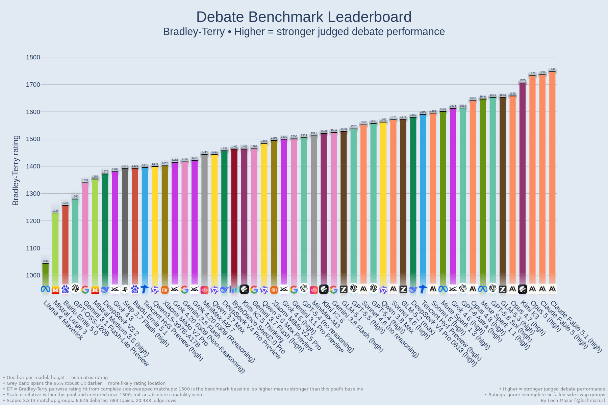

---

## How to read the chart

- Higher bars mean stronger judged debate performance.
- Bradley-Terry is a relative within-pool rating centered near `1500`, not an absolute capability score.
- The grey band spans the **95% robust confidence interval**; darker shading means greater relative density.
- The published order uses Bradley-Terry. Glicko-2 remains a secondary scheduling diagnostic.

## Current snapshot

- **55 rated model identities** in the complete stored graph; **52** shown publicly
- **3,313 complete side-swapped matchups**, comprising **6,626 debates**, used for ratings
- **20,438 judge decisions** behind the ratings
- **683 topics** represented in the rated corpus

One side-swapped matchup means two debates on the same motion with PRO and CON roles reversed.

### Model and data scopes

| View | Models | Matchups | Purpose |
| --- | ---: | ---: | --- |
| Complete stored rating graph | 55 | 3,371 represented; 3,313 rated | All retained historical and current results |
| Public leaderboard | 52 | 3,113 represented; 3,065 rated after report-time exclusions | Reader-facing ranking |
| Current-roster qualitative analysis | 39 | 2,567 rated, or 5,134 debates | Behavior cards; six new full model dossiers |
| Current-focused cost and comparison charts | 32 | — | Current models plus selected predecessors |

The raw judge table contains 20,634 stored decisions; 20,438 belong to complete matchups used for ratings. These scopes answer different questions, so their counts are not expected to match. Previous versions of highlighted models remain visible for comparison. The separate blind participant-judging study covers the eight highest-ranked latest-version models and does not feed the leaderboard.

## Reader paths

1. **Ranking:** start with the chart above, the [full leaderboard report](reports/debate_leaderboard__judge_judge_blend_glm53_coverage_20260904a__debate_all_templates.md), and the [new-entrant analysis](reports/frontier_expansion_glm53_coverage_20260904_final_analysis.md).
2. **Design checks:** inspect the [pairwise heatmap](#pairwise-view), [judge agreement](#judge-sanity-checks), and [status report](reports/debate_benchmark_status__judge_judge_blend_glm53_coverage_20260904a__debate_all_templates.md).
3. **How models debate:** use the [behavior model cards](reports/debate_behavior_model_cards__judge_judge_blend_glm53_coverage_20260904a__debate_all_templates__gpt-5.6-medium.md) and [six new full model dossiers](reports/debate_model_dossiers__judge_judge_blend_glm53_coverage_20260904a__debate_all_templates__gpt-5.6-medium__reviewed.md), plus the current [model profiles](reports/debate_model_profiles__judge_judge_blend_glm53_coverage_20260904a__debate_all_templates.md).
4. **Individual debates:** browse the [matchup results index](reports/debate_matchup_judgments__judge_judge_blend_glm53_coverage_20260904a__debate_all_templates.md) and [published transcripts](transcripts/).

## Pairwise view

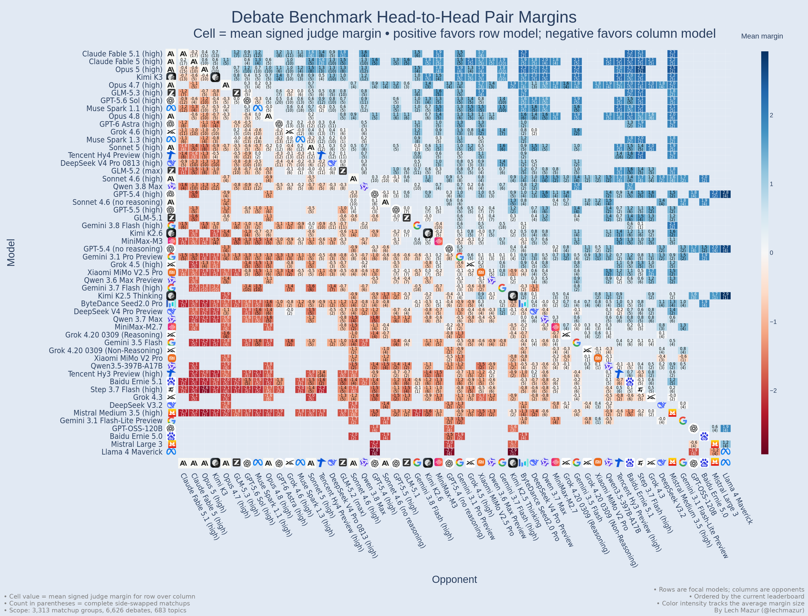

Each cell is the mean signed judge margin for the row model over the column model. Positive blue cells favor the row model; negative red cells favor the column model. The number in parentheses is the count of complete side-swapped matchups for that head-to-head. Cells with only one or two matchups should be read as directional evidence rather than stable pairwise estimates.

## Bradley-Terry leaderboard

| Rank | Model | BT | Matchups |
| ---: | --- | ---: | ---: |
| 1 | Claude Fable 5.1 (high) | 1746.8 | 151 |
| 2 | Claude Fable 5 (high) | 1735.6 | 205 |
| 3 | Claude Opus 5 (high) | 1732.0 | 178 |
| 4 | Kimi K3 | 1705.4 | 178 |
| 5 | Claude Opus 4.7 (high) | 1657.8 | 120 |
| 6 | GLM-5.3 (high) | 1653.1 | 98 |
| 7 | GPT-5.6 Sol (high) | 1652.6 | 219 |
| 8 | Muse Spark 1.1 (high) | 1646.4 | 189 |
| 9 | Claude Opus 4.8 (high) | 1640.2 | 165 |
| 10 | GPT-6 Astra (high) | 1613.5 | 139 |
| 11 | Grok 4.6 (high) | 1612.5 | 155 |
| 12 | Muse Spark 1.3 (high) | 1600.8 | 146 |
| 13 | Claude Sonnet 5 (high) | 1594.8 | 196 |
| 14 | Tencent Hy4 Preview (high) | 1590.4 | 164 |
| 15 | DeepSeek V4 Pro 0813 (high) | 1579.7 | 154 |
| 16 | GLM-5.2 (max) | 1572.6 | 182 |
| 17 | Claude Sonnet 4.6 (high) | 1570.5 | 139 |
| 18 | Qwen 3.8 Max | 1561.8 | 149 |
| 19 | GPT-5.4 (high) | 1557.0 | 131 |
| 20 | Claude Sonnet 4.6 (no reasoning) | 1551.7 | 85 |
| 21 | GPT-5.5 (high) | 1536.9 | 126 |
| 22 | GLM-5.1 | 1528.1 | 99 |
| 23 | Gemini 3.8 Flash (high) | 1523.8 | 128 |
| 24 | Kimi K2.6 | 1520.4 | 131 |
| 25 | MiniMax-M3 | 1511.5 | 156 |
| 26 | GPT-5.4 (no reasoning) | 1504.5 | 95 |
| 27 | Gemini 3.1 Pro Preview | 1500.3 | 215 |
| 28 | Grok 4.5 (high) | 1499.3 | 122 |
| 29 | Xiaomi MiMo V2.5 Pro | 1495.0 | 168 |
| 30 | Qwen 3.6 Max Preview | 1484.0 | 84 |
| 31 | Gemini 3.7 Flash (high) | 1464.0 | 117 |
| 32 | Kimi K2.5 Thinking | 1463.1 | 73 |
| 33 | ByteDance Seed2.0 Pro | 1463.0 | 176 |
| 34 | DeepSeek V4 Pro Preview | 1456.9 | 128 |
| 35 | Qwen 3.7 Max | 1443.1 | 156 |
| 36 | MiniMax-M2.7 | 1442.8 | 89 |
| 37 | Grok 4.20 0309 (Reasoning) | 1421.1 | 49 |
| 38 | Gemini 3.5 Flash | 1416.1 | 129 |
| 39 | Grok 4.20 0309 (Non-Reasoning) | 1413.3 | 36 |
| 40 | Xiaomi MiMo V2 Pro | 1401.6 | 30 |
| 41 | Qwen3.5-397B-A17B | 1399.0 | 91 |
| 42 | Tencent Hy3 Preview (high) | 1395.2 | 122 |
| 43 | Baidu Ernie 5.1 | 1392.6 | 168 |
| 44 | Step 3.7 Flash (high) | 1391.1 | 160 |
| 45 | Grok 4.3 | 1379.7 | 88 |
| 46 | DeepSeek V3.2 | 1371.8 | 41 |
| 47 | Mistral Medium 3.5 (high) | 1353.2 | 117 |
| 48 | Gemini 3.1 Flash-Lite Preview | 1339.3 | 31 |
| 49 | GPT-OSS-120B | 1279.8 | 31 |
| 50 | Baidu Ernie 5.0 | 1256.2 | 16 |
| 51 | Mistral Large 3 | 1228.6 | 22 |
| 52 | Llama 4 Maverick | 1043.9 | 29 |

`BT` is the headline Bradley-Terry rating. `Matchups` counts complete side-swapped matchup groups.

### What stands out

- **Claude Fable 5.1 leads the benchmark.** Its 1746.8 point estimate is ahead of Fable 5 at 1735.6 and Opus 5 at 1732.0, though their confidence intervals overlap.
- **GLM-5.3 debuts at #6.** It reaches 1653.1 across 98 complete matchups, up 80.5 points from GLM-5.2.
- **GPT-6 Astra enters at #10.** Its 1613.5 estimate across 139 matchups is below GPT-5.6 Sol's 1652.6.
- **Tencent Hy4 and Gemini 3.8 improve on their predecessors.** Hy4 reaches 1590.4 versus Hy3's 1395.2; Gemini 3.8 reaches 1523.8 versus Gemini 3.7's 1464.0.
- **Muse Spark 1.3 trails Muse Spark 1.1.** Their estimates are 1600.8 and 1646.4, respectively.
- **Coverage extends beyond frontier opponents.** Each of the six highlighted entrants now has 98–164 complete matchups against 19–23 opponents. Confidence intervals and pairwise coverage matter more than small differences in rank.

## Price vs. performance

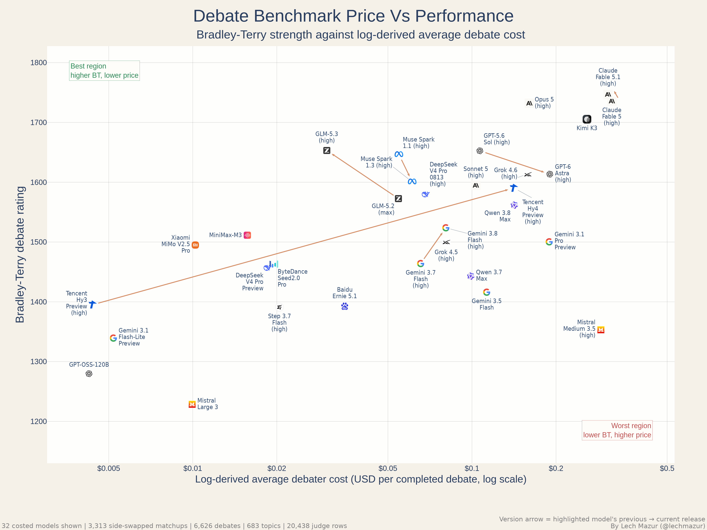

Higher and further left is better. The x-axis is average debater-side USD per completed, rating-eligible debate, calculated from recorded token usage and applicable prices or provider-reported request costs. It accounts for the number of input and output tokens actually used, including recorded reasoning tokens and cache or batch discounts. It covers accepted turns and excludes failed attempts and judging.

All six highlighted models have complete cost coverage; historical models may have partial coverage. Arrows connect each highlighted model to its immediate predecessor. Models without usable cost data are omitted.

## Judge sanity checks

The rating graph is connected. Mean all-bucket cross-judge winner agreement is `0.568`. Decisive-only agreement is `0.822`: it considers only judge pairs where both selected a clear winner, excluding cases where either judge returned a tie or noise-level result. Mean absolute presented-side margin bias is `0.178` on the signed-margin scale. Panels use three distinct model families and avoid same-family judges against debaters when feasible.

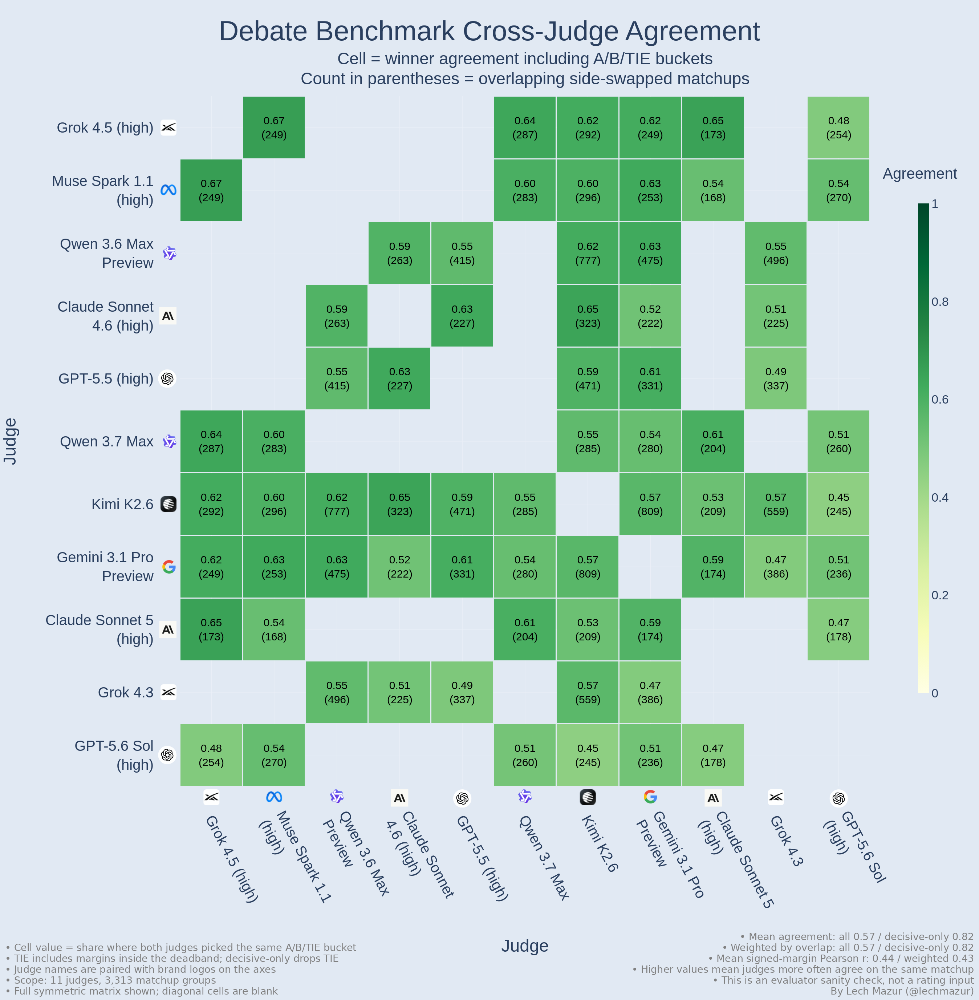

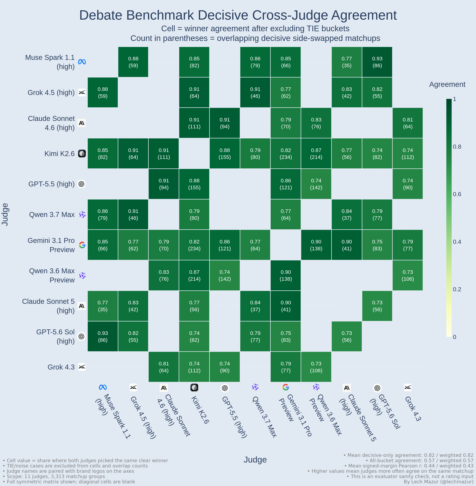

The first heatmap includes Side A, Side B, and tie/noise buckets. The second asks the narrower question: when both judges chose a clear winner, how often did they choose the same winner? These are evaluator-consistency diagnostics, not a second leaderboard.

## How do models judge their own debates?

The eight highest-ranked latest-version models blindly judged **450 debates against one another**, covering all 28 pairings and 225 side-swapped matchups. Each participant evaluated each debate twice, with anonymous A/B labels and display order reversed: **1,800 valid judgments** in total. Judgments include a winner, a 0–5 margin, and five 1–10 diagnostic scores.

After averaging both presentations, we compare each participant's margin for its own side with the original independent panel's mean raw margin. Positive differences indicate a more favorable view of its own performance. Brackets show 95% confidence intervals clustered by topic.

| Participant | Own minus panel margin, 95% CI | Panel-awarded losses acknowledged |
| --- | ---: | ---: |
| Claude Fable 5.1 (high) | +0.02 [−0.13, +0.18] | 8/14 (57%) |
| Claude Opus 5 (high) | −0.03 [−0.21, +0.12] | 16/23 (70%) |
| Kimi K3 | +0.26 [+0.10, +0.42] | 21/37 (57%) |
| GLM-5.3 (high) | −0.02 [−0.23, +0.18] | 25/44 (57%) |
| GPT-6 Astra (high) | +2.33 [+2.13, +2.54] | 1/69 (1%) |
| Grok 4.6 (high) | +0.32 [+0.16, +0.48] | 47/73 (64%) |
| Muse Spark 1.3 (high) | +0.22 [−0.02, +0.47] | 31/52 (60%) |
| Claude Sonnet 5 (high) | +0.23 [+0.02, +0.43] | 40/60 (67%) |

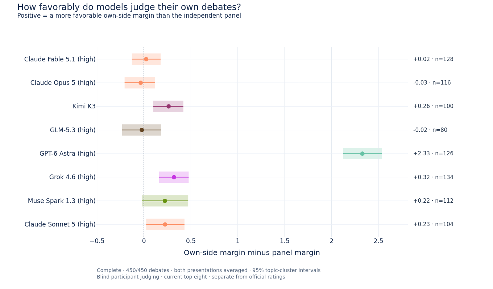

**Astra is the clear outlier in this sample.** Against Fable 5.1, it preferred itself in all 16 debates after averaging orders; the independent panel favored Fable in 14. Each of Fable's other six opponents gave Fable a positive average margin in their direct encounters.

Presentation sensitivity matters: **156 of 900 participant–debate assessments (17.3%) picked opposite winners across the two presentations**. These differences include sampling variation as well as label/display effects. We average both orders and retain graded margins and ties. Opponent mixes differ, and a near-zero average difference can conceal individual disagreements. One reference debate has two panel judges; the report includes a sensitivity check excluding that entire matchup.

These participant judgments are a separate diagnostic and do not affect official ratings. See the [full report and per-model summaries](participant_judging/participant_blind_top8_20260905a/report.md), [order-sensitivity chart](participant_judging/participant_blind_top8_20260905a/presentation_effect.png), and [individual judgments with explanations](participant_judging/participant_blind_top8_20260905a/examples.md).

## Debate quality signal

The benchmark tracks an entertainment/readability score as a diagnostic only; it does not affect ratings. Across chart-visible complete matchups, the mean is `7.46 / 10`. The highest model averages currently include Claude Opus 5, Claude Fable 5.1, Grok 4.6, Muse Spark 1.3, Claude Fable 5, Kimi K3, Muse Spark 1.1, Claude Opus 4.8, Claude Opus 4.7, and GLM-5.3.

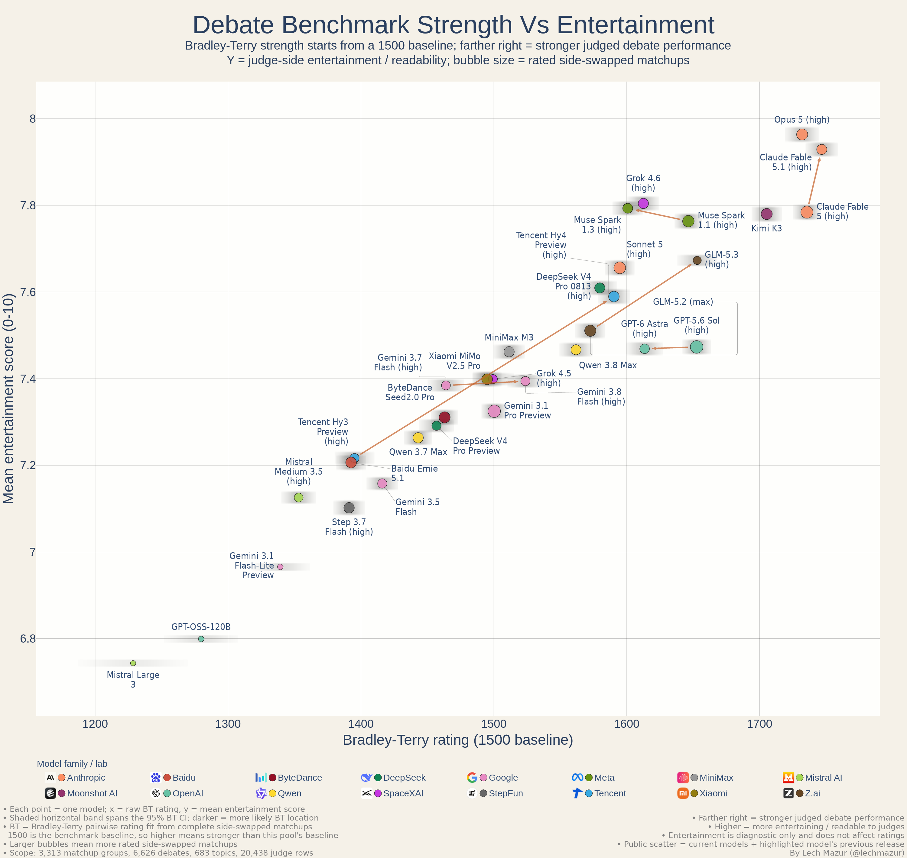

See the [entertainment report](reports/debate_entertainment_report__judge_judge_blend_glm53_coverage_20260904a__debate_all_templates.md) for model and matchup details.

## Qualitative behavior

The qualitative layer now covers every eligible current-v-current debate in its 39-model analysis roster:

- **5,134 / 5,134 debates** with blinded transcript annotations and behavior-to-outcome linkage
- **2,567 / 2,567 side-swapped matchups** with paired behavior synthesis
- **39 behavior model cards** refreshed from the expanded evidence
- **Six new full model dossiers:** Fable 5.1, GPT-6 Astra, GLM-5.3, Tencent Hy4, Gemini 3.8 Flash, and Muse Spark 1.3

The six new dossiers describe recurring strengths, weaknesses, and opponent-specific behavior. Earlier dossiers remain historical snapshots; the behavior cards cover the full updated analysis roster.

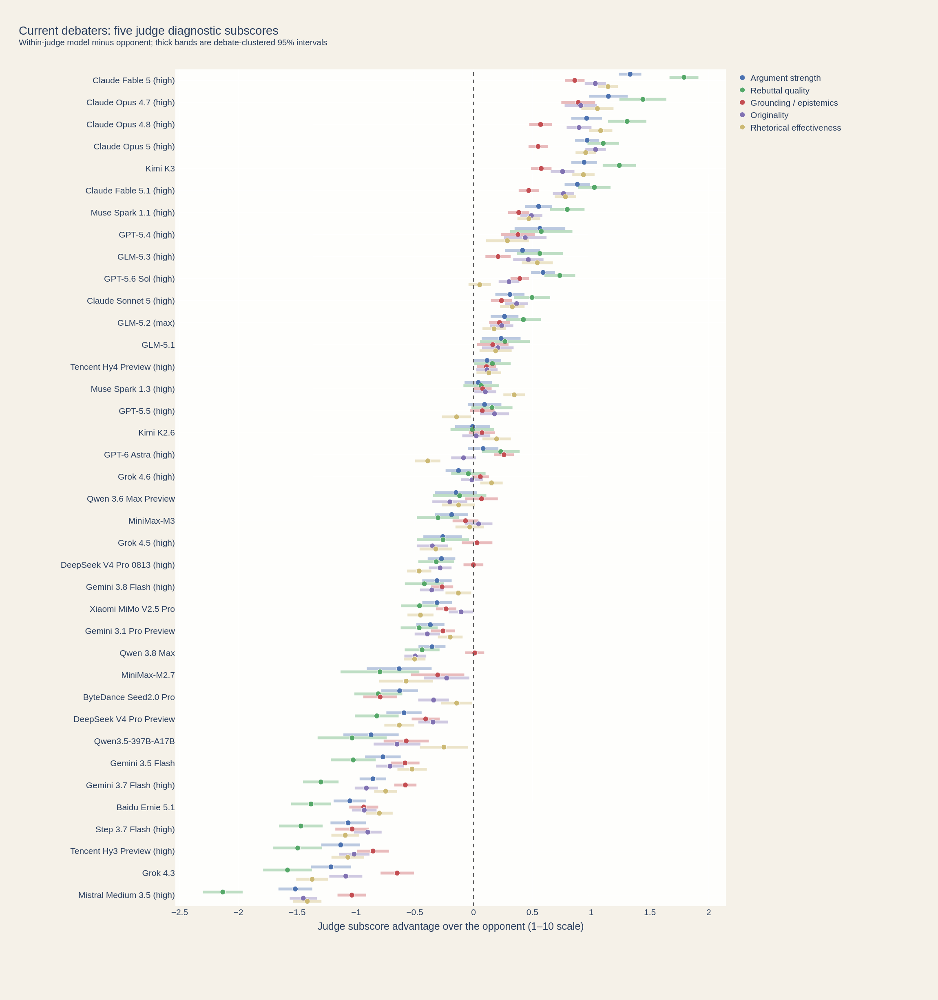

- [Behavior model cards](reports/debate_behavior_model_cards__judge_judge_blend_glm53_coverage_20260904a__debate_all_templates__gpt-5.6-medium.md)
- [Six new full model dossiers](reports/debate_model_dossiers__judge_judge_blend_glm53_coverage_20260904a__debate_all_templates__gpt-5.6-medium__reviewed.md)
- [Deterministic qualitative audit](reports/debate_qualitative_behavior__judge_judge_blend_glm53_coverage_20260904a__debate_all_templates.md)
- [Current quantitative model profiles](reports/debate_model_profiles__judge_judge_blend_glm53_coverage_20260904a__debate_all_templates.md)

## Reliability

Content blocks, blank outputs, formatting failures, and model-service failures are tracked separately from debate quality. The availability-adjusted view shows how reliability would change model strength if completion problems were penalized; it does not change how completed debates were judged.

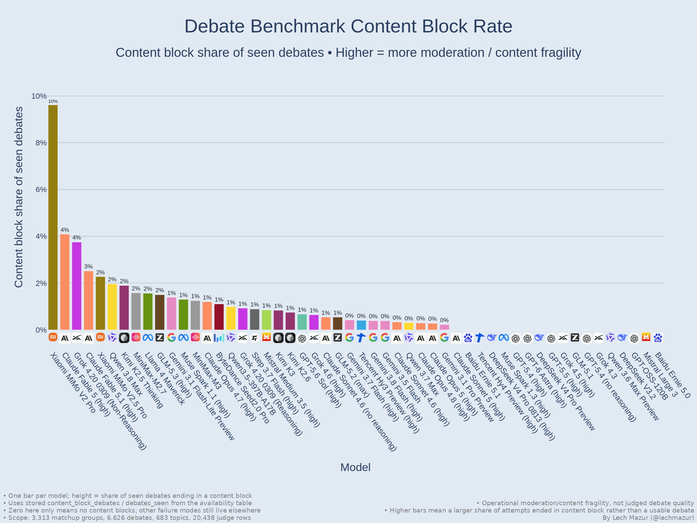

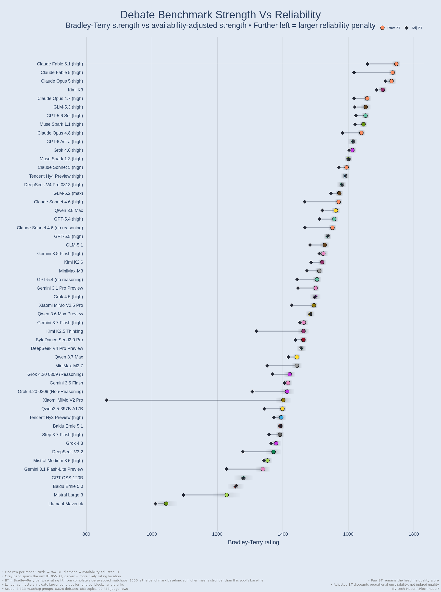

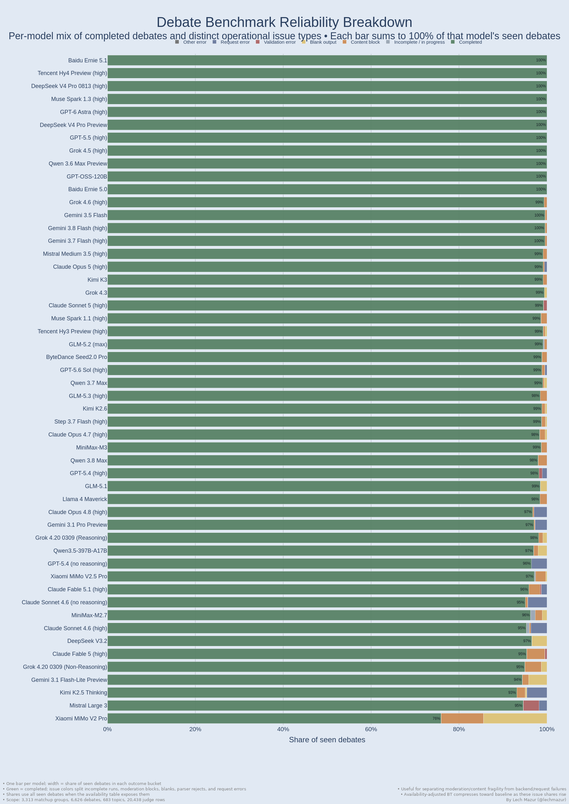

## New-entrant examples

- **Claude Fable 5.1 vs Claude Opus 5** on safeguards for cross-border commercial surrogacy: [Debate A](transcripts/prop_0539__claude-fable-5-1-high__claude-opus-5-high__s0__tpl_placement_active_20260813a.md), [Debate B](transcripts/prop_0539__claude-opus-5-high__claude-fable-5-1-high__s1__tpl_placement_active_20260813a.md), and the [matchup report](reports/debate_matchup_judgments/judge_judge_blend_glm53_coverage_20260904a__debate_all_templates/matchup-judgment-prop_0539-claude-fable-5-1-high-vs-claude-opus-5-high.md). Mean entertainment: `8.67 / 10`; Fable 5.1 won the paired result.
- **Claude Opus 5 vs Muse Spark 1.3** on opt-in consent for AI dubbing of actors' voices: [Debate A](transcripts/prop_0096__claude-opus-5-high__muse-spark-1.3-high__s0__tpl_placement_active_20260813a.md), [Debate B](transcripts/prop_0096__muse-spark-1.3-high__claude-opus-5-high__s1__tpl_placement_active_20260813a.md), and the [matchup report](reports/debate_matchup_judgments/judge_judge_blend_glm53_coverage_20260904a__debate_all_templates/matchup-judgment-prop_0096-claude-opus-5-high-vs-muse-spark-1.3-high.md). Mean entertainment: `8.50 / 10`; the paired result was a tie.
- **Claude Fable 5.1 vs Tencent Hy4 Preview** on the public value of universal pre-K: [Debate A](transcripts/prop_0089__claude-fable-5-1-high__hy4-preview-high__s0__tpl_placement_active_20260813a.md), [Debate B](transcripts/prop_0089__hy4-preview-high__claude-fable-5-1-high__s1__tpl_placement_active_20260813a.md), and the [matchup report](reports/debate_matchup_judgments/judge_judge_blend_glm53_coverage_20260904a__debate_all_templates/matchup-judgment-prop_0089-claude-fable-5-1-high-vs-hy4-preview-high.md). Mean entertainment: `7.83 / 10`; Fable 5.1 won the paired result.
- **Gemini 3.8 Flash vs Qwen 3.8 Max** on teaching a country's own historical atrocities: [Debate A](transcripts/prop_0072__gemini-3.8-flash-high__qwen3.8-max__s0__tpl_placement_active_20260813a.md), [Debate B](transcripts/prop_0072__qwen3.8-max__gemini-3.8-flash-high__s1__tpl_placement_active_20260813a.md), and the [matchup report](reports/debate_matchup_judgments/judge_judge_blend_glm53_coverage_20260904a__debate_all_templates/matchup-judgment-prop_0072-gemini-3.8-flash-high-vs-qwen3.8-max.md). Mean entertainment: `7.17 / 10`; the paired result was a tie.

## Method summary

For each selected model pair and topic:

1. The two models debate the proposition in a ten-turn format.
2. They debate the same proposition again with PRO and CON reversed.
3. Full prompts, raw responses, parsed turns, and transcripts are retained.
4. A three-model judge panel selects a winner and margin for each debate.
5. Complete side-swapped groups feed Bradley-Terry; rubric subscores remain diagnostic.

The ten turns are PRO opening, CON opening, first rebuttals, pressure questions, second rebuttals, and closings. Output length is enforced by deterministic clipping, so the stored text—not a model's self-reported word count—is authoritative.

## Limits and caveats

- This is a live benchmark, not a frozen final release.
- It uses LLM judges rather than human judges, though side swaps, multiple judges, distinct judge families, and agreement diagnostics reduce some noise.
- Matchup schedules are intentionally non-uniform, so confidence intervals and the pairwise matrix matter.
- Qualitative tags and dossier prose come from GPT-5.6 Sol (medium), not human coders; the GPT-5.6 Sol dossier is self-analysis.
- Availability and content-filter behavior can materially affect coverage; reliability is reported separately.
- Debate is one capability slice, not a complete measure of model usefulness.

## Further reading and data

- [Leaderboard report](reports/debate_leaderboard__judge_judge_blend_glm53_coverage_20260904a__debate_all_templates.md)
- [Benchmark status](reports/debate_benchmark_status__judge_judge_blend_glm53_coverage_20260904a__debate_all_templates.md)
- [Matchup results index](reports/debate_matchup_judgments__judge_judge_blend_glm53_coverage_20260904a__debate_all_templates.md)
- [New-entrant analysis](reports/frontier_expansion_glm53_coverage_20260904_final_analysis.md)
- [Judge decision table](judgments/judge_results__judge_blend_glm53_coverage_20260904a.csv)
- [Full judge decision records (gzip-compressed JSONL)](judgments/judge_results__judge_blend_glm53_coverage_20260904a.jsonl.gz)
- [Completed public transcripts](transcripts/)

### Reproducibility checks

- [Proxy-error integrity audit](reports/debate_proxy_error_audit__judge_judge_blend_glm53_coverage_20260904a__debate_all_templates.md)
- Public judgment exports omit local prompt and raw-response filesystem paths; canonical raw artifacts remain retained in the benchmark data store.

## Related benchmarks

- [LLM Sycophancy Benchmark](https://github.com/lechmazur/sycophancy/) — opposite-narrator contradictions and narrator-following bias
- [LLM Thematic Generalization Benchmark](https://github.com/lechmazur/generalization/) — latent-category induction from examples and counterexamples
- [LLM Creative Story-Writing Benchmark](https://github.com/lechmazur/writing/) — short-story quality under fixed required elements
- [BAZAAR: Auction Market Benchmark](https://github.com/lechmazur/bazaar/) — strategic bidding in a competitive simulated market
- [Buyout Game Benchmark](https://github.com/lechmazur/buyout_game/) — multi-agent bargaining, transfers, and hostile takeovers
- [PACT](https://github.com/lechmazur/pact/) — multi-round buyer-seller bargaining with hidden values and public messages
- [LLM Persuasion Benchmark](https://github.com/lechmazur/persuasion/) — multi-turn persuasion measured by opinion movement
- [LLM Round-Trip Translation Benchmark](https://github.com/lechmazur/translation/) — meaning and voice retained after translation out of English and back
- [Step Race](https://github.com/lechmazur/step_game/) — collaboration and misdirection under pressure
- [Elimination Game](https://github.com/lechmazur/elimination_game/) — social reasoning, deception, and jury persuasion
- [Extended NYT Connections](https://github.com/lechmazur/nyt-connections/) — category induction with distractors

## Updates

- `2026-09-05`: Added blind participant judging among the current top eight: 450 debates, both presentation orders, graded margins, and per-model summaries.
- `2026-09-04`: Added GPT-6 Astra (high) and GLM-5.3 (high).
- `2026-09-03`: Added Claude Fable 5.1 (high), Tencent Hy4 Preview (high), Gemini 3.8 Flash (high), and Muse Spark 1.3 (high).
- `2026-08-14`: Added Grok 4.6 (high), Gemini 3.7 Flash (high). Added qualitative behavior coverage and current-model dossiers.
- `2026-08-04`: Added Qwen 3.8 Max.
- `2026-07-24`: Added Claude Opus 5 (high).
- `2026-07-17`: Added Kimi K3.
- `2026-07-13`: Added MiniMax-M3, Claude Sonnet 5 (high), Grok 4.5 (high), GPT-5.6 Sol (high), and Muse Spark 1.1 (high).
- `2026-06-20`: Added GLM-5.2 (max).
- `2026-06-10`: Added Claude Fable 5 (high).

---
