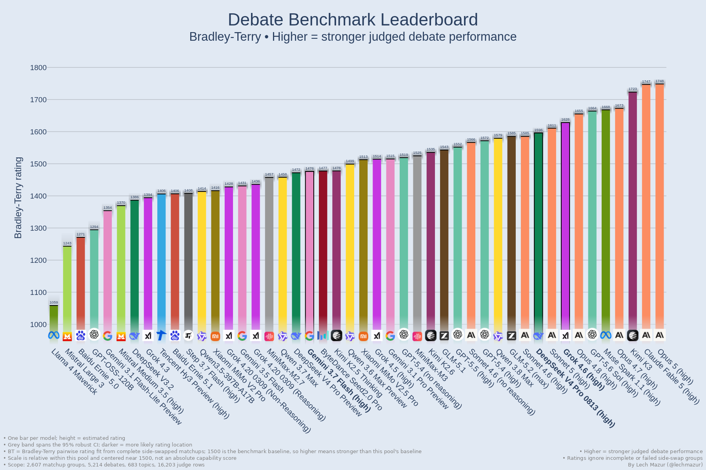
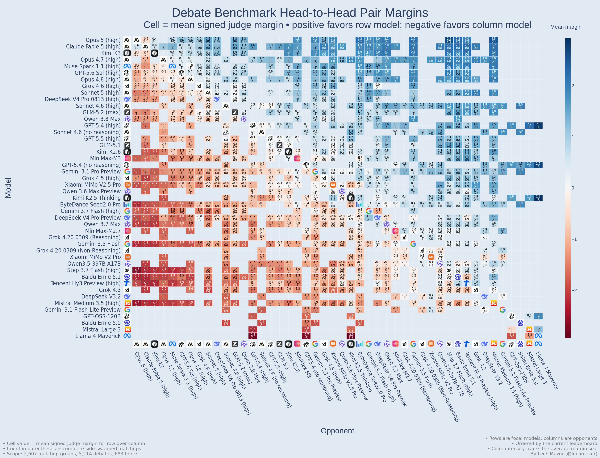
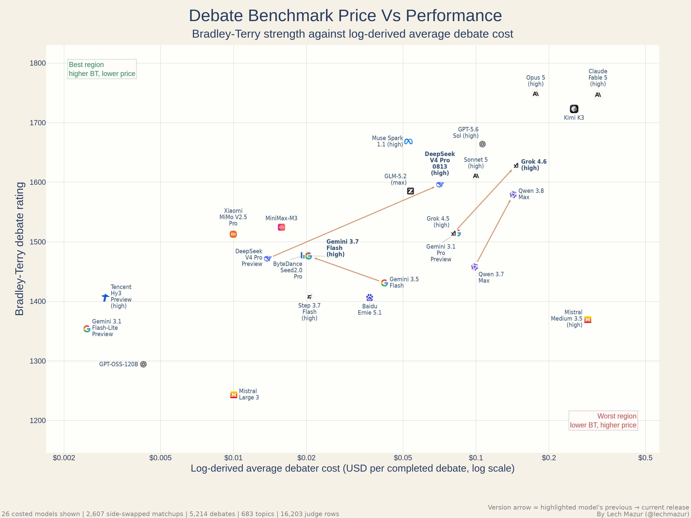
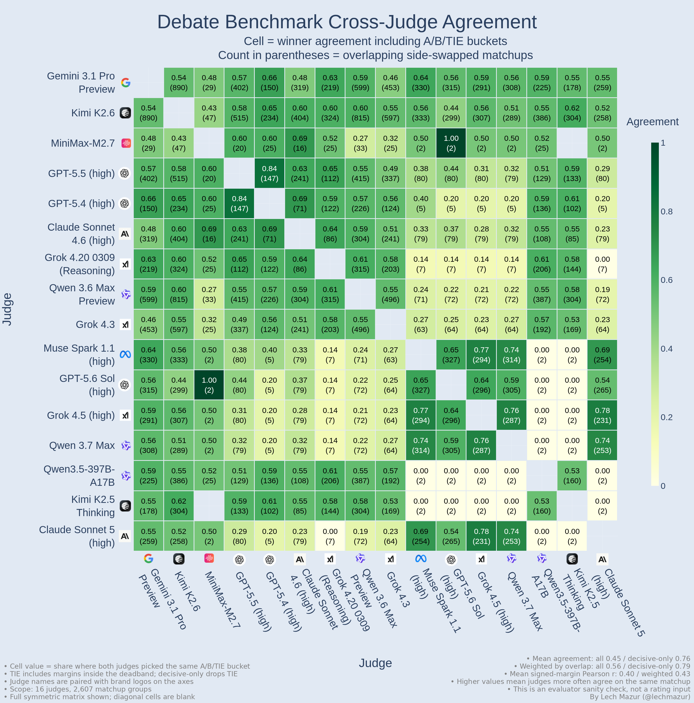
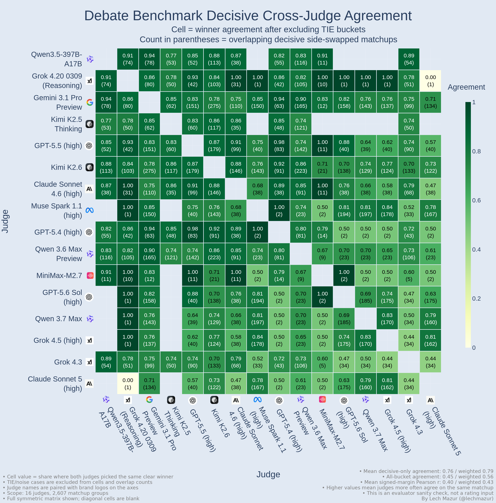
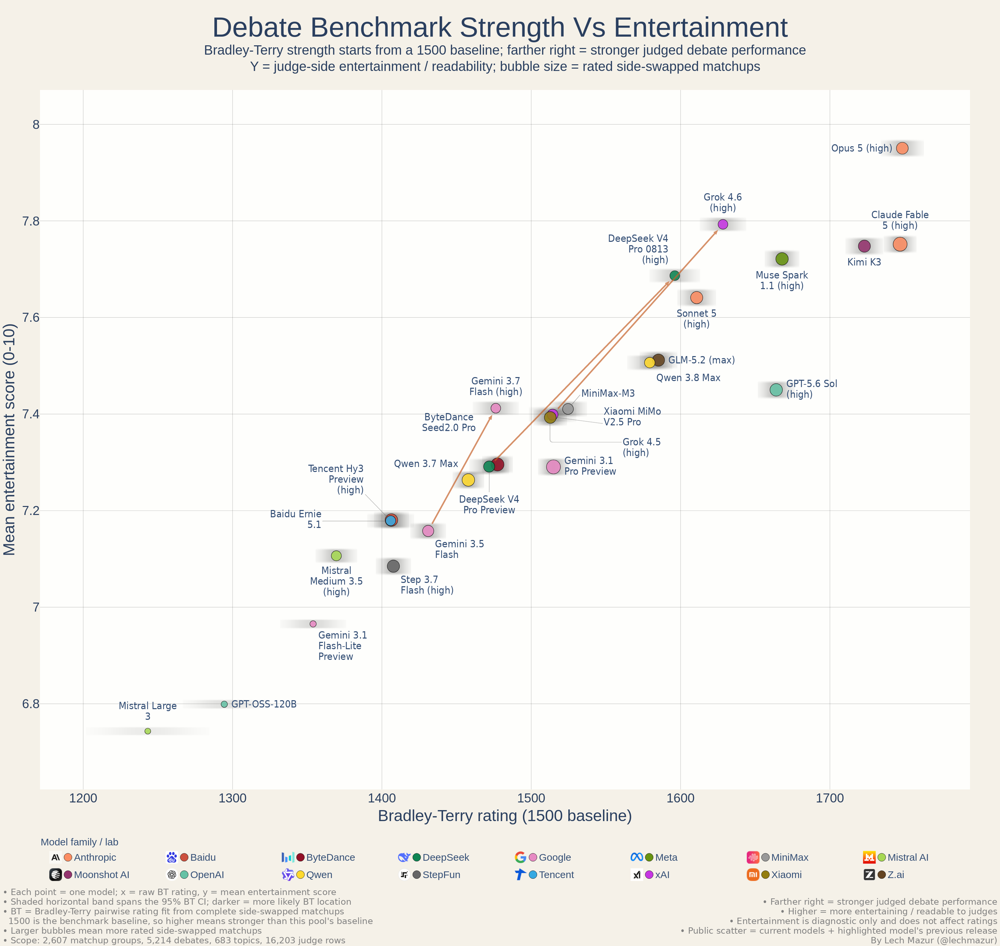
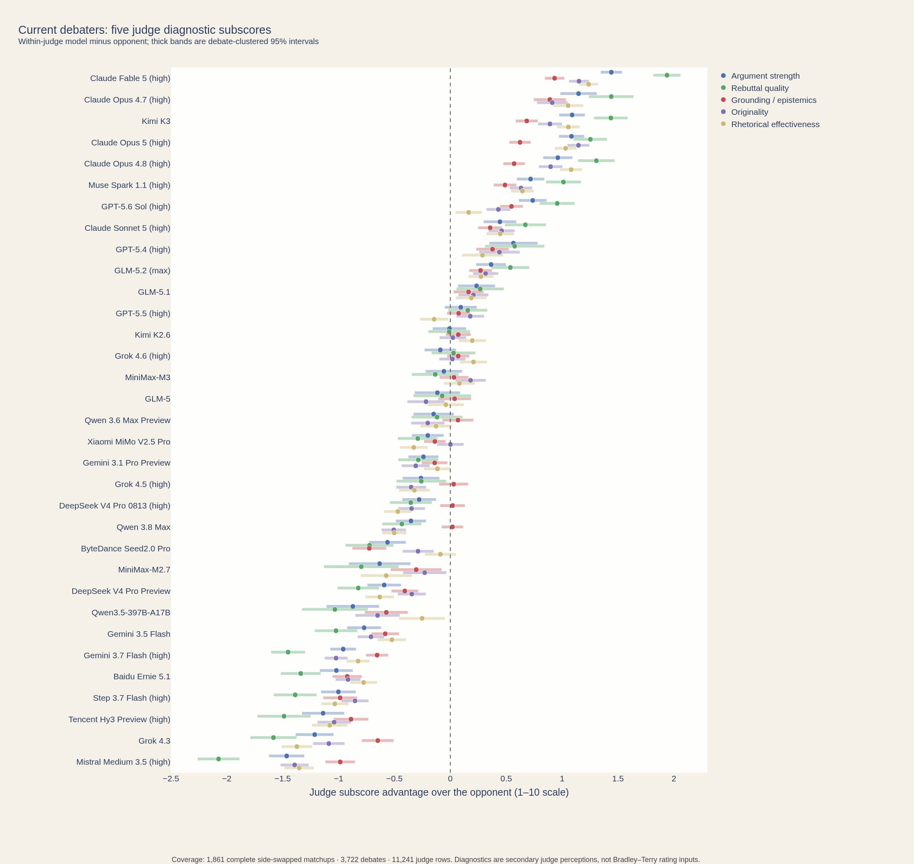
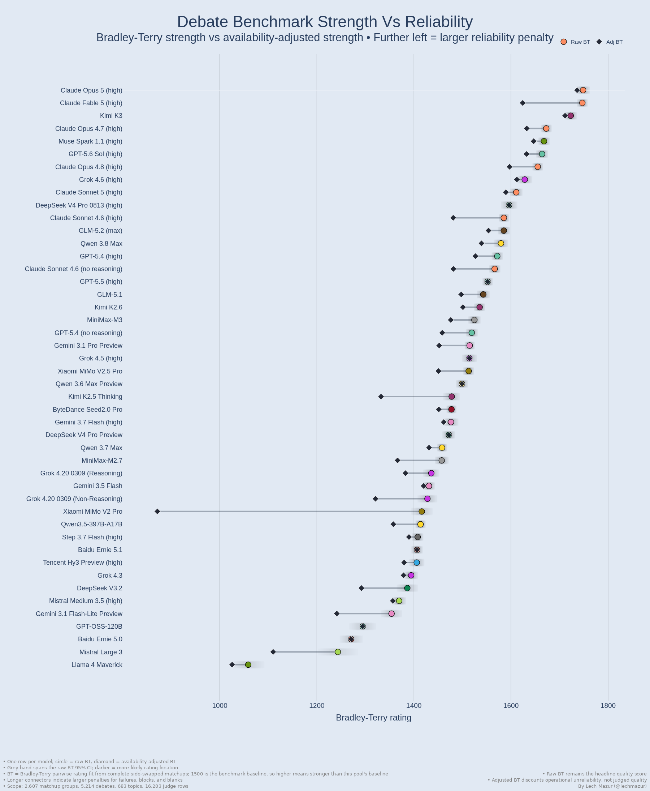
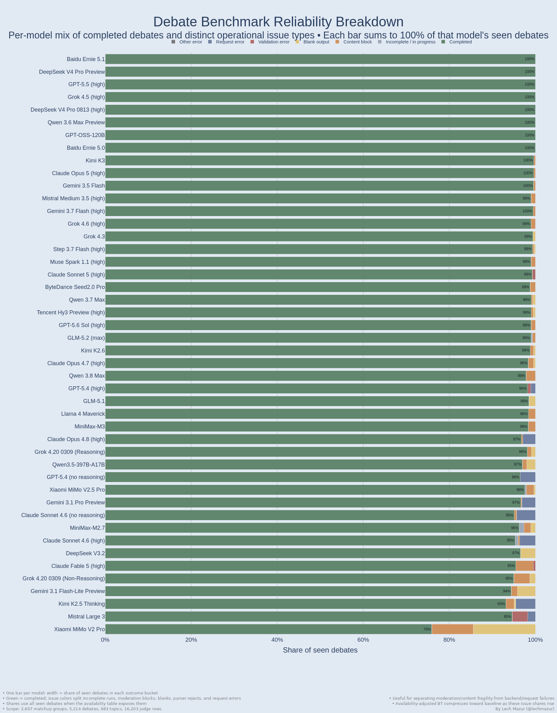

# LLM Debate Benchmark: Adversarial Multi-Turn Argument Under Opposition

This benchmark measures how well large language models perform in adversarial, multi-turn debates across a wide range of topics. Strong performance requires more than a polished opening: models need broad knowledge, accurate facts under pressure, strong rebuttal, and the ability to remain coherent and responsive over several rounds.

Each matchup runs twice on the **same motion with sides swapped**. A three-model judge panel decides each debate's winner and margin. The published leaderboard uses Bradley-Terry ratings built from complete side-swapped matchups.

---

---

## How to read the chart

- Higher bars mean stronger judged debate performance.
- Bradley-Terry is a relative within-pool rating centered near `1500`, not an absolute capability score.
- The grey band spans the **95% robust confidence interval**; darker shading means greater relative density.
- The published order uses Bradley-Terry. Glicko-2 remains a secondary scheduling diagnostic.

## Current snapshot

- **49 rated model identities** in the complete stored graph; **46** shown publicly
- **2,607 complete side-swapped matchups**, comprising **5,214 debates**, used for ratings
- **16,203 judge decisions** behind the ratings
- **683 topics** represented in the rated corpus

One side-swapped matchup means two debates on the same motion with PRO and CON roles reversed.

### Model and data scopes

| View | Models | Matchups | Purpose |
| --- | ---: | ---: | --- |
| Complete stored rating graph | 49 | 2,660 represented; 2,607 rated | All retained historical and current results |
| Public leaderboard | 46 | 2,402 represented; 2,359 rated after retired or superseded identities are excluded | Reader-facing ranking |
| Current-roster qualitative analysis | 33 | 1,861 rated, or 3,722 debates | Behavior cards and dossiers among current peers only |
| Current-focused cost and comparison charts | 26 | — | Current models plus selected predecessors |

The raw judge table contains 16,384 stored decisions; 16,203 belong to complete matchups used for ratings. These scopes answer different questions, so their counts are not expected to match.

This refresh adds **Grok 4.6 (high)**, **Gemini 3.7 Flash (high)**, and **DeepSeek V4 Pro 0813 (high)**. We planned 558 individual debates for the new entrants and completed 555. Three model refusals remain preserved as reliability outcomes. The new set contributes 277 complete side-swapped matchups to ratings; one completed debate is excluded because its reverse-side partner failed. All 1,665 planned judge decisions for the completed debates were captured.

The three entrants are the only highlighted models in this release. Current-focused scatter plots retain each one's immediate predecessor for comparison and draw the eligible Grok 4.5 → Grok 4.6, Gemini 3.5 Flash → Gemini 3.7 Flash, and DeepSeek V4 Pro Preview → DeepSeek V4 Pro 0813 arrows.

The integrity audit finds 22 historical debates containing literal upstream proxy-error text, but **zero affected rating groups** in this release. Their source artifacts remain preserved while the contaminated groups remain outside rating inputs.

## Reader paths

1. **Ranking:** start with the chart above and the [full leaderboard report](reports/debate_leaderboard__judge_judge_blend_20260814a__debate_all_templates.md).
2. **Design checks:** inspect the [pairwise heatmap](#pairwise-view), [judge agreement](#judge-sanity-checks), and [status report](reports/debate_benchmark_status__judge_judge_blend_20260814a__debate_all_templates.md).
3. **How models debate:** use the [behavior model cards](reports/debate_behavior_model_cards__judge_judge_blend_20260814a__debate_all_templates__gpt-5.6-medium.md), [current-model dossiers](reports/debate_model_dossiers__judge_judge_blend_20260814a__debate_all_templates__gpt-5.6-medium.md), and [model profiles](reports/debate_model_profiles__judge_judge_blend_20260814a__debate_all_templates.md).
4. **Individual debates:** browse the [matchup results index](reports/debate_matchup_judgments__judge_judge_blend_20260814a__debate_all_templates.md) and [published transcripts](transcripts/).

## Pairwise view

Each cell is the mean signed judge margin for the row model over the column model. Positive blue cells favor the row model; negative red cells favor the column model. The number in parentheses is the count of complete side-swapped matchups for that head-to-head. Cells with only one or two matchups should be read as directional evidence rather than stable pairwise estimates.

## Bradley-Terry leaderboard

| Rank | Model | BT | Matchups |
| ---: | --- | ---: | ---: |
| 1 | Claude Opus 5 (high) | 1748.5 | 141 |
| 2 | Claude Fable 5 (high) | 1747.0 | 185 |
| 3 | Kimi K3 | 1723.1 | 146 |
| 4 | Claude Opus 4.7 (high) | 1672.6 | 120 |
| 5 | Muse Spark 1.1 (high) | 1668.0 | 155 |
| 6 | GPT-5.6 Sol (high) | 1664.0 | 154 |
| 7 | Claude Opus 4.8 (high) | 1655.1 | 165 |
| 8 | Grok 4.6 (high) | 1628.4 | 99 |
| 9 | Claude Sonnet 5 (high) | 1610.8 | 149 |
| 10 | DeepSeek V4 Pro 0813 (high) | 1596.1 | 100 |
| 11 | Claude Sonnet 4.6 (high) | 1585.2 | 139 |
| 12 | GLM-5.2 (max) | 1585.2 | 148 |
| 13 | Qwen 3.8 Max | 1579.4 | 115 |
| 14 | GPT-5.4 (high) | 1571.7 | 131 |
| 15 | Claude Sonnet 4.6 (no reasoning) | 1566.4 | 85 |
| 16 | GPT-5.5 (high) | 1551.7 | 126 |
| 17 | GLM-5.1 | 1542.8 | 99 |
| 18 | Kimi K2.6 | 1535.4 | 131 |
| 19 | MiniMax-M3 | 1524.6 | 121 |
| 20 | GPT-5.4 (no reasoning) | 1519.1 | 95 |
| 21 | Gemini 3.1 Pro Preview | 1514.9 | 185 |
| 22 | Grok 4.5 (high) | 1514.3 | 122 |
| 23 | Xiaomi MiMo V2.5 Pro | 1512.7 | 140 |
| 24 | Qwen 3.6 Max Preview | 1498.8 | 84 |
| 25 | Kimi K2.5 Thinking | 1477.8 | 73 |
| 26 | ByteDance Seed2.0 Pro | 1477.4 | 164 |
| 27 | Gemini 3.7 Flash (high) | 1476.3 | 99 |
| 28 | DeepSeek V4 Pro Preview | 1471.8 | 128 |
| 29 | Qwen 3.7 Max | 1457.9 | 156 |
| 30 | MiniMax-M2.7 | 1457.3 | 89 |
| 31 | Grok 4.20 0309 (Reasoning) | 1435.8 | 49 |
| 32 | Gemini 3.5 Flash | 1431.0 | 129 |
| 33 | Grok 4.20 0309 (Non-Reasoning) | 1427.9 | 36 |
| 34 | Xiaomi MiMo V2 Pro | 1416.2 | 30 |
| 35 | Qwen3.5-397B-A17B | 1413.6 | 91 |
| 36 | Step 3.7 Flash (high) | 1407.7 | 150 |
| 37 | Baidu Ernie 5.1 | 1406.4 | 156 |
| 38 | Tencent Hy3 Preview (high) | 1405.9 | 106 |
| 39 | Grok 4.3 | 1394.3 | 88 |
| 40 | DeepSeek V3.2 | 1386.4 | 41 |
| 41 | Mistral Medium 3.5 (high) | 1369.5 | 105 |
| 42 | Gemini 3.1 Flash-Lite Preview | 1353.9 | 31 |
| 43 | GPT-OSS-120B | 1294.5 | 31 |
| 44 | Baidu Ernie 5.0 | 1270.8 | 16 |
| 45 | Mistral Large 3 | 1243.2 | 22 |
| 46 | Llama 4 Maverick | 1058.6 | 29 |

`BT` is the headline Bradley-Terry rating. `Matchups` counts complete side-swapped matchup groups.

### What stands out

- **Claude Opus 5 and Claude Fable 5 are effectively tied at the top by point estimate.** Their robust intervals overlap substantially; Kimi K3 remains close behind.
- **Grok 4.6 enters at #8.** Its 1628.4 BT estimate across 99 complete matchups is well above Grok 4.5's 1514.3.
- **DeepSeek V4 Pro 0813 enters at #10.** It reaches 1596.1 BT across 100 matchups, compared with 1471.8 for the preserved historical Preview identity.
- **Gemini 3.7 Flash enters at #27.** Its Bradley-Terry rating is above Gemini 3.5 Flash, while its Glicko-2 rating is below that predecessor; the disagreement is a reminder to inspect schedule and matchup structure.
- **Qwen 3.8 remains the strongest Qwen in the Bradley-Terry view.** It ranks #13 at 1579.4 BT.
- **The top cluster is not cleanly separated.** Confidence intervals and pairwise coverage matter more than one- or two-place rank differences.

## Price vs. performance

Higher and further left is better. The x-axis is estimated debater-side USD per completed debate and excludes judging cost. Price estimates cover 52,381 stored turns, and all 49 rated model identities have usable estimates. Among the new entrants, Gemini 3.7 Flash is estimated at about `$0.020` per completed debate, DeepSeek V4 Pro 0813 at `$0.071`, and Grok 4.6 at `$0.146`. Among the top three, Claude Opus 5 averages about `$0.176`, Kimi K3 about `$0.254`, and Claude Fable 5 about `$0.319`.

## Judge sanity checks

The rating graph is connected. Mean all-bucket cross-judge winner agreement is `0.448`. Decisive-only agreement is `0.761`: it considers only judge pairs where both selected a clear winner, excluding cases where either judge returned a tie or noise-level result. Mean absolute presented-side margin bias is `0.167` on the signed-margin scale. Panels use three distinct model families and avoid same-family judges against debaters when feasible.

The first heatmap includes Side A, Side B, and tie/noise buckets. The second asks the narrower question: when both judges chose a clear winner, how often did they choose the same winner? These are evaluator-consistency diagnostics, not a second leaderboard.

## Debate quality signal

The benchmark tracks an entertainment/readability score as a diagnostic only; it does not affect ratings. Across chart-visible complete matchups, the mean is `7.41 / 10`. The highest model averages currently include Claude Opus 5, Grok 4.6, Claude Fable 5, Kimi K3, Muse Spark 1.1, Claude Opus 4.8, Claude Opus 4.7, DeepSeek V4 Pro 0813, Claude Sonnet 5, and GLM-5.2.

See the [entertainment report](reports/debate_entertainment_report__judge_judge_blend_20260814a__debate_all_templates.md) for model and matchup details.

## Qualitative behavior

The qualitative layer covers every eligible current-v-current debate in the 33-model current roster:

- **3,722 / 3,722 debates** with blinded transcript annotations
- **1,861 / 1,861 side-swapped matchups** with paired behavior synthesis
- **3,722 / 3,722 debates** with behavior-to-outcome linkage
- **11,241 judge rows** feeding judge-consensus and diagnostic summaries
- **33 current-model dossiers** generated from current-peer evidence only

The model cards keep judge opinions, blinded transcript behavior, side-swap stability, outcome associations, execution facts, and the five diagnostic subscores separate. GPT-5.6 Sol (medium) tags stored judge rationales and blinded transcripts, then synthesizes the dossiers. “Judge-panel consensus” means at least two judges in the panel received the same behavior tag for that debate; it is not a fresh panel vote. Subscores remain secondary perceptions rather than rating inputs.

This annotation layer uses one model, so its taxonomy and summaries can share that model's blind spots. The GPT-5.6 Sol dossier is also self-analysis by the same model family. The reports retain deterministic counts, quoted evidence, and separate judge signals so readers can audit those interpretations.

- [Behavior model cards](reports/debate_behavior_model_cards__judge_judge_blend_20260814a__debate_all_templates__gpt-5.6-medium.md)
- [Current-model dossiers](reports/debate_model_dossiers__judge_judge_blend_20260814a__debate_all_templates__gpt-5.6-medium.md)
- [Deterministic qualitative audit](reports/debate_qualitative_behavior__judge_judge_blend_20260814a__debate_all_templates.md)
- [Model profiles](reports/debate_model_profiles__judge_judge_blend_20260814a__debate_all_templates.md)

## Reliability

Content blocks, blank outputs, formatting failures, and model-service failures are tracked separately from debate quality. The availability-adjusted view shows how reliability would change model strength if completion problems were penalized; it does not change how completed debates were judged.

## New-entrant examples

- **Claude Opus 5 vs Grok 4.6** on funding crewed deep-ocean exploration: [Debate A](transcripts/prop_0499__claude-opus-5-high__grok-4.6-high__s0__tpl_placement_active_20260813a.md), [Debate B](transcripts/prop_0499__grok-4.6-high__claude-opus-5-high__s1__tpl_placement_active_20260813a.md), and the [matchup report](reports/debate_matchup_judgments/judge_judge_blend_20260814a__debate_all_templates/matchup-judgment-prop_0499-claude-opus-5-high-vs-grok-4.6-high.md). Mean entertainment: `8.67 / 10`; Opus 5 won the paired result.
- **Claude Fable 5 vs DeepSeek V4 Pro 0813** on NATO forward deployment: [Debate A](transcripts/prop_0611__claude-fable-5-high__deepseek-v4-pro-0813-high__s0__tpl_placement_active_20260813a.md), [Debate B](transcripts/prop_0611__deepseek-v4-pro-0813-high__claude-fable-5-high__s1__tpl_placement_active_20260813a.md), and the [matchup report](reports/debate_matchup_judgments/judge_judge_blend_20260814a__debate_all_templates/matchup-judgment-prop_0611-claude-fable-5-high-vs-deepseek-v4-pro-0813-high.md). Mean entertainment: `8.50 / 10`; Fable 5 won the paired result.
- **Claude Opus 5 vs Gemini 3.7 Flash** on creators' rights over generative-AI training: [Debate A](transcripts/prop_0321__claude-opus-5-high__gemini-3.7-flash-high__s0__tpl_placement_active_20260813a.md), [Debate B](transcripts/prop_0321__gemini-3.7-flash-high__claude-opus-5-high__s1__tpl_placement_active_20260813a.md), and the [matchup report](reports/debate_matchup_judgments/judge_judge_blend_20260814a__debate_all_templates/matchup-judgment-prop_0321-claude-opus-5-high-vs-gemini-3.7-flash-high.md). Mean entertainment: `8.00 / 10`; Opus 5 won the paired result.

## Method summary

For each selected model pair and topic:

1. The two models debate the proposition in a ten-turn format.
2. They debate the same proposition again with PRO and CON reversed.
3. Full prompts, raw responses, parsed turns, and transcripts are retained.
4. A three-model judge panel selects a winner and margin for each debate.
5. Complete side-swapped groups feed Bradley-Terry; rubric subscores remain diagnostic.

The ten turns are PRO opening, CON opening, first rebuttals, pressure questions, second rebuttals, and closings. Output length is enforced by deterministic clipping, so the stored text—not a model's self-reported word count—is authoritative.

## Limits and caveats

- This is a live benchmark, not a frozen final release.
- It uses LLM judges rather than human judges, though side swaps, multiple judges, distinct judge families, and agreement diagnostics reduce some noise.
- Matchup schedules are intentionally non-uniform, so confidence intervals and the pairwise matrix matter.
- Qualitative tags and dossier prose come from GPT-5.6 Sol (medium), not human coders; the GPT-5.6 Sol dossier is self-analysis.
- Availability and content-filter behavior can materially affect coverage; reliability is reported separately.
- Debate is one capability slice, not a complete measure of model usefulness.

## Further reading and data

- [Leaderboard report](reports/debate_leaderboard__judge_judge_blend_20260814a__debate_all_templates.md)
- [Benchmark status](reports/debate_benchmark_status__judge_judge_blend_20260814a__debate_all_templates.md)
- [Matchup results index](reports/debate_matchup_judgments__judge_judge_blend_20260814a__debate_all_templates.md)
- [Judge decision table](judgments/judge_results__judge_blend_20260814a.csv)
- [Full judge decision records (gzip-compressed JSONL)](judgments/judge_results__judge_blend_20260814a.jsonl.gz)
- [Completed public transcripts](transcripts/)

### Reproducibility checks

- [Proxy-error integrity audit](reports/debate_proxy_error_audit__judge_judge_blend_20260814a__debate_all_templates.md)
- Public judgment exports omit local prompt and raw-response filesystem paths; canonical raw artifacts remain retained in the benchmark data store.

## Related benchmarks

- [LLM Sycophancy Benchmark](https://github.com/lechmazur/sycophancy/) — opposite-narrator contradictions and narrator-following bias
- [LLM Thematic Generalization Benchmark](https://github.com/lechmazur/generalization/) — latent-category induction from examples and counterexamples
- [LLM Creative Story-Writing Benchmark](https://github.com/lechmazur/writing/) — short-story quality under fixed required elements
- [BAZAAR: Auction Market Benchmark](https://github.com/lechmazur/bazaar/) — strategic bidding in a competitive simulated market
- [Buyout Game Benchmark](https://github.com/lechmazur/buyout_game/) — multi-agent bargaining, transfers, and hostile takeovers
- [PACT](https://github.com/lechmazur/pact/) — multi-round buyer-seller bargaining with hidden values and public messages
- [LLM Persuasion Benchmark](https://github.com/lechmazur/persuasion/) — multi-turn persuasion measured by opinion movement
- [LLM Round-Trip Translation Benchmark](https://github.com/lechmazur/translation/) — meaning and voice retained after translation out of English and back
- [Step Race](https://github.com/lechmazur/step_game/) — collaboration and misdirection under pressure
- [Elimination Game](https://github.com/lechmazur/elimination_game/) — social reasoning, deception, and jury persuasion
- [Extended NYT Connections](https://github.com/lechmazur/nyt-connections/) — category induction with distractors

## Updates

- `2026-08-14`: Added Grok 4.6 (high), Gemini 3.7 Flash (high), and DeepSeek V4 Pro 0813 (high), then refreshed ratings, charts, costs, qualitative behavior coverage, and current-model dossiers from all retained eligible debates.
- `2026-08-04`: Added Qwen 3.8 Max.
- `2026-07-24`: Added Claude Opus 5 (high).
- `2026-07-17`: Added Kimi K3.
- `2026-07-13`: Added MiniMax-M3, Claude Sonnet 5 (high), Grok 4.5 (high), GPT-5.6 Sol (high), and Muse Spark 1.1 (high).
- `2026-06-20`: Added GLM-5.2 (max).
- `2026-06-10`: Added Claude Fable 5 (high).

---
