# LLM Debate Benchmark: Adversarial Multi-Turn Argument Under Opposition

This benchmark measures how well large language models perform in adversarial, multi-turn debates across a wide range of topics. Strong performance requires more than a polished opening: models need broad knowledge, accurate facts under pressure, strong rebuttal, and the ability to remain coherent and responsive over several rounds.

Each matchup runs twice on the **same motion with sides swapped**. A three-model judge panel decides each debate's winner and margin. The published leaderboard uses Bradley-Terry ratings built from complete side-swapped matchups.

---

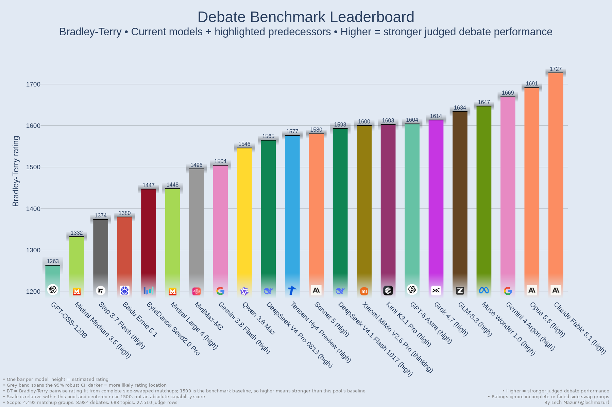

This chart shows **25 current models and selected predecessors**, including Kimi K3.1 Pro (high), Kimi K3, and DeepSeek V4.1 Flash 1017 (high). The [full historical chart](images/debate_bt_ratings__judge_judge_blend_deepseek41flash1017_20261024_finala__debate_all_templates.png) and leaderboard table below retain the broader public comparison set.

---

## How to read the chart

- Higher bars mean stronger judged debate performance.
- Bradley-Terry is a relative within-pool rating centered near `1500`, not an absolute capability score.
- The grey band spans the **95% robust confidence interval**; darker shading means greater relative density.
- The published order uses Bradley-Terry. Glicko-2 remains a secondary scheduling diagnostic.

## Current snapshot — October 26, 2026

- **64 rated model identities** in the complete stored graph; **61** shown in the full public leaderboard
- **4,492 complete side-swapped matchups**, comprising **8,984 debates**, used for ratings
- **27,510 judge decisions** behind the ratings
- **683 topics** represented in the rated corpus

The latest additions are **Kimi K3.1 Pro (high)** and **DeepSeek V4.1 Flash 1017 (high)**. Kimi now has **159 complete matchups across 24 opponents**; DeepSeek has **120 across 23 opponents**. Every tested opponent has at least five complete topics, including ten Kimi–DeepSeek topics. Three opponent refusals in the DeepSeek intake were preserved, and fresh replacement topics completed its planned coverage.

Kimi ranks **10th of the 25 models in the current-focused chart**, and DeepSeek ranks **12th**. The separate October 25 qualitative study compares Kimi K3.1 Pro with K3 using Claude Opus 5.5 (high), including all **19 direct topic pairs**.

One side-swapped matchup means two debates on the same motion with PRO and CON roles reversed. Incomplete pairs and archived unavailable-panel or topic-drift results do not enter the ratings.

### Model and data scopes

| View | Models | Matchups | Purpose |
| --- | ---: | ---: | --- |
| Complete stored rating graph | 64 | 4,571 represented; 4,492 rated | All retained historical and current results |
| Full public leaderboard | 61 | 4,245 complete after report-time exclusions | Reader-facing ranking with historical models |
| Current-focused comparison charts | 25 | — | Current models plus selected predecessors |
| October 25 Kimi qualitative study | 24-model comparison roster | 281 eligible; all 19 direct Kimi pairs reviewed | Focused version comparison |
| September 24 qualitative analysis | 43 | 2,926 complete | Dated behavior cards and September entrant dossiers |

The downloadable judge table contains **27,769 retained decisions**; 27,510 belong to complete matchups used for ratings. Public display exclusions do not remove historical results from the stored rating graph. The qualitative studies and participant self-judging studies are separate diagnostics and do not feed the leaderboard.

## Reader paths

1. **Ranking:** start with the chart above, the [full leaderboard report](reports/debate_leaderboard__judge_judge_blend_deepseek41flash1017_20261024_finala__debate_all_templates.md), and the [DeepSeek intake report](reports/frontier_expansion_deepseek41flash1017_20261024_final_analysis.md).
2. **Design checks:** inspect the [pairwise heatmap](#pairwise-view), [judge agreement](#judge-sanity-checks), and [status report](reports/debate_benchmark_status__judge_judge_blend_deepseek41flash1017_20261024_finala__debate_all_templates.md).
3. **How models debate:** read the [Kimi K3.1 versus K3 qualitative study](reports/kimi31pro_vs_k3_qualitative_opus55_20261024.md), its [two model dossiers](reports/debate_model_dossiers__judge_judge_blend_kimi31pro_coverage_20261023_finala__debate_all_templates__claude-opus-5-5-high.md), and the [current quantitative profiles](reports/debate_model_profiles__judge_judge_blend_deepseek41flash1017_20261024_finala__debate_all_templates.md). Earlier studies remain below as dated comparisons.
4. **Individual debates:** browse the [matchup results index](reports/debate_matchup_judgments__judge_judge_blend_deepseek41flash1017_20261024_finala__debate_all_templates.md) and [published transcripts](transcripts/).
5. **Topic coverage:** see the [summaries by subject and question type](#topics).

## Pairwise view

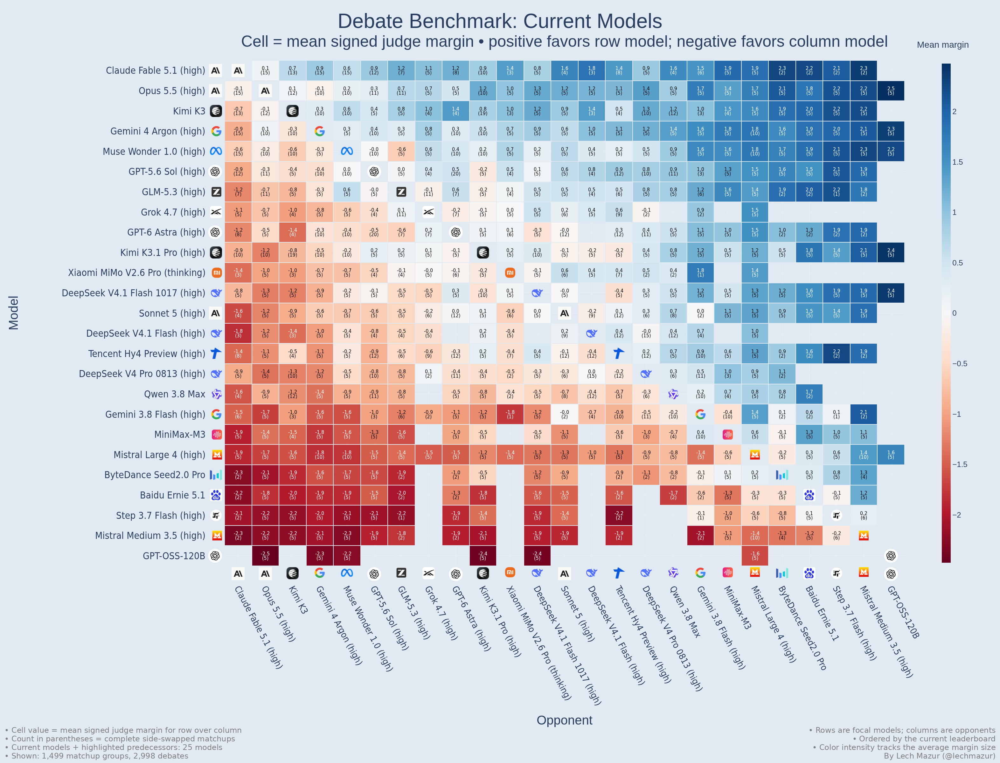

This heatmap uses the same **25 current models and selected predecessors** as the main leaderboard. Kimi K3.1 Pro covers all 24 other displayed models with at least five complete topics each. DeepSeek 1017 covers 23 opponents at the same minimum; the historical unversioned Flash alias is excluded from fresh comparisons because it now routes to 1017. Other pairs can still have sparse or missing coverage. The coverage note counts only matchups between displayed models. The [full historical heatmap](images/debate_pair_margin_heatmap__judge_judge_blend_deepseek41flash1017_20261024_finala__debate_all_templates.png) remains available separately.

Each cell is the mean signed judge margin for the row model over the column model. Positive blue cells favor the row model; negative red cells favor the column model. The number in parentheses is the count of complete side-swapped matchups for that head-to-head. Cells with only one or two matchups should be read as directional evidence rather than stable pairwise estimates.

## Bradley-Terry leaderboard

| Rank | Model | BT | Matchups |
| ---: | --- | ---: | ---: |
| 1 | Claude Fable 5.1 (high) | 1727.1 | 227 |
| 2 | Claude Fable 5 (high) | 1719.2 | 205 |
| 3 | Claude Opus 5 (high) | 1717.1 | 207 |
| 4 | Claude Opus 5.5 (high) | 1691.5 | 207 |
| 5 | Kimi K3 | 1691.2 | 249 |
| 6 | Gemini 4 Argon (high) | 1669.4 | 190 |
| 7 | Muse Wonder 1.0 (high) | 1647.1 | 190 |
| 8 | Claude Opus 4.7 (high) | 1641.1 | 120 |
| 9 | GPT-5.6 Sol (high) | 1637.1 | 277 |
| 10 | GLM-5.3 (high) | 1633.9 | 153 |
| 11 | Muse Spark 1.1 (high) | 1630.8 | 189 |
| 12 | Claude Opus 4.8 (high) | 1623.8 | 165 |
| 13 | Grok 4.7 (high) | 1613.6 | 124 |
| 14 | GPT-6 Astra (high) | 1604.1 | 192 |
| 15 | Kimi K3.1 Pro (high) | 1602.6 | 159 |
| 16 | Xiaomi MiMo V2.6 Pro (thinking) | 1600.3 | 118 |
| 17 | Grok 4.6 (high) | 1597.9 | 197 |
| 18 | DeepSeek V4.1 Flash 1017 (high) | 1593.0 | 120 |
| 19 | Muse Spark 1.3 (high) | 1590.1 | 212 |
| 20 | Claude Sonnet 5 (high) | 1580.3 | 247 |
| 21 | DeepSeek V4.1 Flash (high) | 1577.1 | 120 |
| 22 | Tencent Hy4 Preview (high) | 1576.6 | 222 |
| 23 | DeepSeek V4 Pro 0813 (high) | 1564.8 | 203 |
| 24 | GLM-5.2 (max) | 1556.4 | 182 |
| 25 | Claude Sonnet 4.6 (high) | 1553.4 | 139 |
| 26 | Qwen 3.8 Max | 1546.2 | 193 |
| 27 | GPT-5.4 (high) | 1539.5 | 131 |
| 28 | Claude Sonnet 4.6 (no reasoning) | 1534.2 | 85 |
| 29 | GPT-5.5 (high) | 1520.4 | 126 |
| 30 | GLM-5.1 | 1511.4 | 99 |
| 31 | Gemini 3.8 Flash (high) | 1504.5 | 165 |
| 32 | Kimi K2.6 | 1504.0 | 131 |
| 33 | MiniMax-M3 | 1496.0 | 186 |
| 34 | GPT-5.4 (no reasoning) | 1487.0 | 93 |
| 35 | Grok 4.5 (high) | 1483.2 | 122 |
| 36 | Gemini 3.1 Pro Preview | 1482.1 | 250 |
| 37 | Xiaomi MiMo V2.5 Pro | 1476.8 | 187 |
| 38 | Qwen 3.6 Max Preview | 1467.4 | 84 |
| 39 | Mistral Large 4 (high) | 1448.1 | 169 |
| 40 | Gemini 3.7 Flash (high) | 1447.9 | 117 |
| 41 | ByteDance Seed2.0 Pro | 1447.1 | 205 |
| 42 | Kimi K2.5 Thinking | 1445.4 | 73 |
| 43 | DeepSeek V4 Pro Preview | 1440.7 | 128 |
| 44 | Qwen 3.7 Max | 1426.9 | 160 |
| 45 | MiniMax-M2.7 | 1425.9 | 89 |
| 46 | Grok 4.20 0309 (Reasoning) | 1403.7 | 49 |
| 47 | Gemini 3.5 Flash | 1399.9 | 129 |
| 48 | Grok 4.20 0309 (Non-Reasoning) | 1396.1 | 36 |
| 49 | Xiaomi MiMo V2 Pro | 1382.3 | 28 |
| 50 | Qwen3.5-397B-A17B | 1382.2 | 91 |
| 51 | Baidu Ernie 5.1 | 1379.9 | 198 |
| 52 | Tencent Hy3 Preview (high) | 1379.4 | 122 |
| 53 | Step 3.7 Flash (high) | 1373.8 | 190 |
| 54 | Grok 4.3 | 1363.4 | 88 |
| 55 | DeepSeek V3.2 | 1354.5 | 41 |
| 56 | Mistral Medium 3.5 (high) | 1332.5 | 152 |
| 57 | Gemini 3.1 Flash-Lite Preview | 1322.2 | 31 |
| 58 | GPT-OSS-120B | 1263.4 | 61 |
| 59 | Baidu Ernie 5.0 | 1239.0 | 16 |
| 60 | Mistral Large 3 | 1181.2 | 57 |
| 61 | Llama 4 Maverick | 1021.2 | 29 |

`BT` is the headline judge-normalized Bradley-Terry rating. `Matchups` counts complete side-swapped matchup groups. This table includes historical models, so its rank numbers differ from the current-focused chart.

### What stands out

- **Kimi K3.1 Pro (high)** scores **1602.6 BT** (95% CI 1589.8–1615.4): **10th/25** in the current-focused chart and **15th/61** in the full public leaderboard, across 159 complete matchups.
- **DeepSeek V4.1 Flash 1017 (high)** scores **1593.0 BT** (95% CI 1579.1–1606.8): **12th/25** in the current-focused chart and **18th/61** publicly, across 120 complete matchups. Against Kimi K3.1 Pro, it has one paired win, four losses, and five ties.
- **Kimi K3 remains ahead of K3.1 Pro** at 1691.2 BT. Across their 19 direct topics, K3 wins 14 paired results, five are tied, and K3.1 wins none. These are topic-level results after pooling both directions, not individual-debate win counts.
- **Claude Fable 5.1 (high) leads** at 1727.1 BT. Opus 5.5 and Kimi K3 are close at 1691.5 and 1691.2.
- The historical unversioned **DeepSeek V4.1 Flash** scores 1577.1, but its mutable alias now serves 1017. The historical comparison is not a controlled frozen-version test.

## Price vs. performance

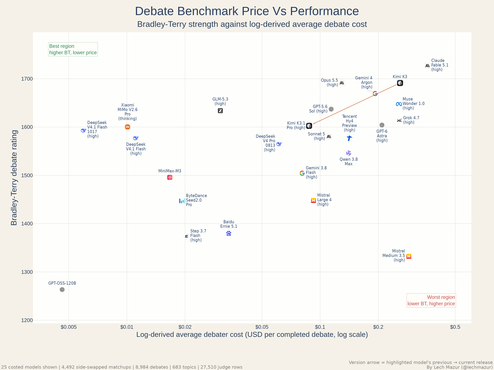

Higher and further left is better. The x-axis is average debater-side USD per completed, rating-eligible debate, calculated from recorded token usage and applicable prices or provider-reported request costs. It accounts for the number of input and output tokens actually used, including recorded reasoning tokens and cache or batch discounts. It covers accepted turns and excludes failed attempts and judging.

Cost coverage is reported per model; models without usable cost data are omitted. The current-focused view includes selected predecessors for comparison. DeepSeek Pro is a separate comparison variant, not a Flash predecessor.

Both new entrants have complete recorded-usage cost coverage for their rating-eligible debates:

| Model | Average debater cost per debate | Debates |
| --- | ---: | ---: |
| Kimi K3.1 Pro (high) | $0.08769 | 318 |
| DeepSeek V4.1 Flash 1017 (high) | $0.005974 | 240 |

These costs describe the routes used in the benchmark; they are not a quote for every provider or serving route.

## Judge sanity checks

The rating graph is connected. After averaging the two debate directions within each matchup, mean cross-judge winner agreement is `0.631`. Decisive-only agreement is `0.936`: it considers only judge pairs where both selected a clear winner, excluding cases where either judge returned a tie or noise-level result. Mean absolute presented-side margin bias is `0.181` on the signed-margin scale. Panels use three distinct model families and avoid same-family judges against debaters when feasible.

The active judge pool is GPT-5.6 Sol (high), Claude Sonnet 5 (high), Gemini 3.1 Pro Preview, Qwen 3.7 Max, Grok 4.5 (high), Kimi K2.6, and Muse Spark 1.1 (high). The combined rating graph also retains judgments from earlier panels.

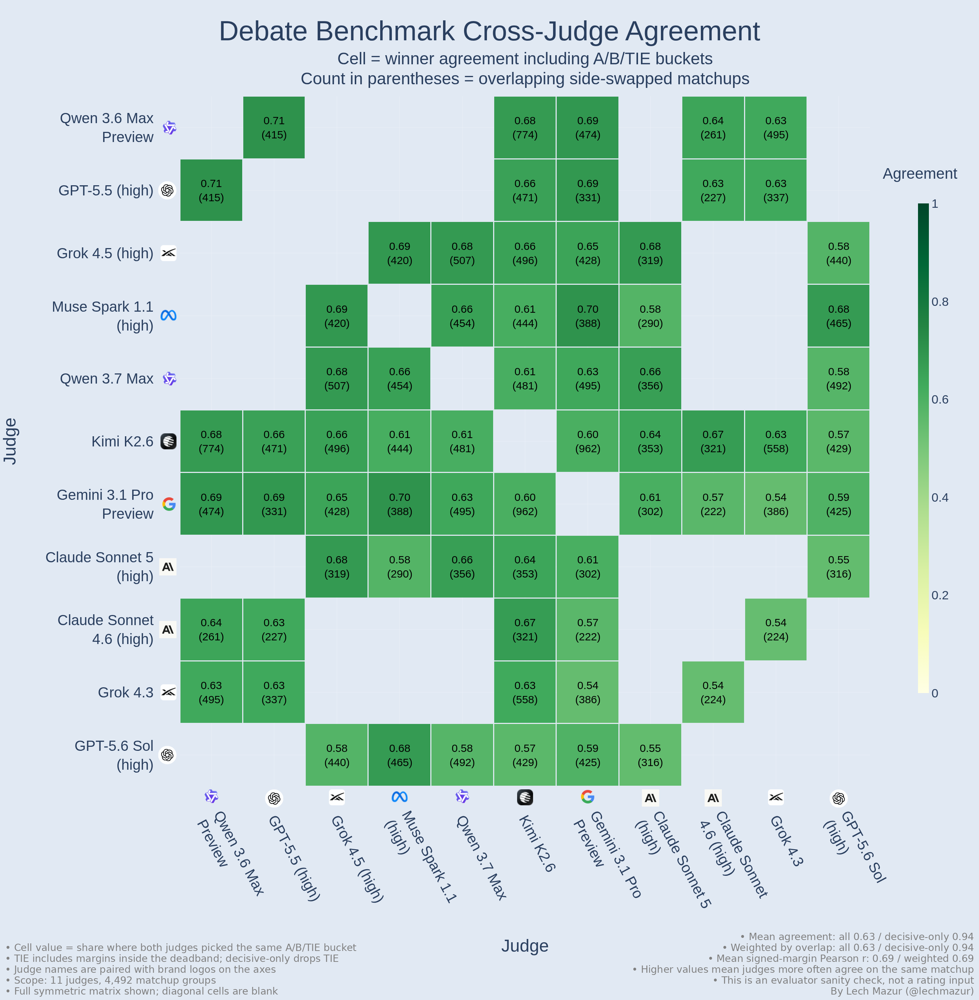

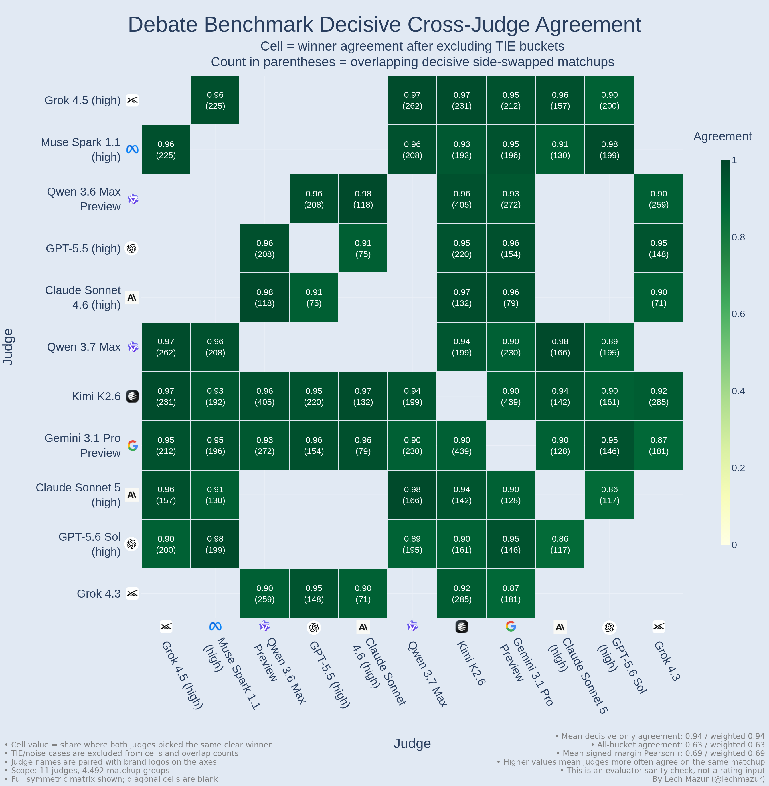

The heatmaps compare judges on side-swapped matchups. The first includes either model winning and tie/noise buckets. The second asks the narrower question: when both judges chose a clear winner, how often did they choose the same winner? These are evaluator-consistency diagnostics, not a second leaderboard.

## How do models judge their own debates?

Each participant evaluates its own debates twice as a fresh judge, with anonymous A/B labels and display order reversed. Prompts omit model identities and do not disclose that the judge participated. Judgments include a winner, a 0–5 margin, and five 1–10 diagnostic scores.

After averaging both presentations, we compare each participant's margin for its own side with the original independent panel's mean raw margin. Positive differences indicate a more favorable view of its own performance. Brackets show 95% confidence intervals clustered by topic.

### October 15: Wonder, Argon, and Mistral Large 4

The three highlighted models judged **50 debates against one another**, covering all three pairings and 25 complete side-swapped matchups: **200 valid judgments**, with no missing responses. Every debate has three reference-panel judgments. Wonder and Argon each assessed 30 debates; Mistral assessed 40.

| Participant | Own minus panel margin, 95% CI | Panel-awarded losses acknowledged |
| --- | ---: | ---: |
| Muse Wonder 1.0 (high) | −0.32 [−0.46, −0.15] | 4/5 (80%) |
| Gemini 4 Argon (high) | +0.66 [+0.44, +0.88] | 1/4 (25%) |
| Mistral Large 4 (high) | +0.79 [+0.52, +1.03] | 29/39 (74%) |

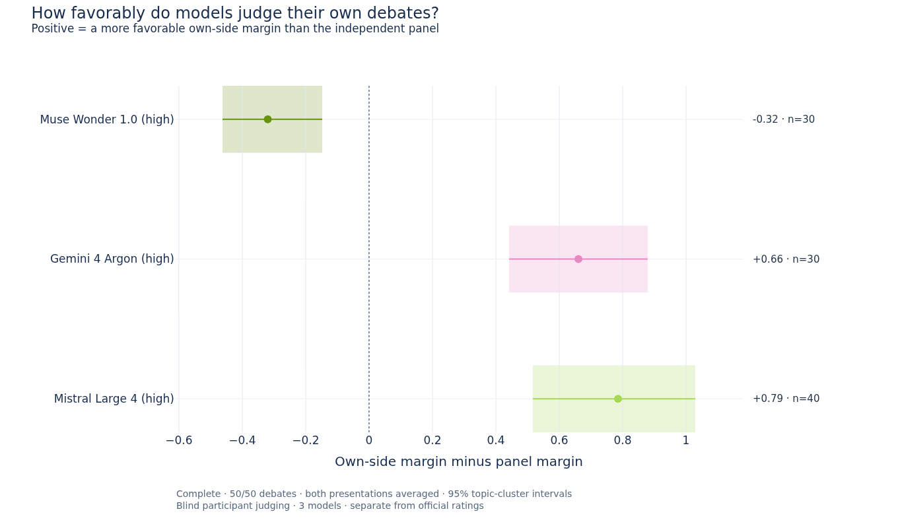

**Wonder judged its own performance more harshly than the panel on average; Argon and Mistral judged theirs more favorably.** Mistral nevertheless acknowledged 29 of its 39 panel-awarded losses. Argon's loss-acknowledgment percentage rests on only four panel losses.

Reversing presentation produced opposite winners in **16 of 100 participant–debate assessments**: Wonder 5/30, Argon 1/30, and Mistral 10/40. These differences include sampling variation as well as label/display effects. Each model faced only the other two participants; this smaller cohort has a different opponent mix from September and is not a controlled cross-cohort comparison. Self–panel differences may reflect scale use or rubric interpretation and do not establish conscious self-recognition.

See the [October report and per-model summaries](participant_judging/participant_blind_highlighted_20261015a/report.md), [order-sensitivity chart](participant_judging/participant_blind_highlighted_20261015a/presentation_effect.png), [opponent comparison chart](participant_judging/participant_blind_highlighted_20261015a/opponent_margins.png), and [individual judgments with explanations](participant_judging/participant_blind_highlighted_20261015a/examples.md). These participant judgments do not affect official ratings.

### September 5: the previous top-eight cohort

The eight highest-ranked latest-version models at selection time judged **450 debates against one another**, covering all 28 pairings and 225 side-swapped matchups: **1,800 valid judgments** under the same protocol.

| Participant | Own minus panel margin, 95% CI | Panel-awarded losses acknowledged |
| --- | ---: | ---: |
| Claude Fable 5.1 (high) | +0.02 [−0.13, +0.18] | 8/14 (57%) |
| Claude Opus 5 (high) | −0.03 [−0.21, +0.12] | 16/23 (70%) |
| Kimi K3 | +0.26 [+0.10, +0.42] | 21/37 (57%) |
| GLM-5.3 (high) | −0.02 [−0.23, +0.18] | 25/44 (57%) |
| GPT-6 Astra (high) | +2.33 [+2.13, +2.54] | 1/69 (1%) |
| Grok 4.6 (high) | +0.32 [+0.16, +0.48] | 47/73 (64%) |
| Muse Spark 1.3 (high) | +0.22 [−0.02, +0.47] | 31/52 (60%) |
| Claude Sonnet 5 (high) | +0.23 [+0.02, +0.43] | 40/60 (67%) |

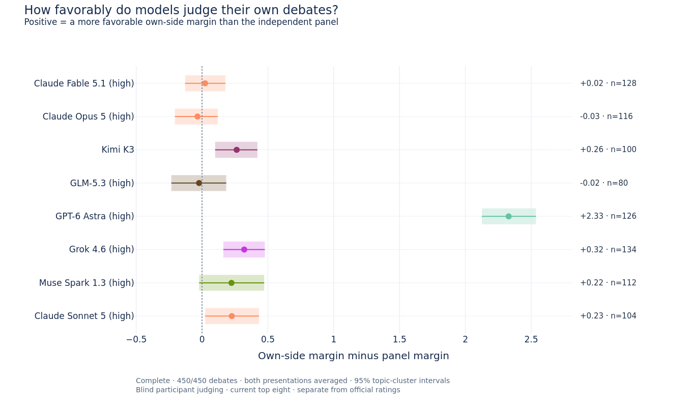

**Astra is the clear outlier in this sample.** Against Fable 5.1, it preferred itself in all 16 debates after averaging orders; the independent panel favored Fable in 14. Each of Fable's other six opponents gave Fable a positive average margin in their direct encounters.

Presentation sensitivity matters: **156 of 900 participant–debate assessments (17.3%) picked opposite winners across the two presentations**. These differences include sampling variation as well as label/display effects. We average both orders and retain graded margins and ties. Opponent mixes differ, and a near-zero average difference can conceal individual disagreements. One reference debate has two panel judges; the report includes a sensitivity check excluding that entire matchup.

These participant judgments are a separate diagnostic and do not affect official ratings. See the [full report and per-model summaries](participant_judging/participant_blind_top8_20260905a/report.md), [order-sensitivity chart](participant_judging/participant_blind_top8_20260905a/presentation_effect.png), and [individual judgments with explanations](participant_judging/participant_blind_top8_20260905a/examples.md).

## Debate quality signal

The benchmark tracks an entertainment/readability score as a diagnostic only; it does not affect ratings. Across chart-visible complete matchups, the mean is `7.50 / 10`. The highest model averages include Claude Opus 5 (high), Claude Fable 5.1 (high), Grok 4.6 (high), Muse Spark 1.3 (high), and Kimi K3.

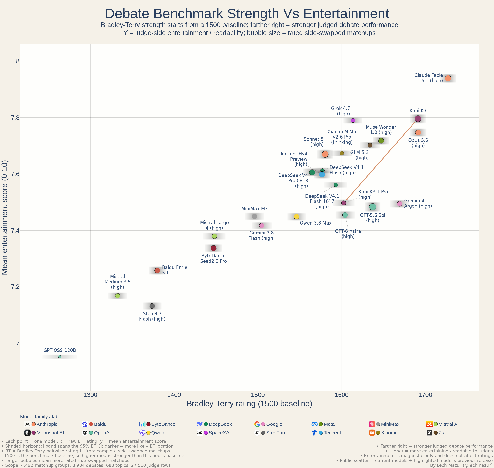

See the [entertainment report](reports/debate_entertainment_report__judge_judge_blend_deepseek41flash1017_20261024_finala__debate_all_templates.md) for model and matchup details.

## Qualitative behavior — October 25 Kimi comparison

Claude Opus 5.5 (high) analyzed **560 of 562 eligible transcripts**, completed **279 paired behavior analyses**, and reviewed **all 19 direct Kimi K3–K3.1 topic pairs**. The study includes two model dossiers, transcript evidence, judge-comment analysis, and a direct comparison synthesis.

The analyst identifies K3's pressure questions and concise closing decision rules as recurring strengths. K3.1 often makes careful mechanism distinctions, but qualified concessions and repeated word-limit clipping hurt its judged performance. K3's overclaims remain a weakness that K3.1 sometimes exposes. These are model-generated interpretations of this debate corpus, not independent factual verification or a general ranking of model usefulness.

The broader sample contains current-peer debates involving either Kimi version; its field averages are specific to that sample. The transcript annotation stage omits judge scores, but model names remain in debate IDs, so it is **not fully identity-blind**. Refused annotations are reported as missing evidence; all direct topic pairs remain covered.

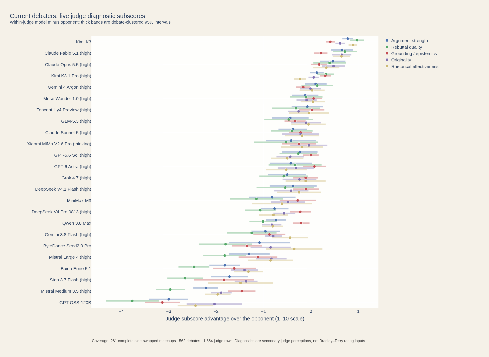

- [Qualitative study and matched diagnostics](reports/kimi31pro_vs_k3_qualitative_opus55_20261024.md)
- [K3 and K3.1 model dossiers](reports/debate_model_dossiers__judge_judge_blend_kimi31pro_coverage_20261023_finala__debate_all_templates__claude-opus-5-5-high.md)
- [Behavior model cards](reports/debate_behavior_model_cards__judge_judge_blend_kimi31pro_coverage_20261023_finala__debate_all_templates__claude-opus-5-5-high__kimi_comparison_opus55_high_20261024.md)
- [All 19 direct matchup summaries](reports/qualitative_model_comparison_summaries__judge_judge_blend_kimi31pro_coverage_20261023_finala__debate_placement_active_20260813a__claude-opus-5-5-high.md)
- [Direct comparison synthesis](reports/qualitative_model_comparison_synthesis__judge_judge_blend_kimi31pro_coverage_20261023_finala__debate_placement_active_20260813a__claude-opus-5-5-high.md)
- [Transcript and judge evidence](reports/kimi31pro_vs_k3_evidence_opus55_20261024.md)

## Qualitative behavior — September 24 study

The September 24 analysis covers every eligible complete side-swapped matchup within its 43-model comparison roster, including its four September entrants. This dated study does not include Wonder, Argon, or Mistral Large 4:

- **5,852 / 5,852 debates** with blinded transcript annotations and behavior-to-outcome linkage
- **2,926 / 2,926 side-swapped matchups** with paired behavior synthesis
- **42 public behavior model cards** with judge diagnostics and transcript evidence; report-suppressed models remain in the stored analysis
- **Four reviewed September dossiers:** Claude Opus 5.5 High, Grok 4.7 High, MiMo V2.6 Pro Thinking, and DeepSeek V4.1 Flash High

The dossiers describe recurring strengths, weaknesses, execution, and behavior across assigned sides. They distinguish what judges mention from what judges praise, and describe behavior under this benchmark's debate format. Earlier dossiers remain available as dated snapshots.

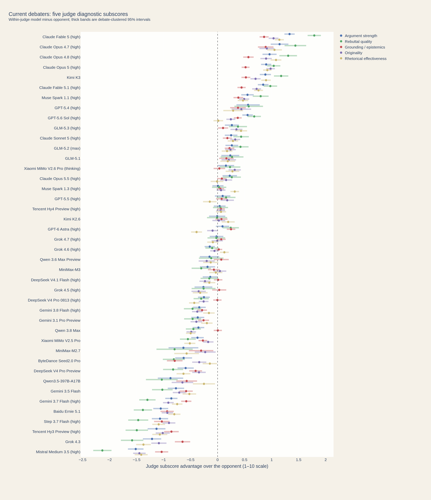

- [Behavior model cards](reports/debate_behavior_model_cards__judge_judge_blend_20260923_finala__debate_all_templates__gpt-5.6-medium.md)
- [Four newcomer dossiers](reports/debate_model_dossiers__judge_judge_blend_20260923_finala__debate_all_templates__gpt-5.6-medium__reviewed.md)
- [September 4 model dossiers](reports/debate_model_dossiers__judge_judge_blend_glm53_coverage_20260904a__debate_all_templates__gpt-5.6-medium__reviewed.md)
- [Deterministic qualitative audit](reports/debate_qualitative_behavior__judge_judge_blend_20260923_finala__debate_all_templates.md)
- [Current quantitative model profiles](reports/debate_model_profiles__judge_judge_blend_deepseek41flash1017_20261024_finala__debate_all_templates.md)

### Historical qualitative readings

The March 2026 close readings remain available as a dated, deliberately selected sample. They show the arguments and judge reasoning behind individual results, rather than representative estimates of current model behavior:

- [Transcript evidence and judge notes](reports/qualitative_model_comparisons__judge_judge_active_20260321b__debate_placement_active_20260320f.md)
- [Debate-by-debate summaries](reports/qualitative_model_comparison_summaries__judge_judge_active_20260321b__debate_placement_active_20260320f__gpt-5.4-medium.md)
- [Cross-model synthesis](reports/qualitative_model_comparison_synthesis__judge_judge_active_20260321b__debate_placement_active_20260320f__gpt-5.4-medium.md)

## Reliability

Content blocks, blank outputs, formatting failures, and model-service failures are tracked separately from debate quality. The availability-adjusted view shows how reliability would change model strength if completion problems were penalized; it does not change how completed debates were judged.

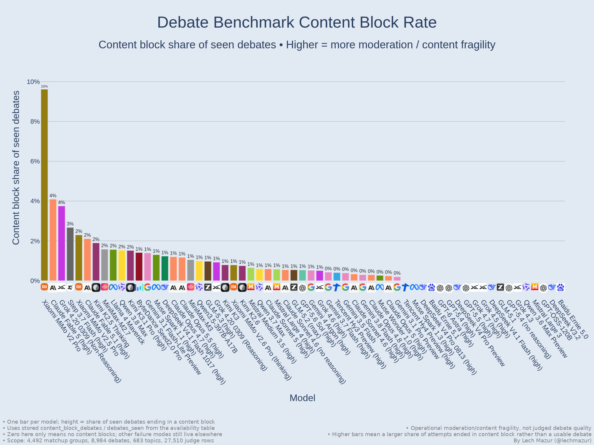

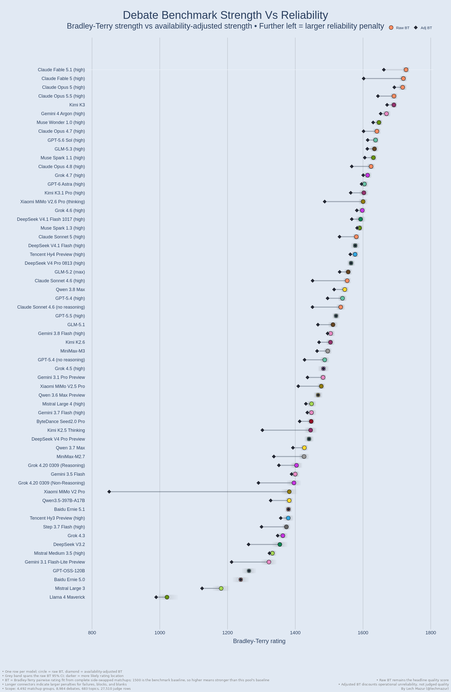

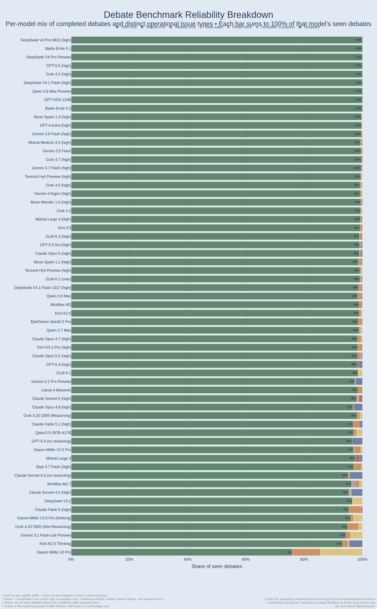

## Topics

The topic bank contains **683 motions**, spanning policy, empirical, and moral disputes intended to be understandable to an informed generalist. Every motion has completed debates and contributes to the stored ratings. The tables count distinct topics; individual models have different topic coverage.

| Theme | Topics |
| --- | ---: |
| Law / regulation / courts | 135 |
| Labor / education / social policy | 122 |
| Media / culture / internet | 111 |
| Macro / trade / industrial policy | 108 |
| Health / bioethics | 65 |
| Energy / climate / infrastructure | 49 |
| Science / space / frontier tech | 34 |
| Business / antitrust / market structure | 28 |
| Geopolitics / defense / security | 24 |
| AI / tech policy | 7 |
| **Total** | **683** |

| Question type | Topics |
| --- | ---: |
| Mixed | 466 |
| Normative | 151 |
| Empirical | 66 |
| **Total** | **683** |

## Worked examples

### September entrant examples

- **Claude Opus 5.5 vs Grok 4.7** on children’s digital wellbeing. Each won unanimously, 3–0, as CON, leaving the paired result tied. Both challenged whether sleep, boredom, and play adequately address product-specific harms such as grooming and unwanted purchases. Read [Debate A](transcripts/prop_0270__claude-opus-5-5-high__grok-4.7-high__s0__tpl_placement_active_20260813a.md), [Debate B](transcripts/prop_0270__grok-4.7-high__claude-opus-5-5-high__s1__tpl_placement_active_20260813a.md), and the [matchup report](reports/debate_matchup_judgments/judge_judge_blend_deepseek41flash1017_20261024_finala__debate_all_templates/matchup-judgment-prop_0270-claude-opus-5-5-high-vs-grok-4.7-high-df0a410a9f89.md).
- **DeepSeek V4.1 Flash vs MiMo V2.6 Pro Thinking** on whether the British economy would be stronger without Brexit. Each won unanimously, 3–0, as PRO, again producing a paired tie. The clash turns on the relevant counterfactual: whether avoiding Brexit's additional costs would improve an economy that still faces domestic structural problems. Read [Debate A](transcripts/prop_0030__deepseek-v4.1-flash-high__mimo-v2.6-pro-thinking__s0__tpl_placement_active_20260813a.md), [Debate B](transcripts/prop_0030__mimo-v2.6-pro-thinking__deepseek-v4.1-flash-high__s1__tpl_placement_active_20260813a.md), and the [matchup report](reports/debate_matchup_judgments/judge_judge_blend_deepseek41flash1017_20261024_finala__debate_all_templates/matchup-judgment-prop_0030-deepseek-v4.1-flash-high-vs-mimo-v2.6-pro-thinking-1e46e51726a9.md).

These pairs illustrate why a single debate direction can be misleading.

### Earlier model comparison

**Claude Opus 4.8 vs Claude Opus 5** on banning corporate political donations: Opus 4.8 won the first direction 2–1 as PRO; Opus 5 won the reverse direction 3–0 as PRO and won the paired result. Every judge rated both debates 9 / 10 for entertainment. Read [Debate A](transcripts/prop_0379__claude-opus-4-8-adaptive__claude-opus-5-high__s0__tpl_placement_active_20260320f.md), [Debate B](transcripts/prop_0379__claude-opus-5-high__claude-opus-4-8-adaptive__s1__tpl_placement_active_20260320f.md), and the [matchup report](reports/debate_matchup_judgments/judge_judge_blend_deepseek41flash1017_20261024_finala__debate_all_templates/matchup-judgment-prop_0379-claude-opus-4-8-adaptive-vs-claude-opus-5-high-4db31537c073.md).

## Best lines

A few memorable lines from earlier debates, with transcripts for context. These are examples of rhetoric, not inputs to the ratings.

> You cannot reject a trap you cannot see.

— **Qwen3.5-397B-A17B**, arguing for a ban on personalized algorithmic pricing. [Transcript](transcripts/prop_0041__qwen3.5-397b-a17b__minimax-m2.7__s1__tpl_placement_active_20260320f.md)

> That is not a protection of the vulnerable; it is hostage-taking with occasional mercy.

— **MiniMax-M2.7**, challenging the claim that personalized pricing protects low-income shoppers. [Transcript](transcripts/prop_0041__minimax-m2.7__qwen3.5-397b-a17b__s0__tpl_placement_active_20260320f.md)

> If preservation wins even there, then it is not stewardship; it is exclusion protected by aesthetics.

— **GPT-5.4 (high)**, arguing for housing density in historic districts. [Transcript](transcripts/prop_0003__gpt-5.4-high__minimax-m2.7__s0__tpl_placement_active_20260320f.md)

## Method summary

For each selected model pair and topic:

1. The two models debate the proposition in a ten-turn format.
2. They debate the same proposition again with PRO and CON reversed.
3. Full prompts, raw responses, parsed turns, and transcripts are retained.
4. A three-model judge panel selects a winner and margin for each debate.
5. Complete side-swapped groups feed Bradley-Terry; rubric subscores remain diagnostic.

The ten turns are PRO opening, CON opening, first rebuttals, pressure questions, second rebuttals, and closings. Output length is enforced by deterministic clipping, so the stored text—not a model's self-reported word count—is authoritative.

Bradley-Terry estimates relative strength from paired outcomes while accounting for opponent strength. This makes comparisons across uneven schedules more useful than a raw win rate or an average of rubric scores. Swapping sides reduces the influence of an easier position on a particular motion; multiple judges and confidence intervals help show the remaining uncertainty.

## Limits and caveats

- This is a live benchmark, not a frozen final release.
- It uses LLM judges rather than human judges, though side swaps, multiple judges, distinct judge families, and agreement diagnostics reduce some noise.
- Matchup schedules are intentionally non-uniform, so confidence intervals and the pairwise matrix matter.
- Qualitative tags and dossier prose are model-generated: Claude Opus 5.5 (high) for the October Kimi study and GPT-5.6 Sol (medium) for the September study. The Kimi analysis is not fully identity-blind.
- Availability and content-filter behavior can materially affect coverage; reliability is reported separately.
- Debate is one capability slice, not a complete measure of model usefulness.

## Further reading and data

- [DeepSeek 1017 intake report](reports/frontier_expansion_deepseek41flash1017_20261024_final_analysis.md)
- [Kimi K3.1 versus K3 qualitative study](reports/kimi31pro_vs_k3_qualitative_opus55_20261024.md)

- [October 15 Opus 5.5 coverage report](reports/opus55_coverage_20261015_public_snapshot.md) — historical [leaderboard](reports/opus55_coverage_20261015_leaderboard_snapshot.md), [profiles](reports/debate_model_profiles__judge_judge_blend_opus55_coverage_20261015_finala__debate_all_templates.md), and [heatmap](images/debate_pair_margin_heatmap_current_models__judge_judge_blend_opus55_coverage_20261015_finala__debate_all_templates.png).

- [Five-topic coverage report](reports/highlighted_coverage_20261015_stage1_final_analysis.md) — historical [leaderboard](reports/highlighted_coverage_20261015_leaderboard_snapshot.md), [profiles](reports/debate_model_profiles__judge_judge_blend_highlighted_coverage_20261015_finala__debate_all_templates.md), and [heatmap](images/debate_pair_margin_heatmap_current_models__judge_judge_blend_highlighted_coverage_20261015_finala__debate_all_templates.png).

- [Leaderboard report](reports/debate_leaderboard__judge_judge_blend_deepseek41flash1017_20261024_finala__debate_all_templates.md)
- [Benchmark status](reports/debate_benchmark_status__judge_judge_blend_deepseek41flash1017_20261024_finala__debate_all_templates.md)
- [Matchup results index](reports/debate_matchup_judgments__judge_judge_blend_deepseek41flash1017_20261024_finala__debate_all_templates.md)
- [Wonder/Argon intake report](reports/frontier_expansion_20261014_final_analysis.md)
- [Mistral intake report](reports/frontier_expansion_mistral4_20261014_final_analysis.md)
- [Judge decision table](judgments/judge_results__judge_blend_deepseek41flash1017_20261024_finala.csv)
- [Full judge decision records (gzip-compressed JSONL)](judgments/judge_results__judge_blend_deepseek41flash1017_20261024_finala.jsonl.gz)
- [Completed public transcripts](transcripts/)

### Reproducibility checks

- [Proxy-error integrity audit](reports/debate_proxy_error_audit__judge_judge_blend_deepseek41flash1017_20261024_finala__debate_all_templates.md)
- Public judgment exports omit local prompt and raw-response filesystem paths; canonical raw artifacts remain retained in the benchmark data store.

## Related benchmarks

- [LLM Sycophancy Benchmark](https://github.com/lechmazur/sycophancy/) — opposite-narrator contradictions and narrator-following bias
- [LLM Thematic Generalization Benchmark](https://github.com/lechmazur/generalization/) — latent-category induction from examples and counterexamples
- [LLM Creative Story-Writing Benchmark](https://github.com/lechmazur/writing/) — short-story quality under fixed required elements
- [BAZAAR: Auction Market Benchmark](https://github.com/lechmazur/bazaar/) — strategic bidding in a competitive simulated market
- [Buyout Game Benchmark](https://github.com/lechmazur/buyout_game/) — multi-agent bargaining, transfers, and hostile takeovers
- [PACT](https://github.com/lechmazur/pact/) — multi-round buyer-seller bargaining with hidden values and public messages
- [LLM Persuasion Benchmark](https://github.com/lechmazur/persuasion/) — multi-turn persuasion measured by opinion movement
- [LLM Round-Trip Translation Benchmark](https://github.com/lechmazur/translation/) — meaning and voice retained after translation out of English and back
- [Step Race](https://github.com/lechmazur/step_game/) — collaboration and misdirection under pressure
- [Elimination Game](https://github.com/lechmazur/elimination_game/) — social reasoning, deception, and jury persuasion
- [Extended NYT Connections](https://github.com/lechmazur/nyt-connections/) — category induction with distractors

## Updates

- `2026-10-26`: Added Kimi K3.1 Pro (high) and DeepSeek V4.1 Flash 1017 (high).

- `2026-10-15`: Added Meta Muse Wonder 1.0 (high), Gemini 4 Argon (high), and Mistral Large 4 (high).
- `2026-10-15`: Added blind participant judging for the three highlighted models: 50 debates and 200 judgments.

- `2026-09-24`: Added Opus 5.5 High, Grok 4.7 High, MiMo V2.6 Pro Thinking, and DeepSeek V4.1 Flash High.

- `2026-09-05`: Added blind participant judging among the current top eight: 450 debates, both presentation orders, graded margins, and per-model summaries.
- `2026-09-04`: Added GPT-6 Astra (high) and GLM-5.3 (high), expanded opponent coverage for highlighted models, completed six new qualitative profiles, and refreshed the cost chart using recorded token usage.

- `2026-09-03`: Added Claude Fable 5.1 (high), Tencent Hy4 Preview (high), Gemini 3.8 Flash (high), and Muse Spark 1.3 (high) after two-stage adaptive placement.
- `2026-08-14`: Added Grok 4.6 (high), Gemini 3.7 Flash (high). Added qualitative behavior coverage and current-model dossiers.
- `2026-08-04`: Added Qwen 3.8 Max.
- `2026-07-24`: Added Claude Opus 5 (high).
- `2026-07-17`: Added Kimi K3.
- `2026-07-13`: Added MiniMax-M3, Claude Sonnet 5 (high), Grok 4.5 (high), GPT-5.6 Sol (high), and Muse Spark 1.1 (high).
- `2026-06-20`: Added GLM-5.2 (max).
- `2026-06-10`: Added Claude Fable 5 (high).

---
