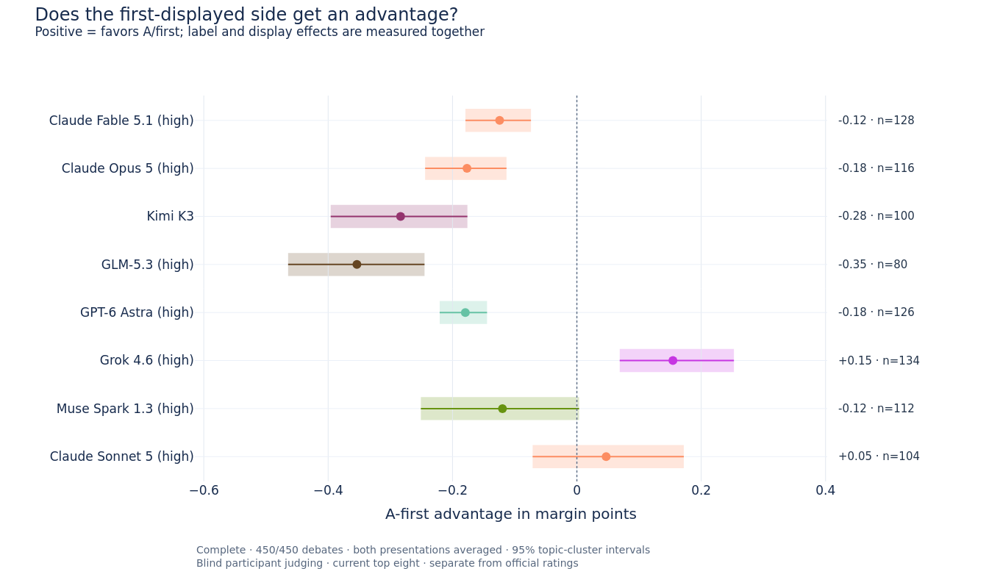
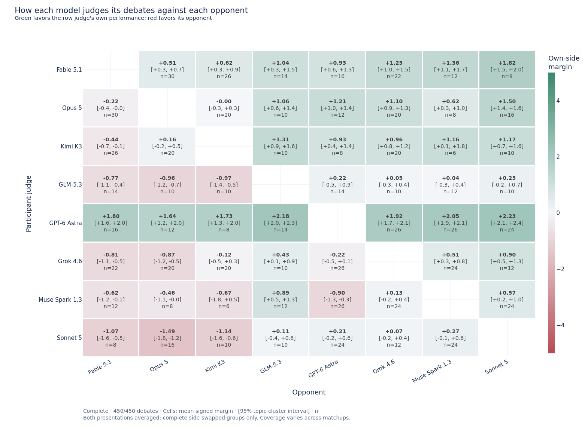

# Blind participant judging: current top eight

Complete analysis: **450/450 debates**, 225/225 side-swapped groups, 1800/1800 valid judgments. Each participant rated the same anonymous debate twice, with A/B labels and first-displayed side reversed within every round.

The primary quantity is the participant's **signed margin for its own side minus the independent panel's signed margin**, after averaging both presentations. Positive values mean a more favorable assessment of its own performance than the panel gave. This is a separate diagnostic; the official leaderboard is unchanged.

Margins range from −5 to +5 in each judgment. Brackets below show 95% confidence intervals from 2,000 topic-cluster bootstrap resamples. Averaged margins at least +0.5 count as own wins, at most −0.5 as opponent wins, and intermediate values as ties. The same rule is applied to the panel's mean raw margin.

| Participant judge | Debates | Own minus panel margin, 95% CI | Panel losses acknowledged | Winner flips across orders |
|---|---:|---:|---:|---:|
| Claude Fable 5.1 (high) | 128/128 | +0.02 [-0.13, +0.18] | 8/14 (57%) | 11/128 (9%) |
| Claude Opus 5 (high) | 116/116 | -0.03 [-0.21, +0.12] | 16/23 (70%) | 17/116 (15%) |
| Kimi K3 | 100/100 | +0.26 [+0.10, +0.42] | 21/37 (57%) | 21/100 (21%) |
| GLM-5.3 (high) | 80/80 | -0.02 [-0.23, +0.18] | 25/44 (57%) | 23/80 (29%) |
| GPT-6 Astra (high) | 126/126 | +2.33 [+2.13, +2.54] | 1/69 (1%) | 5/126 (4%) |
| Grok 4.6 (high) | 134/134 | +0.32 [+0.16, +0.48] | 47/73 (64%) | 27/134 (20%) |
| Muse Spark 1.3 (high) | 112/112 | +0.22 [-0.02, +0.47] | 31/52 (60%) | 24/112 (21%) |
| Claude Sonnet 5 (high) | 104/104 | +0.23 [+0.02, +0.43] | 40/60 (67%) | 28/104 (27%) |

The largest observed own-minus-panel shift is **GPT-6 Astra (high): +2.33 [+2.13, +2.54]** margin points. The highest observed winner/tie agreement with the panel is **Claude Fable 5.1 (high)**, at 96/128 (75%). These comparisons use each model's observed opponent mix.

## Astra versus Fable

Across 16 debates against Fable 5.1, GPT-6 Astra preferred Fable in **0/16 (0%)** after averaging presentation orders. It preferred Fable in both individual presentations in 0/16 debates. Astra's mean margin for its own side was +1.80 [+1.61, +2.00]; the panel's was -1.17. Of 14 panel-awarded losses, Astra acknowledged 0.

The other participant's view of each Fable matchup:

| Participant judge | Mean margin for Fable, 95% CI | Fable preferred after averaging | Fable preferred in both orders |
|---|---:|---:|---:|
| Claude Opus 5 (high) | +0.22 [+0.04, +0.40] | 13/30 (43%) | 13/30 (43%) |
| Kimi K3 | +0.44 [+0.13, +0.75] | 14/26 (54%) | 14/26 (54%) |
| GLM-5.3 (high) | +0.77 [+0.40, +1.11] | 9/14 (64%) | 9/14 (64%) |
| GPT-6 Astra (high) | -1.80 [-2.00, -1.61] | 0/16 (0%) | 0/16 (0%) |
| Grok 4.6 (high) | +0.81 [+0.47, +1.13] | 16/22 (73%) | 16/22 (73%) |
| Muse Spark 1.3 (high) | +0.62 [+0.11, +1.18] | 8/12 (67%) | 8/12 (67%) |
| Claude Sonnet 5 (high) | +1.07 [+0.55, +1.62] | 5/8 (62%) | 5/8 (62%) |

## Presentation sensitivity

A-first advantage is half the difference between the margin a model gives its own side when shown as A/first and when shown as B/second. Positive values favor the first-displayed side. This measures the combined label/display effect; the two cannot be separated by this design. Averaging the two presentations cancels an additive preference for A-first.

| Participant judge | A-first advantage, 95% CI | Mean absolute margin change | Any verdict change, including ties |
|---|---:|---:|---:|
| Claude Fable 5.1 (high) | -0.12 [-0.18, -0.07] | 0.39 | 11/128 (9%) |
| Claude Opus 5 (high) | -0.18 [-0.24, -0.11] | 0.44 | 17/116 (15%) |
| Kimi K3 | -0.28 [-0.40, -0.18] | 0.76 | 21/100 (21%) |
| GLM-5.3 (high) | -0.35 [-0.46, -0.24] | 0.80 | 23/80 (29%) |
| GPT-6 Astra (high) | -0.18 [-0.22, -0.14] | 0.37 | 5/126 (4%) |
| Grok 4.6 (high) | +0.15 [+0.07, +0.25] | 0.60 | 27/134 (20%) |
| Muse Spark 1.3 (high) | -0.12 [-0.25, +0.00] | 0.71 | 24/112 (21%) |
| Claude Sonnet 5 (high) | +0.05 [-0.07, +0.17] | 0.97 | 28/104 (27%) |

Two independent calls also introduce sampling variation. Differences between orders are therefore sensitivity measurements, not proof that every flip was caused by position bias.

## Model summaries

### Claude Fable 5.1 (high)

Across 128 debates against 7 opponents, its average margin for its own side was +0.93, compared with +0.91 from the panel. The difference was +0.02 [-0.13, +0.18]; weighting each opponent equally gives +0.04. Its win/tie/loss calls for itself were 98/11/19.

It matched the panel verdict in 96/128 (75%), and acknowledged 8/14 (57%) of its panel-awarded losses. For 8/14 losses it chose the opponent in both presentations. The most favorable diagnostic shift relative to the panel was in **rebuttal quality**: +0.13 points of own-minus-opponent advantage on the 1–10 score scale. Reversing presentation changed the winning side in 11/128 debates and changed a verdict including ties in 11/128.

### Claude Opus 5 (high)

Across 116 debates against 7 opponents, its average margin for its own side was +0.60, compared with +0.63 from the panel. The difference was -0.03 [-0.21, +0.12]; weighting each opponent equally gives -0.06. Its win/tie/loss calls for itself were 73/17/26.

It matched the panel verdict in 85/116 (73%), and acknowledged 16/23 (70%) of its panel-awarded losses. For 16/23 losses it chose the opponent in both presentations. The most favorable diagnostic shift relative to the panel was in **originality of argument**: +0.02 points of own-minus-opponent advantage on the 1–10 score scale. Reversing presentation changed the winning side in 17/116 debates and changed a verdict including ties in 17/116.

### Kimi K3

Across 100 debates against 7 opponents, its average margin for its own side was +0.50, compared with +0.24 from the panel. The difference was +0.26 [+0.10, +0.42]; weighting each opponent equally gives +0.20. Its win/tie/loss calls for itself were 56/21/23.

It matched the panel verdict in 72/100 (72%), and acknowledged 21/37 (57%) of its panel-awarded losses. For 21/37 losses it chose the opponent in both presentations. The most favorable diagnostic shift relative to the panel was in **rebuttal quality**: +0.13 points of own-minus-opponent advantage on the 1–10 score scale. Reversing presentation changed the winning side in 21/100 debates and changed a verdict including ties in 21/100.

### GLM-5.3 (high)

Across 80 debates against 7 opponents, its average margin for its own side was -0.30, compared with -0.27 from the panel. The difference was -0.02 [-0.23, +0.18]; weighting each opponent equally gives -0.03. Its win/tie/loss calls for itself were 19/23/38.

It matched the panel verdict in 43/80 (54%), and acknowledged 25/44 (57%) of its panel-awarded losses. For 25/44 losses it chose the opponent in both presentations. The most favorable diagnostic shift relative to the panel was in **rhetorical effectiveness**: +0.18 points of own-minus-opponent advantage on the 1–10 score scale. Reversing presentation changed the winning side in 23/80 debates and changed a verdict including ties in 23/80.

### GPT-6 Astra (high)

Across 126 debates against 7 opponents, its average margin for its own side was +1.98, compared with -0.35 from the panel. The difference was +2.33 [+2.13, +2.54]; weighting each opponent equally gives +2.52. Its win/tie/loss calls for itself were 122/3/1.

It matched the panel verdict in 36/126 (29%), and acknowledged 1/69 (1%) of its panel-awarded losses. For 1/69 losses it chose the opponent in both presentations. The most favorable diagnostic shift relative to the panel was in **rebuttal quality**: +3.33 points of own-minus-opponent advantage on the 1–10 score scale. Reversing presentation changed the winning side in 5/126 debates and changed a verdict including ties in 5/126.

### Grok 4.6 (high)

Across 134 debates against 7 opponents, its average margin for its own side was -0.12, compared with -0.44 from the panel. The difference was +0.32 [+0.16, +0.48]; weighting each opponent equally gives +0.33. Its win/tie/loss calls for itself were 48/27/59.

It matched the panel verdict in 78/134 (58%), and acknowledged 47/73 (64%) of its panel-awarded losses. For 47/73 losses it chose the opponent in both presentations. The most favorable diagnostic shift relative to the panel was in **argument strength**: +0.32 points of own-minus-opponent advantage on the 1–10 score scale. Reversing presentation changed the winning side in 27/134 debates and changed a verdict including ties in 27/134.

### Muse Spark 1.3 (high)

Across 112 debates against 7 opponents, its average margin for its own side was -0.10, compared with -0.32 from the panel. The difference was +0.22 [-0.02, +0.47]; weighting each opponent equally gives +0.34. Its win/tie/loss calls for itself were 41/24/47.

It matched the panel verdict in 57/112 (51%), and acknowledged 31/52 (60%) of its panel-awarded losses. For 31/52 losses it chose the opponent in both presentations. The most favorable diagnostic shift relative to the panel was in **rebuttal quality**: +0.25 points of own-minus-opponent advantage on the 1–10 score scale. Reversing presentation changed the winning side in 24/112 debates and changed a verdict including ties in 24/112.

### Claude Sonnet 5 (high)

Across 104 debates against 7 opponents, its average margin for its own side was -0.29, compared with -0.52 from the panel. The difference was +0.23 [+0.02, +0.43]; weighting each opponent equally gives +0.27. Its win/tie/loss calls for itself were 30/27/47.

It matched the panel verdict in 63/104 (61%), and acknowledged 40/60 (67%) of its panel-awarded losses. For 39/60 losses it chose the opponent in both presentations. The most favorable diagnostic shift relative to the panel was in **rebuttal quality**: +0.27 points of own-minus-opponent advantage on the 1–10 score scale. Reversing presentation changed the winning side in 28/104 debates and changed a verdict including ties in 28/104.

## Judging each opponent

Every cell uses only debates between its row judge and column opponent. Positive margin favors the row judge's own debate side. Coverage varies across matchups; the matrix is not a new ranking.

| Participant judge | Opponent | Debates | Own-side margin, 95% CI | Opponent chosen | Opponent chosen in both orders |
|---|---|---:|---:|---:|---:|
| Claude Fable 5.1 (high) | Claude Opus 5 (high) | 30 | +0.51 [+0.30, +0.74] | 6/30 | 6/30 |
| Claude Fable 5.1 (high) | Claude Sonnet 5 (high) | 8 | +1.82 [+1.49, +2.01] | 0/8 | 0/8 |
| Claude Fable 5.1 (high) | GLM-5.3 (high) | 14 | +1.04 [+0.35, +1.53] | 2/14 | 2/14 |
| Claude Fable 5.1 (high) | GPT-6 Astra (high) | 16 | +0.93 [+0.58, +1.31] | 3/16 | 3/16 |
| Claude Fable 5.1 (high) | Grok 4.6 (high) | 22 | +1.25 [+0.95, +1.50] | 2/22 | 2/22 |
| Claude Fable 5.1 (high) | Kimi K3 | 26 | +0.62 [+0.33, +0.90] | 6/26 | 6/26 |
| Claude Fable 5.1 (high) | Muse Spark 1.3 (high) | 12 | +1.36 [+1.07, +1.65] | 0/12 | 0/12 |
| Claude Opus 5 (high) | Claude Fable 5.1 (high) | 30 | -0.22 [-0.40, -0.04] | 13/30 | 13/30 |
| Claude Opus 5 (high) | Claude Sonnet 5 (high) | 16 | +1.50 [+1.45, +1.57] | 0/16 | 0/16 |
| Claude Opus 5 (high) | GLM-5.3 (high) | 10 | +1.06 [+0.57, +1.37] | 1/10 | 1/10 |
| Claude Opus 5 (high) | GPT-6 Astra (high) | 12 | +1.21 [+1.00, +1.36] | 0/12 | 0/12 |
| Claude Opus 5 (high) | Grok 4.6 (high) | 20 | +1.10 [+0.87, +1.30] | 2/20 | 2/20 |
| Claude Opus 5 (high) | Kimi K3 | 20 | -0.00 [-0.26, +0.31] | 8/20 | 8/20 |
| Claude Opus 5 (high) | Muse Spark 1.3 (high) | 8 | +0.62 [+0.26, +1.02] | 2/8 | 2/8 |
| Kimi K3 | Claude Fable 5.1 (high) | 26 | -0.44 [-0.75, -0.13] | 14/26 | 14/26 |
| Kimi K3 | Claude Opus 5 (high) | 20 | +0.16 [-0.18, +0.52] | 6/20 | 6/20 |
| Kimi K3 | Claude Sonnet 5 (high) | 10 | +1.17 [+0.71, +1.60] | 1/10 | 1/10 |
| Kimi K3 | GLM-5.3 (high) | 10 | +1.31 [+0.93, +1.56] | 0/10 | 0/10 |
| Kimi K3 | GPT-6 Astra (high) | 8 | +0.93 [+0.42, +1.44] | 1/8 | 1/8 |
| Kimi K3 | Grok 4.6 (high) | 20 | +0.96 [+0.76, +1.18] | 0/20 | 0/20 |
| Kimi K3 | Muse Spark 1.3 (high) | 6 | +1.16 [+0.12, +1.85] | 1/6 | 1/6 |
| GLM-5.3 (high) | Claude Fable 5.1 (high) | 14 | -0.77 [-1.11, -0.40] | 9/14 | 9/14 |
| GLM-5.3 (high) | Claude Opus 5 (high) | 10 | -0.96 [-1.17, -0.73] | 8/10 | 8/10 |
| GLM-5.3 (high) | Claude Sonnet 5 (high) | 10 | +0.25 [-0.23, +0.74] | 3/10 | 3/10 |
| GLM-5.3 (high) | GPT-6 Astra (high) | 14 | +0.22 [-0.49, +0.94] | 6/14 | 6/14 |
| GLM-5.3 (high) | Grok 4.6 (high) | 10 | +0.05 [-0.32, +0.39] | 2/10 | 2/10 |
| GLM-5.3 (high) | Kimi K3 | 10 | -0.97 [-1.35, -0.47] | 7/10 | 7/10 |
| GLM-5.3 (high) | Muse Spark 1.3 (high) | 12 | +0.04 [-0.30, +0.38] | 3/12 | 3/12 |
| GPT-6 Astra (high) | Claude Fable 5.1 (high) | 16 | +1.80 [+1.61, +2.00] | 0/16 | 0/16 |
| GPT-6 Astra (high) | Claude Opus 5 (high) | 12 | +1.64 [+1.23, +1.95] | 1/12 | 1/12 |
| GPT-6 Astra (high) | Claude Sonnet 5 (high) | 24 | +2.23 [+2.09, +2.37] | 0/24 | 0/24 |
| GPT-6 Astra (high) | GLM-5.3 (high) | 14 | +2.18 [+2.04, +2.29] | 0/14 | 0/14 |
| GPT-6 Astra (high) | Grok 4.6 (high) | 26 | +1.92 [+1.73, +2.09] | 0/26 | 0/26 |
| GPT-6 Astra (high) | Kimi K3 | 8 | +1.73 [+1.29, +2.02] | 0/8 | 0/8 |
| GPT-6 Astra (high) | Muse Spark 1.3 (high) | 26 | +2.05 [+1.94, +2.14] | 0/26 | 0/26 |
| Grok 4.6 (high) | Claude Fable 5.1 (high) | 22 | -0.81 [-1.13, -0.47] | 16/22 | 16/22 |
| Grok 4.6 (high) | Claude Opus 5 (high) | 20 | -0.87 [-1.20, -0.51] | 15/20 | 15/20 |
| Grok 4.6 (high) | Claude Sonnet 5 (high) | 12 | +0.90 [+0.49, +1.28] | 2/12 | 2/12 |
| Grok 4.6 (high) | GLM-5.3 (high) | 10 | +0.43 [+0.09, +0.89] | 3/10 | 3/10 |
| Grok 4.6 (high) | GPT-6 Astra (high) | 26 | -0.22 [-0.54, +0.10] | 11/26 | 11/26 |
| Grok 4.6 (high) | Kimi K3 | 20 | -0.12 [-0.50, +0.29] | 7/20 | 7/20 |
| Grok 4.6 (high) | Muse Spark 1.3 (high) | 24 | +0.51 [+0.29, +0.76] | 5/24 | 5/24 |
| Muse Spark 1.3 (high) | Claude Fable 5.1 (high) | 12 | -0.62 [-1.18, -0.11] | 8/12 | 8/12 |
| Muse Spark 1.3 (high) | Claude Opus 5 (high) | 8 | -0.46 [-1.14, -0.04] | 4/8 | 4/8 |
| Muse Spark 1.3 (high) | Claude Sonnet 5 (high) | 24 | +0.57 [+0.18, +0.96] | 4/24 | 4/24 |
| Muse Spark 1.3 (high) | GLM-5.3 (high) | 12 | +0.89 [+0.48, +1.31] | 1/12 | 1/12 |
| Muse Spark 1.3 (high) | GPT-6 Astra (high) | 26 | -0.90 [-1.31, -0.35] | 19/26 | 19/26 |
| Muse Spark 1.3 (high) | Grok 4.6 (high) | 24 | +0.13 [-0.22, +0.42] | 8/24 | 8/24 |
| Muse Spark 1.3 (high) | Kimi K3 | 6 | -0.67 [-1.80, +0.48] | 3/6 | 3/6 |
| Claude Sonnet 5 (high) | Claude Fable 5.1 (high) | 8 | -1.07 [-1.62, -0.55] | 5/8 | 5/8 |
| Claude Sonnet 5 (high) | Claude Opus 5 (high) | 16 | -1.49 [-1.76, -1.22] | 14/16 | 13/16 |
| Claude Sonnet 5 (high) | GLM-5.3 (high) | 10 | +0.11 [-0.43, +0.60] | 3/10 | 3/10 |
| Claude Sonnet 5 (high) | GPT-6 Astra (high) | 24 | +0.21 [-0.15, +0.62] | 9/24 | 9/24 |
| Claude Sonnet 5 (high) | Grok 4.6 (high) | 12 | +0.07 [-0.19, +0.44] | 2/12 | 2/12 |
| Claude Sonnet 5 (high) | Kimi K3 | 10 | -1.14 [-1.63, -0.64] | 7/10 | 7/10 |
| Claude Sonnet 5 (high) | Muse Spark 1.3 (high) | 24 | +0.27 [-0.06, +0.62] | 7/24 | 7/24 |

## Mutual verdicts

The two participants reached the same winner/tie verdict in **247/450 (55%)** debates. Both chose themselves in 79/450; both chose the opponent in 5/450.

[Read illustrative judgment rationales, including the two orders side by side](examples.md). These are labeled examples selected by stated criteria, not a frequency estimate of argument themes.

## Protocol and limitations

- The frozen roster contains the eight highest-rated newest tested lineage versions in the September 4 normalized-BT scope. All 28 pairings are scheduled. Older versions remain in stored benchmark results but are outside this diagnostic.
- Each judgment is a fresh request with anonymous A/B transcript labels, no model identities, and no notice that the judge participated. Blinding does not establish that writing style is unrecognizable.
- Original turn numbers retain the speaking chronology while display order changes within each round. Actual debates also swap PRO and CON. This balances assignments across a matchup but does not separately identify PRO-role and original first-speaker effects.
- Only groups with two debates × two participants × two presentation orders enter the primary summaries. Currently 0 valid responses are excluded because their group is incomplete.
- The reference is each debate's frozen independent panel, averaged on its original raw −5 to +5 rubric; judge-normalized margins are retained separately in the balanced CSV. Its original single randomized presentation was not rerun. Self–panel differences may reflect rubric interpretation or scale use as well as self-favoring judgments.
- Reference-panel coverage: 449 debates with 3 reference judges; 1 debates with 2 reference judges. The model CSV also reports the mean shift after excluding whole side-swapped groups with fewer than three usable reference judges in either debate.
- Diagnostic subscores are 1–10 and remain secondary to the explicit winner and margin. Topic-cluster intervals keep both side swaps and repeated topic appearances together. They describe this observed schedule, not independent samples of 1,800 debates, and are not adjusted for multiple comparisons.
- Opponent coverage is unequal. Model summaries include the observed-debate mean and an equal-opponent mean as a sensitivity check. No participant judgments enter official rating calculations.

Source scope: `judge_judge_blend_glm53_coverage_20260904a__debate_all_templates`. Protocol: `participant-judging-2026-09-05a`. Recorded requests: 1804 judging + 12 support probes. Summaries use no additional model calls.

Data: [frozen plan](plan.json), [coverage and provenance](summary.json), [all parsed judgments](raw_judgments.csv), [balanced debate judgments](balanced_debate_judgments.csv), [model summaries](model_summary.csv), [opponent summaries](model_opponent_summary.csv), [diagnostic scores](diagnostic_summary.csv), [mutual verdicts](mutual_verdicts.csv). Raw judgments are included under responses/. Exact prompts remain in the canonical benchmark archive.
